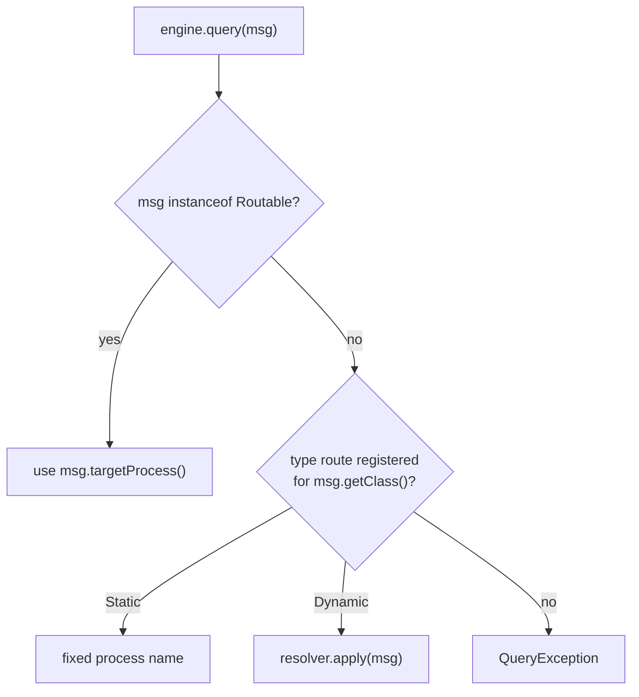

# Graph & routing

## The graph

A `Graph` is an immutable, validated description of your processes:

- **nodes** — a `ProcessNode` per process: its name, dependencies, an optional
  typed `param`, and the `init`/`load` factories.
- **typeRouting** — a map from query class to a `QueryRoute` (how to find the
  target process for a query of that type).
- **top** — the most-recently-added node (a convenience handle).

The compact constructor validates the graph eagerly and throws
`IllegalArgumentException` for:

- a dependency on an unknown process,
- a **cycle** (the graph must be a DAG),
- a static route targeting an unknown process.

`Graph.topologicalOrder()` returns nodes **dependencies-first** — the order the
engine spawns them, so a consumer's `init`/`load` can query an
already-`Serving` dependency.

## Building a graph

Use `GraphBuilder`:

```java
Graph g = new GraphBuilder()
    .add("A", AInit::new, AInit::new)                 // no deps
    .add("B", BInit::new, BInit::new, "A")            // B depends on A (reactive)
    .addDeps("C", CInit::new, CInit::new,             // explicit dependency kinds
             Dependency.reactive("A"), Dependency.stable("B"))
    .addWithParam("Tenant_X", TInit::new, TInit::new, // a parameterised node
                  new TenantParam("X"))
    .build();
```

| Method | Dependencies | Param |
|---|---|---|
| `add` | names → all **reactive** | — |
| `addDeps` | explicit `Dependency` values | — |
| `addWithParam` | names → all **reactive** | yes (`ParamProcessInitializer/Loader`) |
| `addWithParamDeps` | explicit `Dependency` values | yes |

See [Reactive cascade](reactive-cascade.md) for reactive vs stable.

### Typed process references — `ProcessRef`

A process is identified by its **name** — that string is what the log persists
(`Sid`, `LogInitialized`, …), so the durable identity is always the name. To
avoid scattering bare string literals across `add(...)`, dependency lists, and
`ctx.query(...)`, define one **`ProcessRef`** constant per process and pass it
instead. Every name-keyed API has a `ProcessRef` overload, so the two styles
interoperate:

```java
final class InventoryInit implements ProcessInitializer, ProcessLoader {
    static final ProcessRef REF = ProcessRef.of("Inventory");
    // …
}

new GraphBuilder()
    .add(InventoryInit.REF, InventoryInit::new, InventoryInit::new)
        .handles(GetStock.class)
    .add(ProductsInit.REF, ProductsInit::new, ProductsInit::new,
         InventoryInit.REF)          // dependency by ref, not string
    .build();

// addressing a process or a dependency:
engine.queryProcess(InventoryInit.REF, msg);
engine.trigger(InventoryInit.REF, signal);
ctx.query(InventoryInit.REF, new GetStock(sku));   // inside init/load/compute
```

`ProcessRef` is purely a compile-time convenience — `ProcessRef.of("Inventory")`
wraps the same name the engine persists, so it does **not** change the on-disk
format and renaming the *constant* never affects recovery (only changing the
string would). A `Routable` message returns the name with `REF.name()`.

## Routing a query

`engine.query(msg)` resolves the target process in priority order:



1. **`Routable`** — if the message implements `io.fom.api.Routable`, its
   `targetProcess()` wins. Best for multi-tenant messages that carry their own
   address.
2. **Type routing** — otherwise the engine looks up `msg.getClass()` (exact
   match) in the graph's `typeRouting`:
    - `QueryRoute.Static(name)` — a fixed target, registered with
      `.handles(MsgType.class)`.
    - `QueryRoute.Dynamic(resolver)` — the resolver computes the name per query,
      registered with `.route(MsgType.class, resolver)`.
3. **No match** — `QueryException`.

`engine.queryProcess(name, msg)` bypasses all of this and addresses a process
directly.

### Static routes

```java
new GraphBuilder()
    .add("Orders", OrdersInit::new, OrdersInit::new)
        .handles(GetOrder.class, ListOrders.class)   // both route to "Orders"
    .build();
```

`.handles(...)` targets the most-recently-added node. To attach routes to a node
by name regardless of insertion order, use `.handlesFor("Orders",
GetOrder.class)`.

### Dynamic routes

```java
new GraphBuilder()
    .add("Inventory_PUB1", …)
    .add("Inventory_PUB2", …)
    .route(GetInventory.class, q -> "Inventory_" + ((GetInventory) q).pub())
    .build();
```

The resolver must be a `SerializableFunction` because it is serialized with the
graph into the log. (The Kotlin DSL's `route { … }` handles this for you — see
the [Kotlin DSL guide](../guides/kotlin-dsl.md).)

### Routable messages

```java
record GetInventory(String pub) implements Routable, Serializable {
    public String targetProcess() { return "Inventory_" + pub; }
}
```

`Routable` always wins over type routing, so you don't need a route entry for
these.

## Cross-process queries during init/load

Inside a process, `QueryableContext.query("Dep", msg)` queries a **declared**
dependency. Querying an undeclared process fails — this is what guarantees the
topological spawn order is sufficient.
