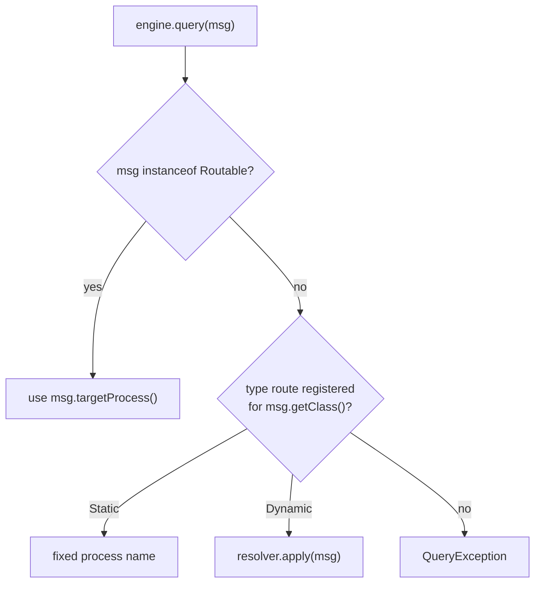

# Graph & routing

## The graph

A `Graph` is an immutable, validated description of your processes:

- **nodes** — a `ProcessNode` per process: its name, dependencies, an optional
  typed `param`, and the `init`/`load` factories.
- **typeRouting** — a map from query class to a `QueryRoute` (how to find the
  target process for a query of that type).
- **top** — the most-recently-added node (a convenience handle).

The compact constructor validates the graph eagerly and throws
`IllegalArgumentException` for:

- a dependency on an unknown process,
- a **cycle** (the graph must be a DAG),
- a static route targeting an unknown process.

Names are checked earlier, when the node is built: a process name or a
dependency name that is empty or blank (whitespace only) is rejected with
`IllegalArgumentException` ("ProcessNode name must not be empty or blank",
"dependency name must not be empty or blank"), and so is a node that names the
same dependency twice — the message names the duplicate ("ProcessNode
'&lt;name&gt;' names dependency '&lt;dep&gt;' more than once"). `GraphBuilder`
refuses a process name added twice ("Duplicate process name: &lt;name&gt;").

`Graph.topologicalOrder()` returns nodes **dependencies-first** — the order the
engine spawns them, so a consumer's `init`/`load` can query an
already-`Serving` dependency.

Between nodes that do **not** depend on each other the order of that *list* is
not arbitrary: `Graph` keeps the **insertion order** of the map it was built
from (it stores the nodes in a `LinkedHashMap`, deliberately not a hash-ordered
copy), so `topologicalOrder()` is **deterministic** — the same graph returns the
same list in every JVM.

!!! warning "Deterministic order ≠ deterministic start order"
    The *start* order is a weaker guarantee. `GraphMachine.startByDependencies` —
    used by the initial `newGraph` (`startAll`) and by every later graph change
    (`applyGraphChange`) alike — walks that list, but it chains each node's start on its dependencies
    (`thenComposeAsync(…, starter)` onto a virtual-thread-per-task executor):
    a node starts as soon as everything it depends on is `Serving`, so nodes
    with **no dependency between them start concurrently**.

    What is guaranteed:

    - a node is started only after every dependency of it is `Serving`;
    - `topologicalOrder()` returns the same list in every JVM.

    What is **not** guaranteed: the order in which two independent nodes
    actually begin. Their `onInitStarted` callbacks arrive in a different
    permutation on nearly every run — do not rely on that order, in production
    or in a test. This holds for **every** graph change, not just the first
    `newGraph`: a later change starts its added and changed nodes exactly like
    the initial install — independent ones concurrently. A
    [node that fails to start](graph-swap.md#if-a-node-fails-to-start) strands
    only its own dependents, not "everything after it in the list", on either
    path.

## Building a graph

Use `GraphBuilder`:

```java
Graph g = new GraphBuilder()
    .add("A", AInit::new, AInit::new)                 // no deps
    .add("B", BInit::new, BInit::new, "A")            // B depends on A (reactive)
    .addDeps("C", CInit::new, CInit::new,             // explicit dependency kinds
             Dependency.reactive("A"), Dependency.stable("B"))
    .addWithParam("Tenant_X", TInit::new, TInit::new, // a parameterised node
                  new TenantParam("X"))
    .build();
```

| Method | Dependencies | Param |
|---|---|---|
| `add` | names → all **reactive** | — |
| `addDeps` | explicit `Dependency` values | — |
| `addWithParam` | names → all **reactive** | yes (`ParamProcessInitializer/Loader`) |
| `addWithParamDeps` | explicit `Dependency` values | yes |

See [Reactive cascade](reactive-cascade.md) for reactive vs stable.

### Typed process references — `ProcessRef`

A process is identified by its **name** — that string is what the log persists
(`Sid`, `LogInitialized`, …), so the durable identity is always the name. To
avoid scattering bare string literals across `add(...)`, dependency lists, and
`ctx.query(...)`, define one **`ProcessRef`** constant per process and pass it
instead. The builder, the engine's per-process calls and the context take a
`ProcessRef` as well as a name — `GraphBuilder.add`/`addWithParam`/`addDeps`/`addWithParamDeps`/`handlesFor`,
`Dependency.reactive`/`stable`, `Engine.queryProcess`/`trigger`/`remove`/`pause`/`resume`,
`QueryableContext.query`, and in Kotlin `process`/`processWithParam`,
`queryProcessAwait` and `ctx.queryAwait` — so the two styles interoperate:

```java
final class StationsInit implements ProcessInitializer, ProcessLoader {
    static final ProcessRef REF = ProcessRef.of("Stations");
    // …
}

new GraphBuilder()
    .add(StationsInit.REF, StationsInit::new, StationsInit::new)
        .handles(GetReadings.class)
    .add(ForecastsInit.REF, ForecastsInit::new, ForecastsInit::new,
         StationsInit.REF)          // dependency by ref, not string
    .build();

// addressing a process or a dependency:
engine.queryProcess(StationsInit.REF, msg);
engine.trigger(StationsInit.REF, signal);
ctx.query(StationsInit.REF, new GetReadings(stationId));   // inside init/load/compute
```

`ProcessRef` is purely a compile-time convenience — `ProcessRef.of("Stations")`
wraps the same name the engine persists, so it does **not** change the on-disk
format and renaming the *constant* never affects recovery (only changing the
string would). A `Routable` message returns the name with `REF.name()`.

A few name-keyed APIs are still string-only; pass `REF.name()` to them:
`Engine.trigger(Map)`, the `ScheduledWatcher` constructor, route resolvers
(`GraphBuilder.route`, Kotlin `route<Q>`) and, in `fom-tenant`'s
`TenantAwareEngine`, the batch `trigger(caller, Map)` and
`Builder.globalProcesses`. Its **single-name** calls do take a `ProcessRef`:
`queryProcess(caller, ref, msg)` — with or without a per-call timeout — and
`trigger(caller, ref, value)`, each authorized exactly like its string form (see
[Multi-tenancy](../guides/multi-tenancy.md#authorized-operations)).

## Routing a query

`engine.query(msg)` resolves the target process in priority order:


```mermaid
graph TD
  Q["engine.query(msg)"] --> R{"msg instanceof Routable?"}
  R -- yes --> RT["use msg.targetProcess()"]
  R -- no --> T{"type route registered<br/>for msg.getClass()?"}
  T -- "Static" --> SP["fixed process name"]
  T -- "Dynamic" --> DR["resolver.apply(msg)"]
  T -- no --> X["QueryException"]
```

1. **`Routable`** — if the message implements `io.fom.api.Routable`, its
   `targetProcess()` wins. Best for multi-tenant messages that carry their own
   address.
2. **Type routing** — otherwise the engine looks up `msg.getClass()` (exact
   match) in the graph's `typeRouting`:
    - `QueryRoute.Static(name)` — a fixed target, registered with
      `.handles(MsgType.class)`.
    - `QueryRoute.Dynamic(resolver)` — the resolver computes the name per query,
      registered with `.route(MsgType.class, resolver)`.
3. **No match** — `QueryException`.

Because type routing matches the **exact** runtime class, `GraphBuilder`
refuses — with `IllegalArgumentException`, when you call `.handles(...)` or
`.route(...)` — a query type that is an interface, an abstract class or a
primitive: no message's `getClass()` can ever be one, so such a route would
never match. `Object.class` is refused too: it would only match a bare
`new Object()`, never "any message". Register each concrete class, or make the
message `Routable`. A `Graph` constructed directly (not through `GraphBuilder`)
gets the same check on its `typeRouting`, so the mistake cannot slip in that way.

One exception to "exact class": an **enum constant with a body**
(`PING { ... }`) is an anonymous subclass of its enum, so its `getClass()` is
not the enum type. The engine routes any enum constant by its enum type
(`getDeclaringClass()`), so `.handles(Cmd.class)` catches every constant of
`Cmd`, with or without a body. The reverse is refused: a route for a constant's
body class (`.handles(Cmd.PING.getClass())`) would never match, so
`GraphBuilder` (and a directly constructed `Graph`) rejects it with
`IllegalArgumentException` ("Query type … is the body of an enum constant;
register its enum … instead"). Register the enum type.

`engine.queryProcess(name, msg)` bypasses all of this and addresses a process
directly.

Query messages are passed **by reference**: the engine never serializes or
copies them (they are not written to the log), so they need not be
`Serializable`. `compute` receives the very object you sent — possibly later,
when the query was stashed while the node initialised or loaded. Don't mutate a
message after sending it; immutable records are the safe choice.

### Static routes

```java
new GraphBuilder()
    .add("Subscriptions", SubscriptionsInit::new, SubscriptionsInit::new)
        .handles(GetSubscription.class, ListSubscriptions.class)   // both route to "Subscriptions"
    .build();
```

`.handles(...)` targets the most-recently-added node. `.handlesFor("Subscriptions",
GetSubscription.class)` names its target instead, so it can attach routes to **any node
you have already added** — not only the last one: you can add several nodes and
then come back to an earlier one. It is not a forward reference. The node must
already exist in the builder at that point, otherwise `handlesFor` throws
`IllegalArgumentException` ("handlesFor(...) for unknown node: 'Subscriptions'").

### Dynamic routes

```java
new GraphBuilder()
    .add("Stations_PUB1", …)
    .add("Stations_PUB2", …)
    .route(GetStations.class, q -> "Stations_" + ((GetStations) q).pub())
    .build();
```

The resolver is an ordinary `Function<Q, String>`. Like the init/load factories,
it is **never written to the log** — a `LogChangeGraph` records only the graph's
structure (node names, dependencies and serialized params) — so it may capture
anything. After a restart your application installs its graph again, resolvers
included. A query type can have only one route: `.handles(...)` and `.route(...)`
for the same type are rejected with `IllegalArgumentException`. (The Kotlin DSL
offers `route<Q> { … }` — see the [Kotlin DSL guide](../guides/kotlin-dsl.md).)

### Routable messages

```java
record GetStations(String pub) implements Routable, Serializable {
    public String targetProcess() { return "Stations_" + pub; }
}
```

`Routable` always wins over type routing, so you don't need a route entry for
these.

## Cross-process queries during init/load

Inside a process, `QueryableContext.query("Dep", msg)` queries a **declared**
dependency. Querying an undeclared process fails — this is what guarantees the
topological spawn order is sufficient.

!!! warning "Inside `compute`, query through `ctx`, not the outer `Engine`"
    A `compute` that calls the outer `Engine` (`engine.query(…)`,
    `engine.queryProcess(…)`) instead of `ctx.query(…)` sidesteps the
    declared-dependency check — nothing stops it from querying an undeclared
    process, or its **own** process, which the topological order does not
    protect. Declare what `compute` needs as a dependency and use `ctx.query`.

    Deadlines and cancellation are the same either way. A query sent from inside
    `compute` — through `ctx.query` or the outer `Engine`, on the thread running
    `compute` before it returns its stage — is tied to the query being computed:

    - it inherits that query's deadline — `ctx.query` always, an `Engine`
      query when that deadline is sooner than its own timeout (through the `Engine` it then fails with `TimeoutException` "Query to
      '&lt;name&gt;' did not complete within the deadline of the query whose
      compute sent it"; through `ctx.query`, "… within the deadline inherited
      from its calling query"); if that deadline has already passed, an
      `Engine` query fails at once without being sent. Since both share one
      deadline, whichever timer fires first wins: the caller of `Outer` may get
      the nested query's `TimeoutException` — naming `Inner`, not `Outer` —
      when `Outer`'s compute passes that failure on;
    - it is reported to observers as that query's child (`parentQueryId`);
    - it is cancelled (`CancellationException` "the query that sent it is no
      longer waited for") when that query fails — times out, is cancelled or is
      rejected.

    That tie exists only while `compute()` itself runs on its thread (the engine
    tracks the issuing query in a thread-local set around the call). A query sent
    through the outer `Engine` from an asynchronous continuation — inside a
    `thenCompose` after `compute` returned its stage, say — is **not** tied to
    the issuing query: it gets a fresh deadline, no parent and no cancellation.
    `ctx.query` carries the deadline (and the parent id) in the context itself,
    so it inherits the deadline in async continuations too; use `ctx.query` for
    anything a compute queries.
