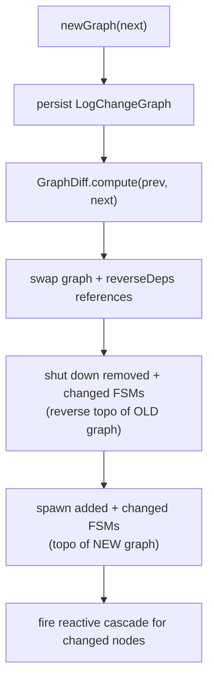

# In-place graph swap

You can change the graph of a **running** engine by calling `newGraph(...)`
again. The engine diffs the new graph against the running one and applies only
the difference — unchanged processes keep their live state; changed ones are
rebuilt.

```java
engine.newGraph(graphV1);   // initial install → returns true
// ... running ...
boolean changed = engine.newGraph(graphV2);  // in-place swap → true if anything differed
```

## The diff

`GraphDiff.compute(prev, next)` classifies every process into one of four sets:

| Set | Condition | Action |
|---|---|---|
| **unchanged** | structurally identical node | keep its FSM and Sid as-is |
| **added** | name only in `next` | spawn fresh (cold `init`) |
| **removed** | name only in `prev` | shut down and remove |
| **changed** | same name, different definition | retire old Sid, spawn fresh |

Two nodes are **equivalent** (hence *unchanged*) when they have the same name,
the same `param` (by value), and the same dependency set (each dependency's name
and kind). The `init`/`load` **factory identity is deliberately not compared** —
lambdas and method references differ on every build, so comparing them would
make every node look "changed".

## What happens on a swap



- **Removed** and **changed** nodes are shut down in reverse-topological order
  of the old graph, each via a *replace* shutdown that writes `LogDead` for the
  retired Sid (so a later restart cold-inits the new definition rather than
  warm-loading stale state).
- **Added** and **changed** nodes are spawned in topological order of the new
  graph and the call blocks until each reaches `Serving`.
- For each **changed** node, the engine fires the
  [reactive cascade](reactive-cascade.md) with the node's real previous Sid, so
  its reactive consumers re-initialise against the new version.

## Cold-init on change

Added and changed nodes always **cold-init** during a swap, even though a
`LogInitialized` for the old definition may still be in the log. That old record
is stale — the node's definition changed — so warm-loading it would be wrong.
(Cross-restart warm-load is a separate path: the *initial* `newGraph` after a
JVM start, which does consult the log. See
[Idempotent restart](idempotent-restart.md).)

## Return value

`newGraph` returns:

- `true` on the **initial** install, and
- on a swap, `true` if the diff had any changes (`added ∪ removed ∪ changed`
  non-empty), `false` if the new graph was structurally identical.

## Concurrency

`newGraph` and `updateConfig` are serialized by an internal control lock, so two
concurrent `newGraph` calls cannot both create a graph machine, and a swap never
races a config hot-reload.
