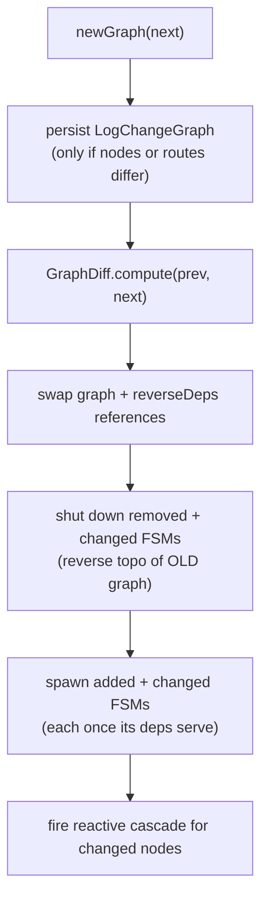

# In-place graph swap

You can change the graph of a **running** engine by calling `newGraph(...)`
again. The engine diffs the new graph against the running one and applies only
the difference — unchanged processes keep their live state; changed ones are
rebuilt.

```java
engine.newGraph(graphV1);   // initial install → returns true
// ... running ...
boolean changed = engine.newGraph(graphV2);  // in-place swap → true if anything differed (topology or routing)
```

## The diff

`GraphDiff.compute(prev, next)` classifies every process into one of four sets:

| Set | Condition | Action |
|---|---|---|
| **unchanged** | structurally identical node | keep its FSM and Sid as-is |
| **added** | name only in `next` | spawn fresh (cold `init`) |
| **removed** | name only in `prev` | shut down and remove |
| **changed** | same name, different definition | retire old Sid, spawn fresh |

Routing lives in the graph, not in the FSMs, so a swap whose only difference is
the type routing (`.handles()`, `.handlesFor()`, `.route(...)`) still returns
`true`: queries really do go elsewhere afterwards. No node is added, removed or
re-initialised in that case.

What counts as a routing difference is limited to what can be compared: a
message type gaining or losing a route, a static route (`.handles`) pointing at
another process, or a route switching between static and dynamic. **A changed
`.route(...)` resolver lambda cannot be detected** — two lambdas are never
comparable — so a swap that only replaces a resolver does take effect (queries
are resolved by the new lambda from then on) but `newGraph` returns `false`.

A swap with no difference at all — the same nodes and the same routes —
**appends nothing to the log**: no `LogChangeGraph` is written, so a reconcile
loop that re-applies the same graph does not grow the log. It still does its one
job, restarting nodes that are `Dead` or never started.

Two nodes are **equivalent** (hence *unchanged*) when they have the same name,
the same `param` (by value), and the same dependency set (each dependency's name
and kind). The `init`/`load` **factory identity is deliberately not compared** —
lambdas and method references differ on every build, so comparing them would
make every node look "changed".

A node's [re-init strategy](process-lifecycle.md#re-initialisation)
(`GraphBuilder.reinitStrategy(...)`) is not part of its definition either: a
swap that only changes it leaves the node *unchanged* and returns `false`, and
the running node uses the new strategy from its next re-init.

!!! warning "Swapping only the code does not re-init a running node"
    A node whose name, dependencies and `param` are the same but whose `init` /
    `load` **implementation** changed (a new factory) is *unchanged*. Its
    running FSM keeps the **old** factories: it is not restarted, and any later
    re-init — a trigger, a reactive cascade — still runs the old code. Paths
    that create a *new* FSM for the node use the **new** factories: a
    pause + resume, restarting a `Dead` node (by `trigger` or a repeated
    `newGraph`), or a JVM restart. So which code a node runs can depend on
    whether it happened to be restarted.

    To switch code deterministically, make the definition differ: bump a
    version field in the `param` (e.g. `new AlertsParams(..., /*codeVersion*/ 2)`)
    so the node counts as *changed* and cold-inits with the new code — or
    remove it and add it back.

!!! warning "Give `param` types a real `equals`"
    A `param` class that does not override `equals()` never equals the running
    node's `param` (unless it is the very same instance), so every `newGraph`
    counts the node as *changed* and re-initialises it. On a swap the engine logs
    a `WARN` for it: "the param of '&lt;name&gt;' (&lt;class&gt;) does not
    override equals(), so it never equals the running one and every newGraph
    re-inits the process; use a record or implement equals()". The same applies
    on restart; see
    [Idempotent restart](idempotent-restart.md).

    Params are compared with `equals()`, and a record's generated `equals`
    compares an **array** component by reference (so does a Kotlin data class
    with an array property). Such a param never equals its persisted copy
    (nor an equal one built anew for the next `newGraph`), so the process
    cold-inits on every restart and
    every `newGraph` — **without any `WARN`**: the check above only catches
    classes that do not override `equals` at all. Use a `List` instead of an
    array, or override `equals`/`hashCode` with `Arrays.equals` /
    `contentEquals`.

!!! warning "Keep `param` classes on the application classpath"
    A `param` whose class is loaded by a **reloadable classloader** — a Kotlin
    script, a plugin or hot-reload loader — is a different `Class` after every
    reload, even when its source did not change. A record's (or data class's)
    `equals` requires the same class, so the rebuilt param never equals the
    running one: **every reload that calls `newGraph` re-inits the node**, and
    no `WARN` says why (the class does override `equals`).

    A JVM restart goes wrong the other way: the `SerDe` cannot load the
    recorded param's class from the application classpath, so the engine logs
    a `WARN` "cannot decode the recorded param of '&lt;name&gt;' to verify its
    definition, so a changed param is NOT detected and the process warm-loads
    its old state …" and keeps the old state even if the param did change.

    Define param types in code that is on the application classpath (e.g. a
    shared module the scripts or plugins depend on) and let the reloadable code
    only build instances of them.

## What happens on a swap


```mermaid
graph TD
  A["newGraph(next)"] --> B["persist LogChangeGraph<br/>(only if nodes or routes differ)"]
  B --> C["GraphDiff.compute(prev, next)"]
  C --> D["swap graph + reverseDeps references"]
  D --> E["shut down removed + changed FSMs<br/>(reverse topo of OLD graph)"]
  E --> F["spawn added + changed FSMs<br/>(each once its deps serve)"]
  F --> G["fire reactive cascade for changed nodes"]
```

- **Removed** and **changed** nodes are shut down in reverse-topological order
  of the old graph, each via a *replace* shutdown that writes `LogDead` for the
  retired Sid (so a later restart cold-inits the new definition rather than
  warm-loading stale state). The swap waits for each of them to stop even if
  the calling thread is interrupted meanwhile, and restores the interrupt flag
  afterwards, so a dependency is never torn down while its consumers still run.
  A `cleanUp` that outruns its cleanup budget is cut off at the budget and the
  node's stop completes; the `WARN` you see is "FSM[X] cleanup failed:
  java.util.concurrent.TimeoutException: X cleanUp did not finish within its
  share of <budget> (the budget also covers draining in-flight queries)". The
  rarer `WARN` "GraphMachine[…] X did not finish stopping within its cleanup
  budget of …" appears only when the node's stop itself does not complete in
  time — at about the budget plus 250 ms, when the FSM's own stop reply times
  out, with a message-less `ExecutionException`/`TimeoutException` as its cause
  (see [Process lifecycle](process-lifecycle.md#retries-backoff-timeouts)).
- **Interrupted caller.** Unlike those stop waits (and `close()`,
  `pause()`), an interrupt does change what the *start* of the new
  nodes does: the engine starts no node that had not begun starting yet, lets
  the ones already starting finish (bounded by one start budget), and then
  returns. If every node came up anyway, `newGraph` returns normally; otherwise
  it throws `IllegalStateException("Interrupted while starting the graph; not
  started, a retried newGraph starts them: [N2, …]")`. Either way the interrupt
  flag is still set afterwards. The swap itself **is applied** — the removed
  nodes were stopped and the new graph is installed — and calling `newGraph`
  again with the same graph (on a thread that is not interrupted) starts the
  nodes the message names. Do not treat that exception as "the swap did not
  happen".
- **Added** and **changed** nodes are spawned the same way the initial install
  starts a graph — each as soon as its own dependencies in the new graph serve,
  independent ones concurrently — and the call blocks until all of them have
  settled.
- For each **changed** node, the engine fires the
  [reactive cascade](reactive-cascade.md) with the node's real previous Sid, so
  its reactive consumers re-initialise against the new version. That holds
  even if the node was re-initialising when the swap changed it: the cascade
  uses the Sid that was serving (under `RELEASE_FIRST`, the one the re-init
  was replacing).
- A removed or changed node whose `init` is still running has its init stage
  cancelled (see [Process lifecycle](process-lifecycle.md#retries-backoff-timeouts)).
  A `KEEP_OLD` re-init in progress is cancelled the same way, and both the
  serving version and a new version already written (not yet loaded) are
  retired with `LogDead`. A changed node still cold-inits under its new
  definition: a swap does not keep the old version serving meanwhile — queries
  to it wait for the new FSM, as described below.
- A query to a changed node between its old and new FSM waits for the new one
  (up to its deadline) instead of failing with "Unknown process" or "is shutting
  down". Queries that were already inside the old FSM when the swap started —
  waiting for it to serve, or arriving while it cleans up — are moved over to the
  replacement as well, keeping their own deadline; each is reported to observers
  exactly once. Queries still waiting for a *removed* node fail with
  `QueryRejectedException`. `introspect()`
  lists such a node once, as `Starting`, until its new FSM exists.
- A query that is already **computing** in the old FSM is drained within
  `cleanupTimeout`, exactly as on any other cleanup: if its compute
  outlives that budget it fails with `QueryRejectedException`
  ("… is shutting down: the query outlived the cleanup timeout"), and the swap
  itself waits out the whole budget before finishing.

## Cold-init on change

Added and changed nodes always **cold-init** during a swap, even though a
`LogInitialized` for the old definition may still be in the log. That old record
is stale — the node's definition changed — so warm-loading it would be wrong.
(Cross-restart warm-load is a separate path: the *initial* `newGraph` after a
JVM start, which does consult the log. See
[Idempotent restart](idempotent-restart.md).)

## If a node fails to start

If an added or changed node does not reach `Serving` in time, `newGraph` throws.
When the node itself failed for good, `newGraph` rethrows that node's own
failure — e.g. an `InitializationTimeoutException` quoting the real init budget;
if the wait simply ran out, the exception says the node "did not reach Serving
within <budget>".
The engine still records and routes against the new graph, and the failed node is
left `Dead`.

*Which other* nodes are left unstarted follows the **dependency edges**, not the
position in `topologicalOrder()`. A graph change starts its added and changed
nodes **exactly like the initial install**: the initial `newGraph`
(`GraphMachine.startAll`) and a later change (`GraphMachine.applyGraphChange`)
both go through `GraphMachine.startByDependencies`, which starts a node as soon
as its own dependencies are `Serving`, so independent nodes start
**concurrently** on both paths (see
[Graph & routing](graph-and-routing.md#the-graph)). Hence, on either path:

- the nodes that depend on the failed one — **directly or transitively** — never
  start, and the engine logs a `WARN` "GraphMachine[<id>] not starting <node>:
  its dependency <dep> did not start" for each of them;
- every node **independent** of the failed one starts regardless, whether it was
  added to the `GraphBuilder` before it or after it;
- `newGraph` returns (or throws) once every node has settled, and the exception
  is the **first root** failure — of the first node, in topological order, whose
  own dependencies did serve;
- broken independent nodes wait out their [start budget](process-lifecycle.md#startup-budget)
  side by side, so the whole start costs **one** start budget, not one per
  broken node.

That rule is what a test can rely on. On either path the *timing*
between independent nodes is not fixed, so do not assert on the order they came
up in.

If `Engine.close()` is called during a swap, the swap starts **nothing further**:
nodes still waiting for their dependencies are not started, and `newGraph`
throws `IllegalStateException` ("Engine closed while 'X' was starting").

Calling `newGraph` again with the same graph **retries**: nodes that are missing
or `Dead` — the failed node and every dependent it left unstarted — are spawned
again, and the call returns `true` (with no new `LogChangeGraph` record, since
the graph itself is unchanged). This also holds after a failed *initial*
install: the engine is already installed, so the retry takes the swap path.
A failed first `newGraph` still arms the configured
[snapshot policy](snapshots.md#automatically--snapshotpolicy) before it throws,
so rotation runs whether or not you retry. (Earlier versions left it off: the
swap path never arms rotation, so after a failed first install the log stopped
rotating until the next JVM start.)

## Removing, pausing and resuming processes

Three shortcuts sit on top of the swap:

```java
engine.remove(Set.of("Subscriptions_PUB1"));   // swap to currentGraph().without(...)
engine.pause(Set.of("Subscriptions_PUB1"));    // stop, keep state
engine.resume(Set.of("Subscriptions_PUB1"));   // warm-load the kept state
```

Each also takes names inline (`String...`) or typed handles (`ProcessRef...`):
`engine.pause("Subscriptions_PUB1", "Subscriptions_PUB2")`,
`engine.remove(SUBSCRIPTIONS_PUB1)` (with
`static final ProcessRef SUBSCRIPTIONS_PUB1 = ProcessRef.of("Subscriptions_PUB1");`). A call with **no** arguments —
`engine.pause()` — does not compile: it is ambiguous between the
`String...` and the `ProcessRef...` overload (it would be a no-op anyway). Pass
an empty collection if you really build the list at run time.

- **`remove`** is a swap to `Graph.without(names)`: the processes are
  shut down and their state is retired with `LogDead`, so adding them back later
  cold-inits. Static routes to them are dropped. It fails with
  `IllegalArgumentException` if a remaining process depends on a removed one, or
  if the call would remove *every* process ("Removing [...] would leave an empty
  graph") — close the engine instead. It only removes: other `Dead` or never-started
  processes are left as they are (a `newGraph` with the same graph still
  restarts them).
- **`pause`** stops processes **without** `LogDead`. They stay in the
  graph; queries to them fail with `QueryRejectedException` ("paused") and
  `introspect()` reports them as `Paused`. A trigger, or a change of a reactive
  dependency, that arrives meanwhile is remembered, and the process re-inits
  after it resumes. Pausing a process while it initialises cancels its init
  stage. Pausing it mid re-init depends on the
  [re-init strategy](process-lifecycle.md#re-initialisation):
    - `KEEP_OLD` (the default): the pause records the version that was
      serving, and that is the `sid` `introspect()` reports while paused. If
      the new version was still in `init`, that init is cancelled and the node
      is paused stale: `resume` warm-loads the old version, serves it, and
      re-initialises in the background (one `init`). If the new version was
      already written and loading, the node is not stale: `resume` warm-loads
      the old version and then loads the written one beside it, without
      running `init` again — unless the node runs under `RELEASE_FIRST` by
      the time it resumes: then the written version is retired and the node
      cold-inits. Removing the paused node retires its state.
    - `RELEASE_FIRST`: the old state is already retired. Paused while
      `Initializing`, resuming runs `init` once (not twice) and its reactive
      consumers re-initialise; while it stays paused `introspect()` reports
      its `sid` as `null`. Paused while the new state was already `Loading`,
      resuming warm-loads that persisted state instead of running `init`
      again (one init, one Sid promotion) — that new state is the one the
      paused node keeps, and removing the paused node retires it.

    A pause that lands just as a re-init completes keeps the new state and
    does not re-init again on resume.
  Consumers must be paused together with their producers.
  The pause is **persisted** (`LogPaused`, re-emitted by snapshots): after a JVM
  restart the processes come up paused until resumed. If the graph installed at
  restart has a running process that depends on a paused one, that process
  comes up paused too (with a warning), since nothing can be resumed before the
  engine starts. This is persisted as a pause **for a dependency**
  (`LogPaused.forDependency`), distinct from an operator pause, and snapshots
  keep the distinction; `engine.pausedByDependency()` lists such processes.
  Resuming the dependency does not resume them while the engine runs — resume
  them with `resume`. But if the engine restarts and none of their
  dependencies is paused any more, they simply start (a `LogResumed` is written;
  one marked stale while paused replays its re-init). A process you paused
  explicitly always stays paused until resumed; pausing a process that is paused
  for a dependency with `pause` turns it into such an ordinary operator
  pause, so it no longer lapses with its dependencies. A paused process that
  the graph installed at restart leaves out has its pause cleared (a
  `LogResumed` is written, logged at `INFO` "Engine[…] paused process 'X' is
  not in the graph; its pause is cleared"), as an in-process removal clears it —
  a later `newGraph` that adds it back starts it normally.
  `pause` returns only once the processes have stopped (or their
  cleanup budget ran out): it keeps waiting even if the calling thread is
  interrupted, and restores the interrupt flag afterwards.
- **`resume`** restarts paused processes dependencies-first and
  warm-loads their state. A dependency of a resumed process must not stay paused.
  If a process fails to start it stays paused and the call can be retried.
  The same holds when the calling thread is interrupted while it waits for a
  process to start: the call throws `IllegalStateException` ("Interrupted while
  waiting for '&lt;name&gt;' to start; the call can be retried"), the process stays paused, and the thread's interrupt flag stays
  set. Before it throws, the call stops the node it had started (waiting up to
  its cleanup budget), so a retry never overlaps the abandoned start. A re-init remembered while the process was paused is **not** done by the time
  the call returns: it goes through the ordinary trigger path, so a query issued
  right after `resume` can still be answered from the pre-resume state
  for about one [`dedupWindow`](reactive-cascade.md#the-dedup-window). Wait for
  the new Sid (`introspect()` / `onSidPromotion`) if you need the post-trigger
  state.

!!! warning "If leadership is lost part-way"
    All three persist their change, so on a log another instance has taken over
    they throw
    [`LeadershipLostException`](../reference/exceptions.md#leadership) — and they
    say how far they got rather than pretending nothing happened. A
    `remove` that swapped the graph but could not write the removed
    processes' `LogDead` **names those processes**: the graph change stands, but
    their state is still live in the log and whoever leads next will warm-load it
    if the name comes back. A `pause` interrupted between two
    `LogPaused` records **names what it had already paused** ("already paused:
    [...]", or "nothing was paused") — this engine can neither finish the pause
    nor undo it. A `resume` whose node cannot append its `LogResumed`
    throws ("… for &lt;name&gt;; it stays paused", plus "already resumed: [...]"),
    stops that node again and leaves it `Paused` with its last Sid (no `Dead`, and
    `lastException` stays `null`), so a later resume can still bring it back — but
    a node that cold-initialised first leaves a new Sid's state behind in the log;
    see [Exceptions](../reference/exceptions.md#leadership).

All three refuse a name that is not in the current graph — including one an
earlier `remove` already removed — with `IllegalArgumentException`
("Unknown process: '&lt;name&gt;'"), and nothing is applied. Removal is
therefore **not idempotent**: check `currentGraph()` (or `introspect()`) before
repeating a call rather than retrying it blindly.

`engine.resumeUnblocked(names)` resumes, atomically under
the control lock, only those of `names` that are still paused for a dependency
and none of whose dependencies is paused; names an operator paused meanwhile,
still blocked, or unknown are left alone. It returns the names resumed. If
another operation (e.g. an operator's `pause`) cancels a process's
start, that process stays paused and is simply left out of the result. Any other
failure to reach `Serving` throws; that process stays paused, and the call can
be retried. (`TenantAwareEngine.resumeTenant` resumes global processes through it.)

While processes are paused, a graph swap may not add or keep a *running* process
that depends on one of them. Removing a paused process retires its state; a
*changed* paused process stays paused and cold-inits under its new definition
when resumed.

## Read-modify-write: `updateGraph` { #read-modify-write-updategraph }

To change the running graph *relative to what is installed* — add a node, drop
one, re-point a route — use `engine.updateGraph(change)`. It hands `change` the
graph installed now and installs the graph it returns, all under the control
lock, so no other control-plane call (`newGraph`, `remove`,
`pause`, `resume`, a tenant's lifecycle call, …) can run in
between:

```java
engine.updateGraph(current -> {
    var nodes = new LinkedHashMap<>(current.nodes());
    nodes.put(alertsNode.name(), alertsNode);    // a ProcessNode you built
    return new Graph(current.top(), nodes, current.typeRouting());
});
```

To **drop** nodes, return `current.without(names)` rather than editing the node
map by hand:

```java
engine.updateGraph(current -> current.without(Set.of("Subscriptions_PUB1")));
```

`Graph.without` also drops the type routes that point at a removed node and,
if the removed node is the graph's `top`, picks a new `top` (the last remaining
node in topological order). It throws `IllegalArgumentException` if a remaining
node still depends on a removed one, or if nothing would remain. The hand-built
form `new Graph(current.top(), nodes, current.typeRouting())` keeps the **old**
`top`: remove the node that is `top` from `nodes` and the constructor throws
`IllegalArgumentException` ("top '…' is not present in nodes map"), so the
change fails and nothing is installed.

The hand-written form, `engine.newGraph(modify(engine.currentGraph()))`, is a
read-modify-write that a concurrent call can slip into: a `remove` that
lands between the read and the `newGraph` is undone by the stale copy, which
puts the removed processes back (they cold-init, their old state having been
retired). See
[Multi-tenancy](../guides/multi-tenancy.md#adding-a-tenant-at-runtime) for the
tenant case.

- `updateGraph` returns what `newGraph` returns for the resulting graph (see
  [Return value](#return-value)); a `change` that returns the graph unchanged is
  a re-apply of the same graph.
- `change` must be quick and must **not** call back into the engine's control
  plane. Such a call would re-enter the (reentrant) control lock and run, and
  the graph `change` then returns — computed from the graph read before it —
  would silently undo it. So `newGraph`, `updateGraph`, `remove`,
  `pause`, `resume` (and the tenant calls built on them) and
  `updateConfig` made from inside `change` are **refused** with
  `IllegalStateException` ("&lt;call&gt; called from inside an updateGraph
  change function; the change must only compute the new graph"). The exception
  propagates out of `updateGraph` unless `change` catches it, and nothing is
  installed.
- That refusal only sees the thread **running `change`**. A control-plane call
  that `change` hands to **another thread** and then waits for (an executor's
  `submit(...).get()`, `CompletableFuture.supplyAsync(...).join()`, Kotlin's
  `withContext(Dispatchers.IO)` or a `runBlocking` on another dispatcher) is not
  refused: it waits for the control lock that `change`'s thread holds, while
  `change` waits for it. The engine **deadlocks for good** — `close()` included,
  since it waits for the same lock (and every later `close()` waits for that
  one). Compute what you need *before* `updateGraph` and make follow-up calls
  *after* it returns.
- Returning `null` throws `NullPointerException` ("the change returned
  null") and installs nothing.
- It throws `IllegalStateException` if no graph is installed yet ("No graph
  installed; call newGraph(graph) first") or the engine is closed.

## Return value

`newGraph` returns:

- `true` on the **initial** install, and
- on a swap, `true` if anything changed: the diff had changes (`added ∪ removed ∪
  changed` non-empty), the [type routing differs](#the-diff), **or** the swap
  restarted a node that was `Dead` or never started. Such a node counts as
  *changed* (a never-started one as *added*), so re-applying an **identical**
  graph that restarts one returns `true` — although, the graph being the same,
  it appends no `LogChangeGraph` (see [above](#the-diff) and
  [If a node fails to start](#if-a-node-fails-to-start)). It returns `false` only
  when the graph is identical and every node was already running (or paused —
  paused nodes are not restarted).

## Concurrency

`newGraph` and `updateConfig` are serialized by an internal control lock, so two
concurrent `newGraph` calls cannot both create a graph machine, and a swap never
races a config hot-reload.

`currentGraph()` returns the graph being installed as soon as a swap has
persisted it, so it matches `introspect()` during the swap. If the swap fails
midway, it still reflects the installed topology.

`remove` and `pause` take the same lock. If a `newGraph` or
`resume` holds it while waiting for a process hanging in its first
start, removing or pausing that process cancels that start instead of waiting
out the budget — a node hung in `Loading` as well as one hung in `Initializing`,
so the call returns in milliseconds instead of holding the caller for the whole
startup budget; the blocked `newGraph` or `resume` then throws
`InitInProgressException` ("Init of process '&lt;name&gt;' was cancelled"). Only starts the holding
operation waits for are cancelled; other processes' inits and loads are left
alone. A
`remove`/`pause` that is refused (`IllegalArgumentException`,
e.g. a dependent would keep running) never cancels an init — also when a
`newGraph` queued behind the running one would add such a dependent; only an
accepted one does. A request that will be refused still waits for the running
`newGraph` to finish, since it is decided against the graph in force by then.
