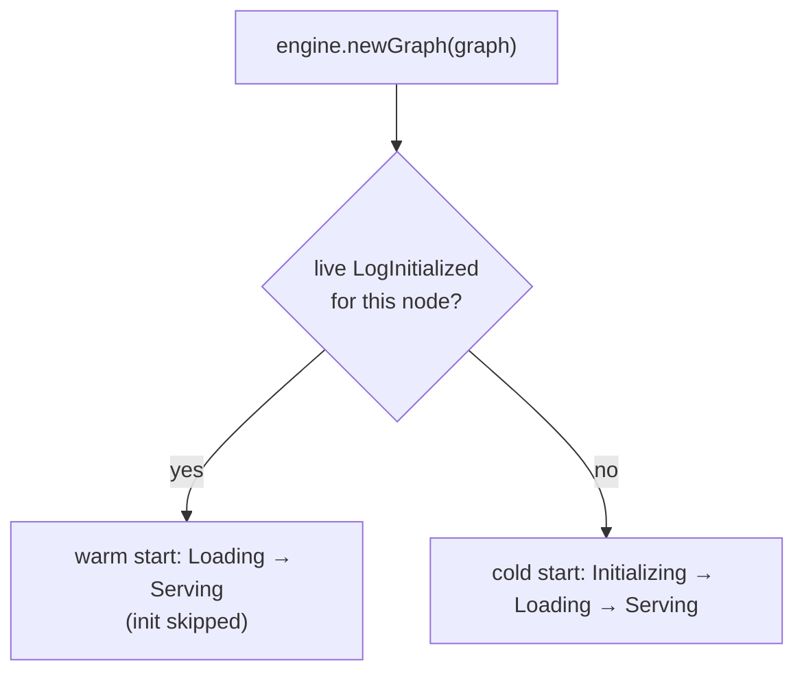

# Idempotent restart

The core promise: restarting the JVM against the **same log** recovers every
process's state **without re-running `init`**. Expensive initialisation happens
once; restarts pay only for `load`.

## How it works

When you call `engine.newGraph(graph)` for the first time in a process, the
engine scans the log once and, for each node in the graph, finds the **latest
non-retired** `LogInitialized`:

- a `LogInitialized` at clock *c* is **live** if there is no later `LogDead` for
  the same process with clock ≥ *c*;
- if a live `LogInitialized` exists, the node **warm-starts** — it goes straight
  to `Loading` using those persisted property cells, skipping `init`;
- otherwise the node **cold-starts** — `init` then `load`.

So the *same code path* — `newGraph` — produces a cold start on first run and a
warm start on every subsequent run. That is what makes the restart idempotent.

## Why `init` and `load` are split

The split is what makes this possible:

- **`init`** does the expensive, one-time work and returns plain `byte[]`
  property cells. Its output is durable (`LogInitialized`).
- **`load`** is a pure function of those cells → a live `Process`. It is cheap
  and runs every start.

Design `init` to be the heavy lift and `load` to be a fast reconstruction.

## What invalidates a warm start

A node cold-inits instead of warm-loading when:

- there is no `LogInitialized` for it yet (first ever run), or
- its latest `LogInitialized` has been retired by a `LogDead` (it was
  re-initialised or replaced), or
- its definition changed in an [in-place graph swap](graph-swap.md) — added and
  changed nodes always cold-init.

## Leadership on restart

Recovery is a leader activity. A single-node app passes `leaderAtStart=true` to
the `Engine` constructor and claims leadership as it installs the graph. In a
multi-node setup the backend's lock decides who recovers; see
[Multi-node](../guides/multi-node.md).

## Verifying it

A restart should show `load` running but **not** `init`. With an
[`EngineObserver`](../guides/observability.md) you'll see `onLoadStarted` /
`onLoadCompleted` for each node and no `onInitStarted`. The bundled
`MultiProcessTest` (`three_node_chain_warm_restart_skips_all_inits`) asserts
exactly this.
