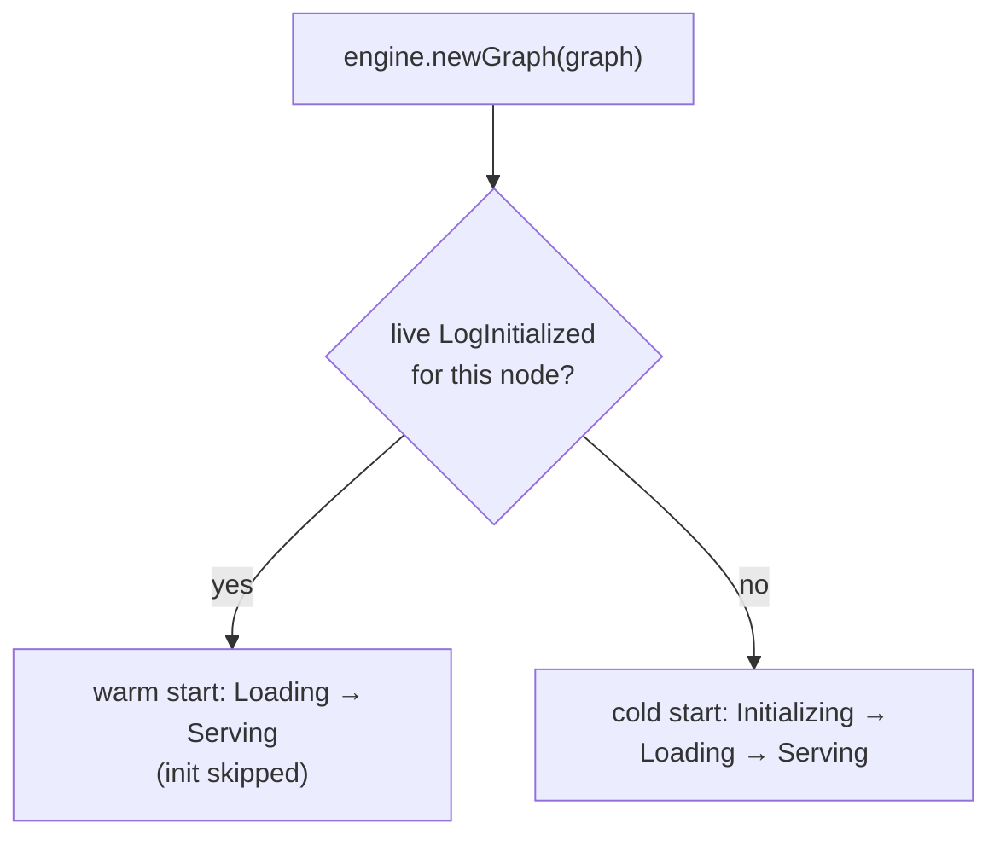

# Idempotent restart

The core promise: restarting the JVM against the **same log** recovers every
process's state **without re-running `init`**. Expensive initialisation happens
once; restarts pay only for `load`.

## How it works

When you call `engine.newGraph(graph)` for the first time in a process, the
engine scans the log once and works out, for each process, its **live**
`LogInitialized` (the incumbent) and at most one **candidate** — a newer
`LogInitialized` written by a re-init to replace it but not loaded yet:

- a `LogInitialized` whose `replaces` names the live incumbent becomes the
  candidate; any other `LogInitialized` (a cold init, or one whose `replaces` is
  already gone) becomes the live one and drops any candidate;
- a `LogLoaded` of the candidate promotes it: it is now the live one;
- a `LogDead` of the candidate drops just the candidate; a `LogDead` with a clock
  ≥ the incumbent's retires the incumbent and its candidate;
- an **older** `LogInitialized` is never live again once a later one has taken
  over, even if no `LogDead` names it — e.g. a parameter change detected at
  restart cold-inits the node and writes a new `LogInitialized` without a
  `LogDead` for the old Sid. Nor does the engine fall back to an older one when
  the live one is retired.

Then, for each node in the graph:

- if a live `LogInitialized` exists, the node **warm-starts** — it goes straight
  to `Loading` using those persisted property cells, skipping `init`;
- otherwise the node **cold-starts** — `init` then `load`.

```mermaid
graph TD
  S["engine.newGraph(graph)"] --> Q{"live LogInitialized<br/>for this node?"}
  Q -- yes --> W["warm start: Loading → Serving<br/>(init skipped)"]
  Q -- no --> C["cold start: Initializing → Loading → Serving"]
```

So the *same code path* — `newGraph` — produces a cold start on first run and a
warm start on every subsequent run. That is what makes the restart idempotent.

## Why `init` and `load` are split

The split is what makes this possible:

- **`init`** does the expensive, one-time work and returns plain `byte[]`
  property cells. Its output is durable (`LogInitialized`).
- **`load`** is a pure function of those cells → a live `Process`. It is cheap
  and runs every start.

Design `init` to be the heavy lift and `load` to be a fast reconstruction.

## What invalidates a warm start

A node cold-inits instead of warm-loading when:

- there is no `LogInitialized` for it yet (first ever run), or
- its live `LogInitialized` has been retired by a `LogDead` (the node was removed
  or replaced by a graph swap, or a `RELEASE_FIRST` re-init stopped after
  retiring the old state and before the new one was written), or
- its definition changed in an [in-place graph swap](graph-swap.md) — added and
  changed nodes always cold-init, or
- its definition changed **between runs**: the node's name, dependency set or
  `param` differs from the graph its state was persisted under. The engine
  compares against the `LogChangeGraph` recorded before that `LogInitialized`,
  using the same structural rule as a graph swap (so `param` types need a real
  `equals`, e.g. a record). If that recorded graph cannot be decoded, the engine
  logs a warning and warm-loads as before.

A reactive consumer whose state was built on producer state that is gone warm-loads
**and then re-initialises in the background** once it serves (the old state
answers queries meanwhile). That is the case when:

- one of its **reactive** dependencies cold-inits at this start (for example
  because that dependency's `param` or dependencies changed between runs) —
  this propagates transitively down the chain, or
- a reactive dependency's live `LogInitialized` is **newer** than the node's own:
  the engine stopped after the producer re-initialised but before the
  [cascade](reactive-cascade.md) reached the consumer, or
- a reactive dependency's warm `load` fails at this start and it falls back to
  a fresh `init` before the consumer has started.

Under `ReinitStrategy.RELEASE_FIRST` (engine-wide or for that node) such a
consumer cold-inits instead. A **paused** consumer in any of these cases is not
started; it is marked stale instead and re-inits when it is resumed.

## A restart in the middle of a re-init { #restart-mid-reinit }

A re-init (trigger, watcher, cascade) can be cut short by a crash or a
`close()` at any point. With the default `KEEP_OLD` strategy the next start
always serves the old state first and finishes the re-init in the background:

| Stopped… | At the next start |
|---|---|
| after the request (`LogTrigger` / `LogDependencyChanged`), before the new `LogInitialized` | warm-loads the old state and serves it; the re-init is replayed in the background ("replaying the re-init of 'X' requested before the last shutdown") |
| after `LogInitialized(new, replaces=old)`, before `LogLoaded(new)` | warm-loads the old state and serves it, then loads the candidate in the background **without running `init` again**. If the candidate cannot be loaded, it is retired with `LogDead` and a fresh `init` runs, the old state serving meanwhile |
| after `LogLoaded(new)` | warm-loads the new state; the old one is not loaded (a missing `LogDead(old)` changes nothing) |

A failed re-init that the engine gave up on before the stop is in the first
row: the request is newer than the live state, so the next start retries it.
A candidate is only finished if it was written under the node's current
definition; if the definition changed between runs, the node cold-inits as
above.

Under `RELEASE_FIRST` a request recorded before the stop is replayed the same
way (the node warm-loads, serves, then re-initialises in its own order); a stop
after the old state's `LogDead` and before the new `LogInitialized` leaves no
live state, so the node cold-inits. See
[Re-initialisation](process-lifecycle.md#re-initialisation).

A candidate written by a `KEEP_OLD` re-init is **never loaded** by a node that
runs under `RELEASE_FIRST` when it starts (the strategy changed between runs,
engine-wide or for that node): loading it beside the old state would hold two
versions in memory. Whether the node starts at a restart, on `resume` or later
(it waited for its dependencies), the candidate is dropped and the node
cold-inits, so its reactive consumers re-initialise with it. A node that stays
paused at startup is not started: it is marked stale instead and re-inits when
it is resumed.

A candidate that will never serve does **not always get a `LogDead` of its
own**. Where the engine can, it writes one (a candidate that failed to load is
retired with `LogDead(candidate)`, best effort). Other paths leave the
candidate's `LogInitialized` in place — for example a node paused while its
candidate was loading and then removed, or a `RELEASE_FIRST` node that resumes
or restarts with a candidate. The log stays correct anyway, by the
[scan rules](#how-it-works): the node's next cold `LogInitialized`, or a
`LogDead` at or after the incumbent's clock (the removal's), drops the
candidate, so it is never loaded.

Each node starts as soon as its own dependencies serve, so independent branches
warm-load or initialise in parallel. A node that fails keeps only its dependents
from starting; see
[Process lifecycle](process-lifecycle.md#cold-start-vs-warm-start).

!!! warning "Give `param` types a real `equals`"
    A `param` class that does not override `equals()` never equals its persisted
    copy, so the process cold-inits on **every** restart. The engine logs a
    `WARN` naming the class when it detects this. Use a record (or implement
    `equals`/`hashCode`).

    Params are compared with `equals()`, and a record's generated `equals`
    compares an **array** component by reference (so does a Kotlin data class
    with an array property). Such a param never equals its persisted copy
    (nor an equal one built anew for the next `newGraph`), so the process
    cold-inits on every restart and
    every `newGraph` — **without any `WARN`**: the check above only catches
    classes that do not override `equals` at all. Use a `List` instead of an
    array, or override `equals`/`hashCode` with `Arrays.equals` /
    `contentEquals`.

## Upgrades: renamed processes and moved classes { #upgrades }

- **Renaming a process** is, to the engine, removing one process and adding
  another: the process name is the durable identity. The new name cold-inits.
  What happens to the old name's state depends on *how* the rename is rolled
  out:
    - **Across a restart** (stop the JVM, start the new version with the
      renamed graph): the old name's state is **left in the log**, un-retired
      and without any message — the new graph simply never mentions it. Roll the
      upgrade back and the old name warm-loads that state again (until a
      snapshot drops it, since a snapshot keeps only the current graph's
      state). To retire it deliberately, remove the old name with
      `remove` before (or instead of) renaming.
    - **In the running engine** (`newGraph` / `updateGraph` with the renamed
      graph): the old name is a *removed* node of the swap, and a removed node
      is stopped with a replace shutdown that writes `LogDead` for its Sid (see
      [Graph swap](graph-swap.md#what-happens-on-a-swap)). The old state is
      **retired**: a rollback to the old name cold-inits it.
- **Moving or renaming a `param` class** makes the param recorded in the log
  undecodable (the usual cause is a `ClassNotFoundException` deep in the cause
  chain). The engine cannot then tell whether the param changed, so it logs a
  `WARN` — "cannot decode the recorded param of 'X' to verify its definition, so
  a changed param is NOT detected and the process warm-loads its old state …",
  with the whole cause chain — and warm-loads **without change detection**. This
  repeats on every restart until the process re-initialises and a new
  `LogInitialized` is recorded under the current graph. So after such an
  upgrade, `trigger` each affected process once. That is the
  `JavaSerializableSerDe` behaviour. A **permissive `FurySerDe`** (`new
  FurySerDe()`) does not throw on a class it cannot find: it decodes the
  recorded param into a placeholder object, which never equals your param. So
  every affected process **cold-inits** on that restart, with only the `INFO`
  "process 'X' definition changed since its state was persisted …; cold-initialising"
  and no `WARN` — correct, but possibly an expensive surprise across many
  processes.
- **Changing a `param` class's fields** has the same effect under the default
  `JavaSerializableSerDe` when the class declares **no fixed
  `serialVersionUID`**. Java serialization then derives the UID from the class
  shape, so adding a field to a Java class or a property to a Kotlin data
  class changes it, and the recorded param fails to decode with
  `InvalidClassException` ("local class incompatible: stream classdesc
  serialVersionUID = …"). You get the same `WARN` and the same warm-load of the
  old state without change detection, on every restart, until the process is
  triggered. To avoid it:
    - declare a fixed `serialVersionUID` on param classes
      (`private static final long serialVersionUID = 1L;`, or
      `private const val serialVersionUID = 1L` in a Kotlin `companion object`).
      An old recorded param then decodes, with the added field at its default
      value (`null`, `0`, `false`). That value is not equal to the new param, so the
      change **is** detected and the process cold-inits as it should. Under
      Kotlin, a non-null property can come back `null` this way, since
      deserialization skips the constructor (and its default values). This is
      fine for the comparison, but don't use such a decoded param anywhere else; or
    - make params **records**. The UID check does not apply to records: an old
      recorded record with a component added since decodes, with the new component at
      its default value, whether or not a `serialVersionUID` is declared.

    Both cover **added fields only**. A field or component whose **type
    changed** (`int` → `long`, `String` → an enum) still fails to decode
    (`InvalidClassException`, "incompatible types for field …"), so it takes
    the `WARN` path above: warm-load without change detection until triggered.
- **Rolling back to an older app version** is not change-detected either when
  v2 added a record component (or a field, with a fixed `serialVersionUID`):
  v1 decodes the param v2 recorded and silently **drops** the component it does
  not know. If the remaining components equal v1's param, v1 warm-loads the
  state v2 built **with a different param**, without any log line. After a
  rollback, `trigger` the processes whose param v2 had changed. A restart with
  an older graph also **clears operator pauses** of processes that graph does
  not contain (see [Graph swap](graph-swap.md#removing-pausing-and-resuming-processes)): pause
  them again if v2 added them and you roll forward later.
- **Upgrading `PostgresLogBackend` across the advisory-lock key change** needs
  a stop-then-start rollout, not a rolling one. The lock key is now a hash of
  schema **and** table name (earlier versions hashed the table name alone), so
  an old-version node and a new-version node on the same log hold *different*
  locks and both believe they lead. Stop every old node before starting a new
  one. If they overlap anyway, the new node's write fence refuses its appends
  once the old node claims the log, but the old node does not fence itself the
  same way. Details: [Multi-node](../guides/multi-node.md#choosing-the-right-backend)
  and [Persistence backends](../guides/persistence-backends.md#postgreslogbackend).

### Evolving the state itself { #state-evolution }

The cells `init` returns are your bytes; the engine never looks inside them,
and there is **no migration hook** between "the log holds v1 state" and "v2's
`load` runs on it". A warm start hands v2's `load` whatever v1's `init`
wrote. Options, cheapest first:

- **Write cells that stay readable.** Java serialization with a fixed
  `serialVersionUID` (and `readObject` for anything beyond added fields), a
  versioned format (a version byte up front; Protobuf, Avro or JSON with
  optional fields), or a codec that tolerates the old bytes and fills
  defaults.
- **Change the param** (or another part of the definition) together with an
  incompatible state change: the persisted state no longer matches the
  definition, so the process cold-inits instead of loading it.
- **Let `load` fail.** A `load` that throws on bytes it cannot read falls back
  to a fresh `init` (see
  [Retries, backoff, timeouts](process-lifecycle.md#retries-backoff-timeouts)),
  so incompatible state is rebuilt rather than served. Throw a clear exception
  — a `load` that half-reads old bytes and serves wrong data is the one outcome
  to avoid.

## Leadership on restart

Recovery is a leader activity. The engine claims leadership (`LogLeader`) as
`newGraph` installs the first graph, then recovers. In a
multi-node setup the backend's lock decides who recovers; see
[Multi-node](../guides/multi-node.md).

## Verifying it

A restart should show `load` running but **not** `init`. With an
[`EngineObserver`](../guides/observability.md) you'll see `onLoadStarted` /
`onLoadCompleted` for each node and no `onInitStarted`. The bundled
`MultiProcessTest` (`three_node_chain_warm_restart_skips_all_inits`) asserts
exactly this.
