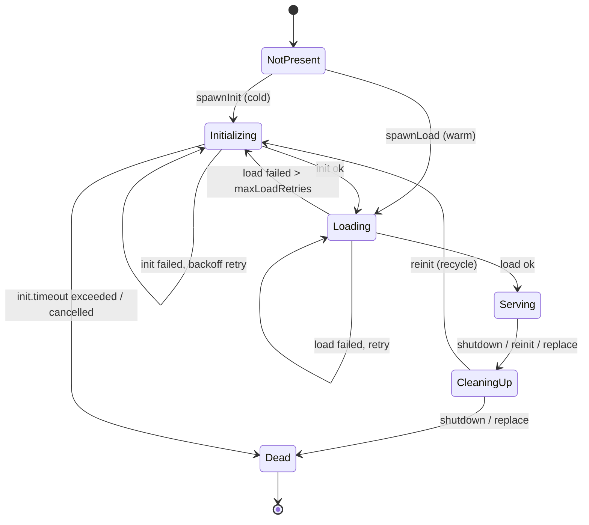

# Process lifecycle

Every process is driven by one `ProcessFSM` — an actor-like finite state machine
with a single **virtual-thread dispatcher** that reads a mailbox of envelopes
and pattern-matches them against the current state. User code (`init`, `load`,
`compute`, `cleanUp`) runs on **separate** virtual threads, so the dispatcher is
never blocked.

## States

| State | Meaning |
|---|---|
| **NotPresent** | Just created; nothing has happened yet. |
| **Initializing** | Running `init`. On failure, retries with exponential backoff until the total `init.timeout` budget is spent. |
| **Loading** | Running `load`. On failure, retries up to `maxLoadRetries`, then falls back to `Initializing`. |
| **Serving** | Live and answering queries. The `Process` object is held in the FSM. |
| **CleaningUp** | Running the process's `cleanUp`; queued queries are failed. |
| **Dead** | Terminal. The dispatcher thread exits. |

## Cold start vs warm start

- **Cold start** (`spawnInit`): `NotPresent → Initializing → Loading → Serving`.
  Used when there is no persisted state for this process.
- **Warm start** (`spawnLoad`): `NotPresent → Loading → Serving`. Used on a
  [restart](idempotent-restart.md) when the engine found a live
  `LogInitialized` for the process — `init` is skipped.

Which path a node takes is decided by the engine when it installs the graph: it
scans the log for the latest non-retired `LogInitialized` per process.

## Retries, backoff, timeouts

- **Init** retries on every failure with [exponential backoff + jitter](#backoff),
  but the *total* wall-clock spent in `Initializing` is bounded by
  `defaultInitTimeout`. Exceeding it transitions to `Dead` with an
  `InitializationTimeoutException`.
- Each individual `init` attempt is also bounded by `defaultInitTimeout`
  (the per-attempt compute future is given that long).
- **Load** retries up to `maxLoadRetries` times; after that the FSM falls back
  to a fresh `init` cycle. Each `load` attempt is bounded by
  `defaultLoadTimeout`.
- **Compute** (a query) is bounded by the query's deadline, derived from
  `queryTimeout` (or the per-call timeout).
- **Cleanup** is bounded by `defaultCleanupTimeout`.

All of these come from [`EngineConfig`](../guides/configuration.md).

### Backoff { #backoff }

`BackoffPolicy` produces `delay = min(max, min · 2^(attempt-1)) · jitter`, with
`jitter` uniform in `[0.5, 1.5)`. Bounds are `backoffMin` and `backoffMax`. The
multiplication is overflow-safe (it saturates at `backoffMax`).

## Queries while not yet Serving

A query that arrives in `Initializing` or `Loading` is **stashed** and replayed
once the process reaches `Serving`. A query that arrives in `NotPresent` fails
with `InitInProgressException`; in `CleaningUp`/`Dead` it fails with
`QueryRejectedException`. See [Exceptions](../reference/exceptions.md).

## Re-initialisation

A [trigger](triggers-and-watchers.md) or a
[reactive dependency change](reactive-cascade.md) causes a *reinit*: the FSM
writes `LogDead` for the current [Sid](sid-and-clock.md), runs `cleanUp`, then
recycles through `Initializing` to produce a **new Sid**. The three cleanup
paths are distinguished internally:

- **shutdown** — graceful stop; no `LogDead` is written, so a later restart can
  still warm-load the state (idempotent restart is preserved).
- **reinit** — `LogDead` written, then recycle to `Initializing`.
- **replace** — `LogDead` written, then terminal `Dead` (used by the
  [graph swap](graph-swap.md)).

## Observability

The FSM emits callbacks to an [`EngineObserver`](../guides/observability.md) for
every transition, init/load/query/compute/cleanup event, and Sid promotion.
Observer callbacks run on engine threads and are wrapped so a misbehaving
observer cannot break the FSM.
