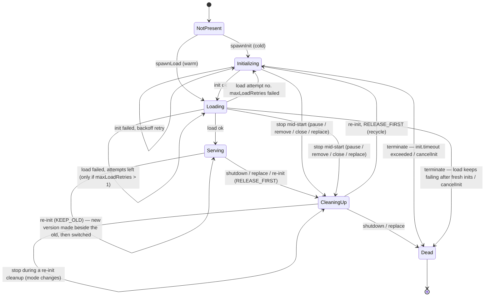

# Process lifecycle

Every process is driven by one `ProcessFSM` — an actor-like finite state machine
with a single **virtual-thread dispatcher** that reads a mailbox of envelopes
and pattern-matches them against the current state. User code (`init`, `load`,
`compute`, `cleanUp`) runs on **separate** virtual threads, so the dispatcher is
never blocked.

## States


```mermaid
stateDiagram-v2
    [*] --> NotPresent
    NotPresent --> Initializing : spawnInit (cold)
    NotPresent --> Loading : spawnLoad (warm)
    Initializing --> Initializing : init failed, backoff retry
    Initializing --> Loading : init ok
    Loading --> Loading : load failed, attempts left (only if maxLoadRetries > 1)
    Loading --> Initializing : load attempt no. maxLoadRetries failed
    Loading --> Serving : load ok
    Serving --> Serving : re-init (KEEP_OLD) — new version made beside the old, then switched
    Serving --> CleaningUp : shutdown / replace / re-init (RELEASE_FIRST)
    Initializing --> CleaningUp : stop mid-start (pause / remove / close / replace)
    Loading --> CleaningUp : stop mid-start (pause / remove / close / replace)
    CleaningUp --> CleaningUp : stop during a re-init cleanup (mode changes)
    CleaningUp --> Initializing : re-init, RELEASE_FIRST (recycle)
    CleaningUp --> Dead : shutdown / replace
    Initializing --> Dead : terminate — init.timeout exceeded / cancelInit
    Loading --> Dead : terminate — load keeps failing after fresh inits / cancelInit
    Dead --> [*]
```

"Paused" is not an FSM state: a paused node has no FSM at all. Pausing a node
still fires `onStateTransition(name, <last state>, "Paused")`, from the state its
FSM ended in once stopped (`Dead` after the pause's cleanup; `NotPresent` for a
node that had no FSM yet) to `"Paused"`, so an observer
tracking states (a gauge of `Dead` processes, say) sees the node leave that state.
`introspect()` likewise reports a paused node with state `Paused`.

`introspect()` reads each node's state and Sid **together**: the pair it
reports is one the FSM was actually in, never a new state paired with a stale
Sid or the other way round. While a new Sid is being made and no version
serves, it reports `sid = null`: while the node is `Initializing`, and during a
`RELEASE_FIRST` re-init's `CleaningUp` (the old Sid is already retired in the
log, the new one does not exist yet). The node still stashes queries as
described below; only the reported Sid is empty. During a `KEEP_OLD`
[re-init](#re-initialisation) the node stays `Serving` and reports the Sid that
answers queries — the old one until the switch — with
`NodeReport.replacement` set to `"Initializing"` or `"Loading"` and
`NodeReport.stale == true`.

| State | Meaning |
|---|---|
| **NotPresent** | Just created; nothing has happened yet. |
| **Initializing** | Running `init`. On failure, retries with exponential backoff until the total `init.timeout` budget is spent. |
| **Loading** | Running `load`. `maxLoadRetries` is the **total** number of load attempts (default `1`, i.e. no retry): once that many have failed, falls back to `Initializing`. |
| **Serving** | Live and answering queries. The `Process` object is held in the FSM. During a `KEEP_OLD` [re-init](#re-initialisation) the new version is initialised and loaded beside the serving one, which keeps answering until the switch; the state stays `Serving` throughout. |
| **CleaningUp** | Running the process's `cleanUp`. What happens to *waiting* queries depends on why: a `RELEASE_FIRST` **re-init** stashes them and serves them from the new state, a **replace** (graph swap) hands them to the new FSM, a real **shutdown** (pause, removal, `close()`) fails them with `QueryRejectedException` ("&lt;name&gt; is shutting down"). A query that is already *computing* is drained within the cleanup budget whatever the reason, and fails if it outlives it. |
| **Dead** | Terminal. The dispatcher thread exits. Only [`trigger`](#restarting-a-dead-process) or a retried `newGraph` starts the process again. A process whose own cold `init`/`load` result could not be appended because another instance took the log over ends here, with `LeadershipLostException` as its `lastException`. A failed [re-init](#re-initialisation) does **not** end here under `KEEP_OLD` (the default): the old version keeps serving. Under `RELEASE_FIRST` it does — the old state is retired before the new `init` runs, so a re-init that gives up (or loses leadership after that `LogDead`) leaves the node `Dead` with `sid == null`, rejecting queries with `QueryRejectedException`. |

## Cold start vs warm start

- **Cold start** (`spawnInit`): `NotPresent → Initializing → Loading → Serving`.
  Used when there is no persisted state for this process.
- **Warm start** (`spawnLoad`): `NotPresent → Loading → Serving`. Used on a
  [restart](idempotent-restart.md) when the engine found a live
  `LogInitialized` for the process — `init` is skipped.

Which path a node takes is decided by the engine when it installs the graph: it
scans the log for the latest non-retired `LogInitialized` per process.

Every `newGraph` — the first install and any later
[graph change](graph-swap.md#if-a-node-fails-to-start) alike — starts each node
**as soon as its own dependencies serve**, so independent branches start in
parallel rather than one node at a time. A node that fails does not stop
unrelated nodes: they keep starting, only the failed node's dependents are not
started. Once every node has settled, `newGraph` throws the first *root* failure
(a node whose dependencies did serve, in topological order). Meanwhile
`introspect()` reports nodes still waiting to start with state `Starting`. If
`Engine.close()` is called while that startup (or a swap's) is still waiting,
the wait gives up at once, no further node is started, and `newGraph` throws
`IllegalStateException` ("Engine closed while 'X' was starting") instead of
waiting out the init budget. A first `newGraph` that throws still leaves the
graph installed and the configured [snapshot policy](snapshots.md#automatically--snapshotpolicy)
armed, so rotation runs even before (or without) a retry; see
[Graph swap](graph-swap.md#if-a-node-fails-to-start).

### The startup budget { #startup-budget }

Each node gets **`initTimeout` + `loadTimeout`** (one minute with
the defaults) to reach `Serving`, counted from the moment its own dependencies
serve. A node that does not make it fails the call that started it with a plain
`java.lang.RuntimeException` naming the state it was stuck in:

```text
Node 'Stations' did not reach Serving within PT1M (state=Loading)
```

`"; last failure: …"` is appended when the node had already failed an attempt.
A later graph change, `resume` and a
[`Dead` restart](#restarting-a-dead-process) use the same budget and report it
the same way.

This budget is the *startup's* patience, not the node's: it does not stop the
node. `introspect()` right after the failure can still show the node `Loading`
with `lastException == null` — the `state=Loading` above says as much — because
its own `init`/`load` attempt has not timed out yet and keeps running.

## Retries, backoff, timeouts

- **Init** retries on every failure with [exponential backoff + jitter](#backoff),
  but the *total* wall-clock spent in `Initializing` is bounded by
  `initTimeout`, and never overrun: an attempt only gets what is left
  of the budget. When the backoff does not fit, the retry comes sooner —
  halfway into the time left once an attempt as long as the last one is
  allowed for — but never sooner than the [backoff floor](#backoff), half of
  `backoffMin`, so a fast-failing `init` does not hammer its upstream with a
  burst of retries near the end of the budget. When not even the floor (plus an
  attempt as long as the last one) fits in what is left, the node gives up at
  once instead of waiting out the budget. So a 30 s budget gives up within 30 s, never a
  backoff later. Giving up fails with an
  `InitializationTimeoutException` ("Init for X ran out of its PT30S budget
  (total across retries); last failure: …", the last failure as its cause),
  A node that then goes `Dead` (a cold start, or a `RELEASE_FIRST` re-init) logs it
  at `ERROR` as "FSM[X] giving up: …". A `KEEP_OLD` re-init keeps the old version
  serving, logs only the `WARN` "re-init gave up; keeps serving …" and is
  [retried later](#when-a-re-init-fails).
- **A refused init result is not retried.** If `init` succeeds but the log
  backend refuses to store its result outright (`IllegalArgumentException`,
  e.g. a `LogInitialized` over the
  [log payload limits](../guides/serialization.md#log-payload-hardening-automatic)),
  running the same `init` again cannot help. The process goes `Dead` at once,
  `NodeReport.lastException` carries the backend's message (which names the
  limits), and `newGraph` throws that `IllegalArgumentException`. Other append
  failures count as failed attempts and are retried as above.
- **An `Error` is a failed attempt too.** An `OutOfMemoryError` (or any other
  `Error`) thrown by `init`/`load`, or while the engine records its result in
  the log (serializing a large state, say), fails that attempt and is retried
  like any other failure — it does not leave the node stuck in `Initializing`
  or `Loading`. A retry that needs the same memory will usually fail the same
  way until the budget is spent. During a `KEEP_OLD` re-init the old version
  keeps serving through all of this, and an `OutOfMemoryError` counts as
  transient: the re-init is retried after `reinitRetryBackoffMin`. See the
  [FAQ on heap sizing](../faq.md#how-much-heap-does-it-need-and-can-i-limit-concurrent-inits).
- Each individual `init` attempt is also measured against `initTimeout`,
  and `loadTimeout` / `cleanupTimeout` work the same way: a budget
  is **wall-clock over the whole attempt**, not just over waiting on the
  stage the attempt returns. Work done *before* the `CompletionStage` is handed
  back — a synchronous `init` that computes everything and returns
  `CompletableFuture.completedFuture(...)` — is measured too, and an attempt that
  has spent its budget is reported as a timeout even when its stage is already
  complete. An `init` or `load` that **blocks before returning its stage** — a
  synchronous computation, or a JDBC/HTTP call without a timeout — is ended at
  its budget too: a scheduler-side watchdog fails the attempt shortly after the
  budget runs out with a `TimeoutException` ("X init attempt N exceeded PT1S
  (init had not even returned its stage)", or the `load` equivalent), and the
  node then retries or goes `Dead` exactly as for any other timeout. So a
  synchronous `init` that spins for 4 s under a 1 s budget fails after about
  1 s, and the node gives up with `InitializationTimeoutException` once the
  total budget is spent. Ending the attempt **does not stop the work**, though:
  nothing interrupts the thread running your `init` or `load` because the
  budget ran out, so that `init` keeps computing on its thread for the full
  4 s, and its late result is discarded. Only an explicit stop interrupts that
  thread ([see below](#cancelling-an-init)) — bound blocking calls with their
  own timeouts so abandoned attempts don't pile up. A timed-out attempt fails
  with a message such as `X init attempt 2 exceeded PT0.999S`: an init attempt
  names the time it was given — what was left of the total budget when it
  started — not the configured `initTimeout` (a load attempt,
  `X load attempt N exceeded …`, names the full `loadTimeout`). That is what
  [`NodeReport.lastException`](../guides/observability.md#point-in-time--introspect)
  then shows.
- When an `init` attempt exceeds that budget, or while `init` runs the process
  is cancelled ([`cancelInit`](#cancelling-an-init)), paused, removed, replaced
  by a graph swap, dies, or the engine closes, the engine calls `cancel(true)` on
  the stage `init` returned — its result would be discarded anyway. For a plain
  `CompletableFuture` that only completes the future and does not interrupt the
  work behind it, so a long `init` should still check for cancellation
  cooperatively; for a Kotlin
  [`SuspendingInitializer`](../guides/kotlin-dsl.md#suspending-init-and-load) it
  cancels the coroutine.
- **A factory that returns `null`** fails the attempt with an
  `IllegalStateException` naming the process — "the init factory of 'X'
  returned null" (or "the load factory of 'X' returned null") — which is
  reported and retried like any other failed attempt.
- **Load** is attempted at most `maxLoadRetries` times **in total** — despite
  its name the setting counts attempts, not retries, so the default `1` means
  *no* load retry: the first failed `load` falls back to a fresh `init` cycle
  (`2` means one retry, and so on). If `load` then fails again on the freshly
  initialised state, each further fallback to `init` waits a
  [backoff](#backoff) delay (`backoffMin`..`backoffMax`), and the whole loop is
  bounded by `initTimeout` (counted from the first fallback): once it is
  spent the process goes `Dead` with an `InitializationTimeoutException`
  ("Load for X kept failing after N fresh inits …"). Each `load` attempt is bounded by
  `loadTimeout`. A `load` stage **is** cancelled when it outruns that
  budget, exactly as one that becomes unwanted for another reason is (the
  cancellation still does not interrupt the loader's thread); see
  [the load cancellation contract](#load-cancellation).
- **An undeclared dependency is never retried.** A `ctx.query` to a name the
  node did not declare, in `init` or in `load`, throws
  `UndeclaredDependencyException` and the process goes `Dead` at once: no init
  retry, no load retry, no fallback from `load` to a fresh `init`. This holds
  when your code wraps and rethrows it too — then `onInitFailed`/`onLoadFailed`
  and `NodeReport.lastException` carry your wrapper, while `newGraph` gets the
  bare `UndeclaredDependencyException`. The verdict applies only to the process
  that asked — the exception's `requester()`. A consumer that receives a
  *dependency's* typo (inside the `QueryRejectedException` it gets when that
  dependency dies, or as the plain answer of the dependency's `compute`) is not
  affected: it retries like after any other failed dependency query. See
  [Exceptions](../reference/exceptions.md#undeclared-dependency-in-init).
- **Compute** (a query) is bounded by the query's deadline, derived from
  `queryTimeout` (or the per-call timeout). When the reply fails — the caller's
  timeout, a cancellation, or the inherited deadline of a dependency query — the
  engine cancels the compute's stage (`toCompletableFuture().cancel(true)`),
  freeing its in-flight slot immediately. For a plain Java future that only
  completes the future, so long loops should still check
  `ctx.currentQueryDeadline()` cooperatively; for a Kotlin
  [`SuspendingProcess`](../guides/kotlin-dsl.md#suspending-processes) it cancels
  the coroutine. A query that reaches its deadline fails with
  `java.util.concurrent.TimeoutException` naming the target ("Query to
  '&lt;name&gt;' did not complete within &lt;timeout&gt;"; one still waiting for
  a node to start may report "&lt;name&gt; did not start before the query
  deadline" instead). A nested `ctx.query(dep, …)` that hits the deadline it
  inherited from its calling query reports "Query to '&lt;dep&gt;' did not
  complete within the deadline inherited from its calling query" — whichever
  deadline fires first wins. A query sent from inside `compute` through the
  outer `Engine` inherits the deadline the same way when it is sooner than its
  own timeout ("Query to '&lt;name&gt;' did not complete within the deadline of
  the query whose compute sent it"), and both kinds are cancelled when the query
  whose compute sent them fails — see
  [Graph & routing](graph-and-routing.md#cross-process-queries-during-initload).
  Because a nested query shares its caller's deadline, the caller of `Outer`
  may receive a `TimeoutException` naming a **nested** target ("Query to
  'Inner' did not complete within the deadline inherited from its calling
  query") instead of `Outer`: both timers are set for the same instant, and when
  the nested one fires first and `Outer`'s compute passes that failure on, it is
  what the caller sees. Don't read the target named in the message as the hop
  that was slow.
  A query that times out or is cancelled while it
  still **waits** — in the mailbox, or stashed while the node initialises or
  loads — is not computed at all once the node serves: nobody reads its answer,
  so `compute` is never called for it.
- **Cleanup** is bounded by `cleanupTimeout` per process. That budget covers draining
  in-flight queries. A query that timed out or was cancelled frees its
  compute's in-flight slot at once, **even when the compute cannot be stopped**
  — it is still blocked inside `compute()` before returning a stage, or its
  stage ignores `cancel()` (a `minimalCompletionStage()`, say). Such a compute
  is *abandoned*: it keeps running in the background, but it no longer holds a
  re-init, pause or close for the cleanup budget, is not reported as a
  cleanup failure, and reports no `onComputeDuration` even if it completes
  later. So `cleanUp` may run while an abandoned compute is still
  running against the old state. Queries still
  computing when the budget runs out fail with `QueryRejectedException`
  ("… is shutting down: the query outlived the cleanup timeout") and their
  computes are cancelled, instead of staying pending until their own deadline.
  This applies to **every** cleanup, not only pause/removal/`close()`: the old
  version after a `KEEP_OLD` re-init, a `RELEASE_FIRST` re-init and a graph swap
  that replaces the node fail an in-flight query the same way. A `KEEP_OLD`
  re-init has already switched to the new version by then, so only the old
  version's `cleanUp` waits; a `RELEASE_FIRST` re-init or a swap waits out the
  remaining budget itself. A `cleanUp` that outlives what is left of the budget is
  reported as failed (`onCleanupCompleted` with `ok=false`) and has its stage
  cancelled (`toCompletableFuture().cancel(true)`). The budget bounds the
  *node*, also for a `cleanUp` that blocks *before* returning its stage: the
  engine calls `cleanUp` on a thread of its own, and the budget bounds the call
  as well as the stage. At the budget the node moves on — a `RELEASE_FIRST`
  re-init proceeds and queries stashed for it are served by the new generation,
  `pause`/`close()` return — and `onCleanupCompleted(ok=false)` fires
  then, at the budget
  ([Observability](../guides/observability.md#engineobserver)). But **nothing
  interrupts the `cleanUp` body**: a spent budget never interrupts its thread,
  and cancelling a stage the body has not returned yet (or one already complete)
  does nothing to it — a blocking body runs to its end in the background. On a
  `RELEASE_FIRST` **re-init** that means the old generation's `cleanUp` body can
  still be running while the next generation's `init` starts (a port or file
  lock not yet released, say); the new `init` recovers through its normal
  retries. Under `KEEP_OLD` the two versions overlap anyway: the new one is
  initialised and loaded while the old one still serves, and the old one's
  `cleanUp` runs only after the switch. A resource only one version can hold at
  a time (a port, an exclusive file lock) needs `RELEASE_FIRST`. A `cleanUp`
  that fails *after* its budget ran out is logged at `WARN` ("cleanUp failed
  after its budget had run out: …") rather than lost. A `cleanUp` that finishes
  promptly is **not** blamed when *draining queries* used up the budget: it is
  still given a 100 ms grace, and one that completes within it is reported
  `ok=true`. Only a
  `cleanUp` that is waiting on its own stage when the budget runs out can be
  stopped, and only if it watches for the cancellation. So return the stage
  early, react to cancellation, and keep
  `cleanupTimeout` above the compute times you expect if a trigger must
  not cut queries short.
- **`close()`** shuts processes down deepest (consumers) first, and processes at
  the same dependency depth in parallel, so it takes at worst about
  (number of dependency levels) × `cleanupTimeout`, not
  (number of processes) × it. `close()`, `pause()` and a removal keep
  waiting for each node to stop even if the calling thread is interrupted, and
  restore the interrupt flag afterwards — so a dependency is never torn down
  while its consumers still run, and `pause` does not return before the
  node has stopped. A `cleanUp` that outruns its cleanup budget is cut off at the
  budget, so the node's stop still completes; what is logged, on the close path
  too, is the `WARN` "FSM[X] cleanup failed: java.util.concurrent.TimeoutException: X cleanUp did
  not finish within its share of <budget> (the budget also covers draining
  in-flight queries)". The rarer
  `WARN` "GraphMachine[…] X did not finish stopping within its cleanup budget of
  …" appears only when the node's stop itself does not complete in time: the
  FSM's own stop reply times out at the budget plus 250 ms, so the WARN fires at
  about **budget + 250 ms** (the caller's outer deadline, budget + 500 ms, is
  not reached first). Its cause chain is then just
  `java.util.concurrent.ExecutionException: java.util.concurrent.TimeoutException`
  with no message — the timeout of that stop reply, not an exception of your
  code.

  Each process also waits for its **log writer** (`fom-log-<name>`, see
  [threads](#virtual-threads)) to finish the records queued before the stop —
  at most `cleanupTimeout`. If the backend hangs, the engine logs `WARN`
  "FSM[X] log writes still pending after &lt;budget&gt;; not waiting for them
  any longer" and `close()` returns anyway. A stuck append may then still land
  **after** `close()` has returned. Such a late write is a valid record: the
  next start reads it like any other (a candidate it finishes or drops, a
  request it replays).
- **`shutdown(timeout)`** stops every process the same way — consumers first,
  same-depth processes together, each with `timeout` as its budget — but leaves
  the log, the scheduler and the backend open, so the engine can be reused with
  a later `newGraph`. It returns a `CompletionStage<Done>` that completes once
  every process has stopped or run out of budget. `close()` shuts those down too
  and is what most callers want.
  **That reuse only works while this engine still leads its log.** `shutdown`
  leaves the graph machine installed, so a later `newGraph` takes the in-place
  swap path, which writes to the log — a `LogChangeGraph` when the graph differs
  from the running one, and the restarted nodes' `LogInitialized`/`LogLoaded` in
  any case (an identical graph appends no `LogChangeGraph`) — and only the very
  first `newGraph` on a fresh engine claims leadership. On an engine whose log has
  been taken over, those appends are refused and `newGraph` throws
  [`LeadershipLostException`](../reference/exceptions.md#leadership): a deposed
  engine cannot be revived by `shutdown` + `newGraph` and must be closed, with a
  new engine opened in its place.

All of these come from [`EngineConfig`](../guides/configuration.md).

### The load cancellation contract { #load-cancellation }

When a load is no longer wanted — [`cancelInit`](#cancelling-an-init), a pause, a
removal or a [graph swap](graph-swap.md) that cancels a start still in progress, a
node terminating, `close()` — or when it simply outruns `loadTimeout`, the
engine calls `cancel(true)` on
the `CompletionStage` that `ProcessLoader.load` returned. **Honour it:** stop
there and release what you have already allocated (for a Kotlin
[`SuspendingLoader`](../guides/kotlin-dsl.md#suspending-init-and-load) the
coroutine is cancelled for you).

A [re-init](#re-initialisation) request is **not** on that list: a trigger or a
cascade arriving while the node is `Initializing` or `Loading` is remembered, the
start in flight runs to completion (or to the end of its budget), and the re-init
begins only once the node has reached `Serving`. One arriving while a `KEEP_OLD`
re-init is already making a new version does not cancel it either: it runs once
that one has switched (or given up).

A loader that ignores the cancellation and completes later **loses its
`Process`**: nothing will ever serve it, and once the stage has been cancelled
its value is no longer observable, so the engine cannot clean it up either — that
`Process` is the loader's own to release. Where the engine *can* still see the
result it releases it: a `Process` whose load merely outran `loadTimeout`
and one whose `LogLoaded` could not be appended get a best-effort `cleanUp`, on a
separate virtual thread bounded by `cleanupTimeout`, with a `WARN` if that
fails. Each `Process` is cleaned up exactly once, whichever path releases it.

`Process.cleanUp` gets the same cancellation but weaker guarantees: one that
outruns its share of `cleanupTimeout` is reported `ok=false` and has its
stage cancelled, yet its thread is never interrupted. The node itself does not
wait longer than the budget — `cleanUp` is called on a thread of its own, so
`pause`/`close()` return and a `RELEASE_FIRST` re-init proceeds at the budget — but a
`cleanUp` that does its work *before* returning its stage is not stopped by the
cancellation, so its body runs to the end in the background, after they have
returned. Return the stage early and honour the cancellation if you want the
`cleanUp` *work* to be bounded in practice.

### Backoff { #backoff }

`BackoffPolicy` produces `delay = min(max, min · 2^(attempt-1)) · jitter`, with
`jitter` uniform in `[0.5, 1.5)`. `backoffMin` and `backoffMax` bound the
**base** delay before jitter, so `backoffMax` is not a hard ceiling: an actual
delay can reach about `1.5 × backoffMax` (and go as low as `0.5 × backoffMin`).
The multiplication is overflow-safe (the base saturates at `backoffMax`).

`0.5 × backoffMin` is a hard floor for init retries: it holds also near the end
of the init budget, where the engine shortens a backoff that does not fit. When
even the floor does not fit in the remaining budget, the node gives up at once
(see [Retries, backoff, timeouts](#retries-backoff-timeouts)).

### Cancelling an init { #cancelling-an-init }

```java
engine.cancelInit("Stations");          // or cancelInit(ProcessRef)
engine.cancelInit(sid);                  // only for exactly this Sid
```

`cancelInit(String)` / `cancelInit(ProcessRef)` cancel whatever init or load the
process runs right now. Use this form for a cold init or a `RELEASE_FIRST`
re-init: they have no Sid yet (`introspect()` shows `sid=null` meanwhile), and
for a `KEEP_OLD` re-init whose new version is still in `init`. `cancelInit(Sid)` only
matches while the process is loading that Sid, or re-initialising after that
Sid's load failed; otherwise it does nothing. Either way the init stage is
cancelled and the process goes `Dead`; whoever waited for it gets
`InitInProgressException` ("Init of process '&lt;name&gt;' was cancelled"), and
`NodeReport.lastException` then reads "InitInProgressException: Init of process
'&lt;name&gt;' was cancelled". Nothing happens if the process is not
initialising or loading; an unknown or paused process fails the returned stage
with `IllegalArgumentException`.

During a `KEEP_OLD` [re-init](#re-initialisation) only the new version is
cancelled. `cancelInit(name)` stops its `init` or `load`; `cancelInit(Sid)`
matches the new version's Sid (once its `LogInitialized` is written) and does
nothing for the Sid that serves. The old version keeps serving, the node stays
`Serving` with `stale == true`, a new version already written is retired with
`LogDead`, and the observer gets `onReinitFailed` with the
`InitInProgressException`. The cancelled re-init is not retried
automatically. A re-init requested meanwhile — queued behind the cancelled
replacement — is not dropped with it: it starts at once. Otherwise the next
`trigger` or the next start runs the re-init again.

`cancelInit(name)` also cancels an automatic re-init retry that is only
scheduled (a `KEEP_OLD` re-init gave up and is waiting for
`reinitRetryBackoffMin`; engine logs `INFO` "cancelling the scheduled re-init
retry; &lt;sid&gt; keeps serving"). The node keeps serving, stays `stale`, and is
not retried automatically — the next `trigger` or start re-initialises it.
`cancelInit(Sid)` leaves a scheduled retry alone.

A cancelled init — by `cancelInit`, a pause, a removal, a graph swap or
`close()` — is reported to the observer once: `onInitFailed` with an
`io.fom.api.AttemptCancelledException`, delivered before the process leaves
`Initializing` (so before `cancelInit`'s stage completes). A load cut short the
same way gets `onLoadFailed` with it. `AttemptCancelledException` is a
`CancellationException` subclass reserved for **engine-initiated** stops, so an
observer can tell an operator's stop from a real failure. A plain
`CancellationException` thrown by *your* `init`/`load` (a timeout inside it, a
cancelled future you joined) is an ordinary failed attempt: it is retried and
counts against the budget like any other exception.

The report goes by **who stopped the attempt**, not by which side noticed first.
An engine stop cancels the attempt's stage and interrupts its thread, so your
`init`/`load` may wake up and fail by itself first, with a plain
`CancellationException`, an `InterruptedException` or whatever that produced.
That attempt is still reported as `AttemptCancelledException`, exactly once. It
is not reported as your exception, and it is not retried.

!!! warning "An explicit stop interrupts the thread, a spent budget does not"

    Those five operations also **interrupt** the virtual thread running your
    `init` or `load`, because a stop must not wait for work nobody will use: an
    implementation that does its work *before* returning its `CompletionStage`
    (a blocking JDBC call, `Thread.sleep`) sees an `InterruptedException` there
    rather than holding `newGraph`, `pause` or `close()` for the rest of
    its budget. Treat an interrupt as "stop and release", and do not swallow the
    flag. A budget that merely **runs out** never interrupts: the attempt is
    reported as a timeout and only the stage is cancelled, so inline work keeps
    running to its end.

### Restarting a Dead process { #restarting-a-dead-process }

`Dead` is terminal for the FSM, but `engine.trigger(name, value)` (or
`trigger(Map)`) on a `Dead` process **restarts** it immediately: a fresh FSM
replaces the dead one, warm-loading the process's persisted state where it has
live state and cold-initialising otherwise. A query sent right after the
trigger waits for the restarted process instead of being rejected. `trigger`
returns at once, only one restart runs at a time per process, and a failed
restart is logged at `WARN`. The `LogTrigger` is recorded **before** the
restart, like any other trigger: the request survives a JVM stop and is replayed
on the next start, and on a log another instance owns the `trigger` throws
[`LeadershipLostException`](../reference/exceptions.md#leadership) and restarts
nothing. Once it serves, dependents that never started
because of it are started too. The restart uses the graph in force when it
actually restarts: if a graph swap holds the engine at that moment, it waits
for the swap and then restarts the process (if still `Dead`) against the
swapped graph — it never reinstalls the pre-swap graph.

## Queries while not yet Serving

A query that arrives in `NotPresent`, `Initializing` or `Loading` is **stashed**
and replayed once the process reaches `Serving` — so a query racing a process
that is just being (re)started, e.g. by `resume`, waits too. During a `KEEP_OLD`
[re-init](#re-initialisation) nothing waits: the old version answers at once
until the switch, the new one from then on. During a `RELEASE_FIRST` re-init
(`CleaningUp`, then `Initializing`/`Loading`) a query is stashed the same way and
answered from the new state once it serves again — it is not rejected. It fails with
`QueryRejectedException` only when the process is really stopping ("is shutting
down": a pause, a removal or `close()`) or is `Dead`. A query that races a
pause or a removal — it found the process just before it was taken out of the
graph — gets "&lt;name&gt; is shutting down", not "is Dead": the node was
stopped on request, it did not fail. Stashed queries of a
process whose init is [cancelled](#cancelling-an-init) fail with
`QueryRejectedException` whose cause is the `InitInProgressException`
("Init of process '&lt;name&gt;' was cancelled"). The message tells who
cancelled it: when a **pause or a removal** cancels the start, a query waiting
on the node gets "&lt;name&gt; is shutting down" (it was stopped on request);
a user's **`cancelInit`** leaves the node `Dead`, so the query gets
"&lt;name&gt; is Dead". See [Exceptions](../reference/exceptions.md).

The same holds for a graph node that has **no running FSM** right now — still
waiting for its dependencies at startup (`Starting` in `introspect()`), or
between the old and the new FSM while a graph swap replaces it: a query to it
(`engine.query`/`queryProcess`, or `ctx.query` from another process) waits for
the node, up to its deadline — however the target was chosen: by name, a
`Routable` message, a static `.handles` route or a dynamic `.route(...)`. Such a
waiting query is
[visible to observers](../guides/observability.md#queries-that-wait-for-a-node)
from the moment it starts waiting. A paused process still rejects ("is paused").
Queries still waiting when the node is removed or paused, or when the engine
closes, fail with `QueryRejectedException`; one whose deadline passes fails with
`TimeoutException` (see [above](#retries-backoff-timeouts)). On a closed engine,
`engine.query` and `queryProcess` do not throw: the returned stage fails with
`IllegalStateException` ("Engine &lt;id&gt; is closed").

A target that is **not in the graph at all** fails at once, but the exception
depends on the path:

| Path | Failure |
|---|---|
| `queryProcess(name)` / `queryProcess(ProcessRef)` | `QueryRejectedException` ("Unknown process: '&lt;name&gt;'") |
| `ctx.query(name, …)` from another process | `UndeclaredDependencyException`, a `QueryException` ("No such dependency: &lt;name&gt;; declared: [&lt;names&gt;]") — the name is checked against the caller's **declared** dependencies, so any other name fails this way, whether or not it is in the graph. Raised during `init` or `load` — also when your code wraps it — it is permanent: no retry, no load-to-init fallback, the process fails right away ([details](../reference/exceptions.md#undeclared-dependency-in-init)). Only the process that asked (`requester()`) is failed for good: one that is a *dependency's* typo — inside its `QueryRejectedException` or as its `compute`'s answer — makes the consumer retry |
| `engine.query(msg)` with a `Routable` target or a dynamic `.route(...)` resolver | `QueryException` — the resolved name is blank or not in the graph |
| `engine.query(msg)` whose static `.handles` route was removed with its node | `QueryException` ("No route for type &lt;class&gt;") — `Graph.without` drops static routes to removed nodes |

!!! tip "Retry transient rejections"
    A paused, stopping or `Dead` process rejects queries with
    `QueryRejectedException` ("is paused", "is shutting down" — also for a query
    that raced a pause or removal, or waited on a start that a pause or
    removal cancelled —, "is Dead", also after a `cancelInit`; the cancelled
    init is then the `InitInProgressException` cause); retry those with a short
    backoff. A re-init or a
    graph swap needs no retry — the old version answers (`KEEP_OLD`) or the
    query waits for the new state.
    "Unknown process" for a name that really is not in the graph is permanent.

## Re-initialisation

A [trigger](triggers-and-watchers.md), a watcher or a
[reactive dependency change](reactive-cascade.md) causes a *re-init*: the
process builds a new version of its state — a new [Sid](sid-and-clock.md) —
with `init` and `load`. What happens to the version serving meanwhile is set by
`EngineConfig.reinitStrategy` ([configuration](../guides/configuration.md)),
which a node can override with `GraphBuilder.reinitStrategy(...)`:

| Strategy | During the re-init | If it fails | Memory |
|---|---|---|---|
| `KEEP_OLD` (default) | the old version answers queries | the old version keeps serving; retried later | old + new + the `init` working set, until the old one drains — briefly more if triggers keep coming (see below) |
| `RELEASE_FIRST` | the old version is retired first; queries wait | the node is `Dead`, with no state | one version at a time |

The per-node override is not part of the node's definition: a
[graph swap](graph-swap.md) that changes only the strategy restarts nothing,
and the running node takes the new strategy for its next re-init.

### KEEP_OLD: the old version serves until the new one does

1. The request arrives. Nothing is written yet. The engine logs `INFO`
   "FSM[X] re-init started; &lt;old Sid&gt; keeps serving (cause=…)" and calls
   `onReinitStarted(name, servingSid)`.
2. `init` runs with the usual [retries, backoff and `initTimeout`
   budget](#retries-backoff-timeouts). Queries are answered at once by the old
   version — nothing is stashed. `introspect()` shows the node `Serving` with
   the old Sid, `replacement = "Initializing"` and `stale = true`.
3. `init` succeeds: `LogInitialized(new, replaces = old)` is written and
   `replacement` becomes `"Loading"`. The old version still answers.
4. `load` succeeds: `LogLoaded(new)` is written, and in one dispatcher step the
   new version becomes the serving one — every query from the next one on goes
   to it. `onSidPromotion(old, new)` fires, the engine logs `INFO`
   "Process 'X' replaced &lt;old Sid&gt; with &lt;new Sid&gt;", and
   `LogDead(old)` is appended (if that append fails, only a `WARN` is logged:
   the `LogLoaded` already made the new version the live one).
5. The old version finishes the computes it had started, within
   `cleanupTimeout`; one that outlives it fails with `QueryRejectedException`
   ("… is shutting down: the query outlived the cleanup timeout"). Then its
   `cleanUp` runs, `LogCleanedUp(old)` is written and `onCleanupCompleted`
   fires for the old Sid.

The node never leaves `Serving`, so no `onStateTransition` fires during a
re-init. If the new version's `load` fails `maxLoadRetries` times, the written
version is retired with `LogDead` and a fresh `init` runs, the old version
still serving.

A trigger or a dependency change that arrives while a new version is being
made does not interrupt it: the requests are merged into one, which starts
once the new version serves (the new version may or may not have seen the
change, so one more cycle runs).

!!! warning "Peak memory: two versions is not a bound"
    Until the old version has drained, the JVM holds the old state, the new
    state and whatever `init` needed to build it. Two is not the ceiling: a
    request merged during the re-init (above) starts the next re-init the
    moment the new version serves — while the old one is still draining — so
    the node can hold **three versions at once**: the one draining, the one
    serving and the one being built (and one more draining for each further
    cycle that completes before its predecessor has drained). To bound it:

    - keep `cleanupTimeout` short, so a draining version is cut off and cleaned
      up sooner (a `cleanUp` body is never interrupted, so make it release its
      memory promptly);
    - raise `dedupWindow`, so a burst of triggers or dependency changes merges
      into fewer re-inits;
    - for a node too large to hold twice, use `RELEASE_FIRST` — engine-wide or
      for that node only — which keeps one version at a time.

### When a re-init fails { #when-a-re-init-fails }

Whatever the failure — the `init` budget spent
(`InitializationTimeoutException`), a `load` that keeps failing, an
`OutOfMemoryError`, a refused append — the new version is abandoned and the
old one keeps serving:

- the running `init`/`load` is cancelled, and a new version already written
  but never loaded is retired with `LogDead`;
- the engine logs `WARN` "FSM[X] re-init gave up; keeps serving &lt;old Sid&gt;:
  &lt;exception class&gt;: &lt;message&gt;";
- `introspect()` shows the node `Serving` with the old Sid,
  `replacement = null`, `stale = true` and the failure in `lastException`;
- the observer gets `onReinitFailed(name, keptSid, cause)`.

What comes next:

- A request that arrived during the failed attempt starts a new re-init at
  once.
- Otherwise the re-init is **retried automatically** after
  `reinitRetryBackoffMin` (default `max(initTimeout, 30 s)`), doubling with
  jitter up to `reinitRetryBackoffMax` (default 10 min); the engine logs `INFO`
  "FSM[X] retrying the re-init in N ms". `Duration.ZERO` turns this off. A new
  trigger does not wait for the retry: it starts a re-init at once, and the
  scheduled retry is dropped.
- **Permanent** failures are not retried: lost leadership, an append the log
  refuses with `IllegalArgumentException`, an `UndeclaredDependencyException`,
  and an operator's [`cancelInit`](#cancelling-an-init) (which also cancels a
  retry that is only scheduled). After lost leadership the instance cannot
  write the log any more. The loss is reported once per serving Sid — the
  failed attempt's `onInitFailed`/`onLoadFailed` and `onReinitFailed` with the
  `LeadershipLostException` — and later requests for the node are dropped
  silently, without running `init`; the node stays `stale`.
- The request stays in the log, newer than the serving state, so the next
  start re-runs it in any case.

### Restart, pause and removal mid re-init

- **Restart.** The engine serves the old state at once and finishes the
  re-init in the background: if the new version's `LogInitialized` was not yet
  written, the re-init runs again; if it was written but not loaded, it is
  loaded without a new `init` (one that cannot be loaded is retired and a fresh
  `init` runs); after its `LogLoaded`, the new version is the one warm-loaded.
  A node that runs under `RELEASE_FIRST` by the next start retires such a
  candidate and cold-inits instead (see below).
  See [Idempotent restart](idempotent-restart.md).
- **Pause.** The pause records the serving Sid. A new version that is already
  loading is kept: `resume` loads it without a second `init` (under
  `RELEASE_FIRST` by then, it drops it and cold-inits). One still in
  `init` is dropped, the node is paused `stale`, and `resume` re-initialises it.
- **Removal** (or `newGraph` without the node) retires the serving version
  and, with it, a written new one. The new version does not always get a
  `LogDead` of its own (e.g. when the node was paused while it was loading);
  the serving version's `LogDead` drops it from the log all the same — see
  [Idempotent restart](idempotent-restart.md#restart-mid-reinit).
- **`close()`** cancels the re-init — and a scheduled automatic retry or a
  merged request waiting to start — at once, and returns once every version
  the node holds is cleaned up and its queued log writes are done (waited for
  at most `cleanupTimeout`, see [`close()`](#retries-backoff-timeouts) above).
  A new version already written is kept in the log and loaded at the next
  start.
- **Graph swap of a changed node** works as before: the node is
  [replaced cold](graph-swap.md), whatever re-init it was running.

### RELEASE_FIRST: retire first, then initialise

The legacy order: the FSM writes `LogDead` for the
current Sid, drains and runs `cleanUp`, then recycles through `Initializing`
and `Loading` to a new Sid. Queries that arrive meanwhile are stashed and
answered by the new version. The three cleanup paths are distinguished
internally:

- **shutdown** — graceful stop; no `LogDead` is written, so a later restart can
  still warm-load the state (idempotent restart is preserved).
- **reinit** — `LogDead` written, then recycle to `Initializing`.
- **replace** — `LogDead` written, then terminal `Dead` (used by the
  [graph swap](graph-swap.md)).

!!! danger "Under RELEASE_FIRST a re-init retires the current state before the new `init` runs"
    The `LogDead` for the current Sid is written **first** — before `cleanUp`,
    before the new `init` starts. If the new `init` then keeps failing for its
    whole `initTimeout` budget (the source it reads is down, say), the node ends
    **`Dead` with no state** (`sid == null`). Queries to it are rejected with
    `QueryRejectedException` ("… is Dead") until a `trigger` restarts it, and a
    JVM restart cannot warm-load it either: the old state is retired, so the
    restart cold-inits — and fails the same way while the source is still down.

    So either keep the default `KEEP_OLD`, make `init` resilient (fall back
    inside `init` to a last-good copy you keep yourself), or don't trigger a
    re-init while the source is known to be down.

All three paths drain in-flight queries within `cleanupTimeout` first: a
compute that outlives it is cancelled and its query fails with
`QueryRejectedException` ("… the query outlived the cleanup timeout"), so a
plain trigger can cut a long-running query short just as a pause or a swap does.
A `cleanUp` that outlives the remaining budget is cancelled too, and logged
naming the process and the budget ("`<name>` cleanUp did not finish within its
share of `PT…`"; the budget also covers draining in-flight queries).

At startup, a `RELEASE_FIRST` node that must be rebuilt because its reactive
producer changed while the engine was down cold-inits instead of serving its
old state first. The same holds for a `RELEASE_FIRST` node that finds a
candidate a `KEEP_OLD` re-init persisted earlier (the strategy changed between
runs): at a restart, on `resume` or on a later start the candidate is dropped
(not always with a `LogDead` of its own: the node's cold `LogInitialized` drops
it from the log), never loaded beside the old state, and the node cold-inits — its reactive
consumers re-initialise with it. A node that stays paused at startup is marked
stale instead and re-inits when it is resumed.

A `RELEASE_FIRST` re-init whose `LogDead` **cannot be stored** is **dropped**:
the FSM logs an `ERROR` and keeps serving the state it already has, rather than
retiring it and ending `Dead` with no state at all. Reads stay correct, but that
state is now known to be stale (`NodeReport.stale == true`), and nothing durable
can be recorded for this process any more. Three backend answers are permanent
and all end this way:

- the append is **refused** (the backend returns an empty `Optional` — another
  instance took the log over between the accepted trigger and the debounced
  re-init). The engine raises its own
  [`LeadershipLostException`](../reference/exceptions.md#leadership) — "cannot
  re-initialise `<name>`: no longer the leader of the log".
- the backend **throws** `LeadershipLostException` (a fenced
  [Postgres](../guides/persistence-backends.md) instance). The exception, and its
  message, are the backend's own.
- the backend throws `IllegalArgumentException` — an event it can never store,
  whatever happens (for example a payload over the
  [log payload limits](../guides/serialization.md#log-payload-hardening-automatic)).
  Retrying it for ever would be pointless, so this too is dropped, and the
  `IllegalArgumentException` is what gets reported.

Anything else (a timeout, a dropped connection) is transient: the re-init is
**retried** with the init [backoff](#backoff) instead of being dropped.

A drop is reported to the [observer](../guides/observability.md) right away as
`onInitFailed` with attempt `1` and whichever of the three exceptions above
applies, and that exception also becomes the node's `NodeReport.lastException`
while its `state` still reads `Serving`. The report happens **once per stuck
state**: the engine remembers the [Sid](sid-and-clock.md) it gave up on, so a
loop of triggers against that same state re-drops silently instead of flooding
the observer. Once a re-init really does happen — its `LogDead` lands, so the
node recycles through `Initializing` — the node forgets the drop, and a later
one is reported again.

Losing leadership while the process's *own* `init` or `load` result is being
appended is different: there the node does end `Dead`, with that exception as its
`NodeReport.lastException`.

## Threads your code runs on { #virtual-threads }

Every `init`, `load`, `compute` and `cleanUp` call runs on a virtual thread —
each `compute` on a **fresh** one (the per-process worker executor starts a new
virtual thread per task; see [Reading a thread dump](#thread-dumps) for their
names). Two consequences:

- **`ThreadLocal` caches are never reused.** A `ThreadLocal` (a
  `SimpleDateFormat`, a buffer, a parser) set in one `compute` is gone by the
  next: every call pays the initialisation cost again. Keep such objects in the
  `Process` itself (thread-safe or immutable), or in a pool.
- **Don't block while pinned.** On JDK 21 a virtual thread that blocks inside a
  `synchronized` block or method (or a native frame) *pins* its carrier thread.
  The carrier pool is only as large as the number of CPU cores, so a handful of
  pinned computes can stall **the whole engine** — every dispatcher, every other
  `compute`, and even query timeouts, because deadlines are completed on virtual
  threads too. The worst case is blocking on another query from inside
  `synchronized`, e.g. `ctx.query(dep, msg).toCompletableFuture().get()`: the
  dependency's compute may need a carrier that is itself pinned, waiting for
  you.

  ```java
  // Don't: pins the carrier while it waits for another process
  public synchronized CompletionStage<?> compute(QueryableContext ctx, Object query) {
      Object unit = ctx.query("Units", query).toCompletableFuture().join();
      return CompletableFuture.completedFuture(convert(unit));
  }

  // Do: compose the stage and don't block at all ...
  public CompletionStage<?> compute(QueryableContext ctx, Object query) {
      return ctx.query("Units", query).thenApply(this::convert);
  }

  // ... and guard state that must be locked with a ReentrantLock, which parks
  // the virtual thread and frees its carrier
  private final ReentrantLock lock = new ReentrantLock();
  ```

  Use `java.util.concurrent.locks.ReentrantLock` instead of `synchronized`
  wherever the guarded code can block, and never block on `ctx.query(...).get()`
  while holding a monitor — prefer returning the composed `CompletionStage`. To
  find pinning, run with `-Djdk.tracePinnedThreads=full` (JDK 21), which prints a
  stack trace whenever a virtual thread blocks while pinned.
- **Don't run CPU-bound loops on virtual threads.** JDK 21 virtual threads are
  **not time-sliced**: one that never parks keeps its carrier until it finishes.
  All virtual threads in the JVM — yours and the engine's — share the one
  default scheduler, whose carrier pool is only as large as the number of CPU
  cores. So application virtual threads that never park (a busy-wait loop, a
  long number-crunching job started with `Thread.ofVirtual()` or a
  `newVirtualThreadPerTaskExecutor()`, CPU-heavy `compute` or `init` calls) can
  occupy **every** carrier, and the engine's own virtual threads — dispatchers,
  cleanups, deadline timeouts — cannot run until they let go. The symptoms look
  like engine bugs: queries time out, and a `pauseTenant` (or any stop) waits
  out its whole cleanup budget and logs "cleanUp did not finish within its
  share of …" although your `cleanUp` itself is instant — it just never got a
  carrier. Run CPU-bound work on a **platform-thread pool** (e.g.
  `Executors.newFixedThreadPool(n)` with `n` below the core count) and hand the
  result back as a `CompletionStage`; keep virtual threads for work that
  blocks on I/O or locks.

### Reading a thread dump { #thread-dumps }

The engine names its threads after the process they work for, so a stuck
`init` or a busy dispatcher shows whose it is:

| Thread name | Kind | What runs on it |
|---|---|---|
| `fom-fsm-<name>` | virtual | the process's **dispatcher**: its mailbox, state changes, lifecycle logging |
| `fom-worker-<name>-<N>` | virtual | the process's `init`, `load` and `compute` calls, and tasks sent to `ctx.executor()` — one thread per task, `N` counting from 0. During a `KEEP_OLD` re-init the new version's `init`/`load` and the old version's computes run side by side here |
| `fom-log-<name>` | virtual | the process's **log writer**: appends a `KEEP_OLD` re-init's records (the new version's `LogInitialized` and `LogLoaded`, the old version's `LogDead`, a retired candidate's `LogDead`, a re-recorded `LogTrigger`) in order, off the dispatcher, so a slow log does not hold up queries to the old version. A stop's records and a `RELEASE_FIRST` re-init's `LogDead` also go through it, with the dispatcher waiting for them; `close()` waits for it at most `cleanupTimeout` (then `WARN` "log writes still pending …", and a stuck append may land after `close()` returned). Started on demand; ends after about a second idle |
| `fom-budget-<name>` | virtual | the watchdog that ends an init/load attempt whose budget is spent |
| `fom-cleanup-<name>`, `fom-cleanup-call-<name>` | virtual | draining in-flight queries and calling `cleanUp` on a stop, or on the old version after a re-init |
| `fom-discard-<name>` | virtual | a best-effort `cleanUp` of a `Process` that `load` built but that will never serve (a stale or late result) |
| `fom-cascade-<name>` | virtual | recording a producer's change for its consumers and triggering their re-init |
| `fom-restart-<name>` | virtual | restarting a `Dead` process (a `trigger`) |
| `fom-observer` | virtual | `EngineObserver` query callbacks (`onQueryCompleted`, `onQueryFailed`, `onComputeDuration`) |
| `fom-watcher-<N>` | virtual | checks of a `ScheduledWatcher` that brings no executor of its own |
| `fom-scheduler-<instanceId>` | platform | the engine's single timer thread (`instanceId` is itself `fom-<uuid>`) |
| `fom-query-deadlines`, `fom-query-deadline` | platform / virtual | query timeouts |
| `fom-engine-task`, `fom-size-policy` | virtual | snapshots and shutdown work; `SizeBasedSnapshotPolicy` checks |
| `fom-start-<N>` | virtual | starting a node during `newGraph` (the first graph or a swap): picks warm or cold start, logs "warm start for X" / "cold start for X" and waits for it to serve — one thread per node, `N` counting from 0. A resume starts its nodes on the caller's thread |

Almost all of them are **virtual threads**, and `jstack` (like `kill -3`)
prints **platform threads only** — the dispatchers and workers are simply not
in its output. Dump virtual threads with `jcmd`:

```bash
jcmd <pid> Thread.dump_to_file -format=text /tmp/threads.txt
jcmd <pid> Thread.dump_to_file -format=json /tmp/threads.json
```

The file must not exist yet. A virtual thread that is parked shows its stack
(e.g. a dispatcher waiting on its mailbox, a worker blocked in your `init`).

## Observability

The FSM emits callbacks to an [`EngineObserver`](../guides/observability.md) for
every transition, init/load/query/compute/cleanup event, and Sid promotion; a
`KEEP_OLD` re-init adds `onReinitStarted` and, if it gives up, `onReinitFailed`.
Observer callbacks run on engine threads and are wrapped so a misbehaving
observer cannot break the FSM. A callback that keeps throwing is logged at
`WARN` only on its 1st, 2nd, 4th, 8th… failure per process (at `DEBUG`
otherwise).

Every line a process's dispatcher logs — the built-in lifecycle lines (init/load
start, completion and timing, retries, "giving up") included — carries two
[MDC](https://www.slf4j.org/manual.html#mdc) keys: **`fom.engine`** (the
engine's instance id) and **`fom.process`** (the process name). Use them to
tell apart two engines in one JVM with same-named processes, e.g.
`%X{fom.engine} %X{fom.process}` in a Logback pattern or a JSON encoder. They
are set on the dispatcher thread only, not on the threads running your
`init`/`load`/`compute` — except that the `GraphMachine` "warm start for X from
clock N" / "cold start for X" line carries them too, although it is logged on a
`fom-start-<N>` thread (or the caller's). `slf4j-simple` ignores the MDC; use a binding that
supports it (Logback, Log4j 2) to see them.
