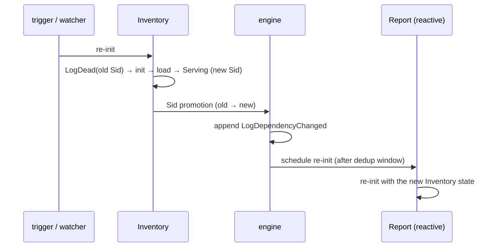

# Reactive cascade

When a producer process re-initialises, its [Sid](sid-and-clock.md) changes.
FOM can automatically re-initialise the consumers that depend on it, in
dependency order. That propagation is the **reactive cascade**.

## Reactive vs stable

Each dependency edge is one of two kinds:

| Kind | Created by | On producer Sid change |
|---|---|---|
| **Reactive** | `add(..., "Producer")`, `Dependency.reactive("Producer")` | consumer re-initialises |
| **Stable** | `Dependency.stable("Producer")` (via `addDeps`) | nothing — consumer keeps its state |

Use **reactive** when the consumer's state is derived from the producer and must
stay consistent. Use **stable** when the consumer reads the producer once at
init and doesn't care about later changes.

```java
new GraphBuilder()
    .add("Inventory", InventoryInit::new, InventoryInit::new)
    .addDeps("Report", ReportInit::new, ReportInit::new,
             Dependency.reactive("Inventory"))   // re-run Report when Inventory changes
    .addDeps("Audit",  AuditInit::new,  AuditInit::new,
             Dependency.stable("Inventory"))      // Audit snapshots Inventory once
    .build();
```

## How a cascade propagates



1. `Inventory` re-initialises and is promoted from its old Sid to a new one.
2. The engine appends a `LogDependencyChanged` recording the transition.
3. For each **reactive** consumer, the engine schedules a re-init.
4. A consumer that is itself a producer cascades further — propagation follows
   the DAG.

## The dedup window

Re-inits for a process are debounced by the **dedup window**
(`EngineConfig.dedupWindow`, default 100 ms). Multiple changes arriving within
the window **collapse into a single re-init**:

- The first change schedules a re-init after `dedupWindow`.
- Further changes within the window are counted but don't add work.
- When the window fires, one re-init runs; if more than one change collapsed,
  the observer's `onDedupCollapsed(process, count)` is called.

This prevents a burst of upstream changes (or a fan-in diamond where several
producers change at once) from re-running a consumer many times in a row. The
window must be strictly positive; set it small (e.g. 1 ms) to effectively
disable debouncing.

## Initial install vs later changes

On the **initial** graph install there is no cascade: consumers haven't been
spawned yet, and each is started fresh in topological order. The cascade only
fires on *subsequent* Sid promotions — triggers, watchers, upstream re-inits,
and [graph swaps](graph-swap.md).
