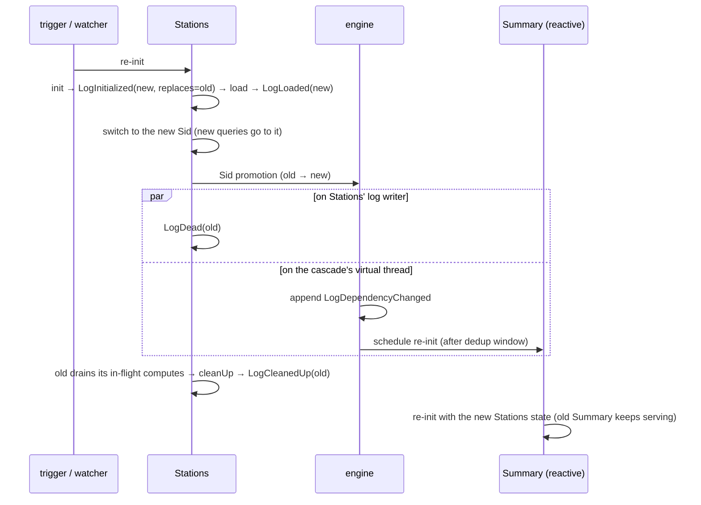

# Reactive cascade

When a producer process re-initialises, its [Sid](sid-and-clock.md) changes.
FOM can automatically re-initialise the consumers that depend on it, in
dependency order. That propagation is the **reactive cascade**.

## Reactive vs stable

Each dependency edge is one of two kinds:

| Kind | Created by | On producer Sid change |
|---|---|---|
| **Reactive** | `add(..., "Producer")`, `Dependency.reactive("Producer")` | consumer re-initialises |
| **Stable** | `Dependency.stable("Producer")` (via `addDeps`) | nothing — consumer keeps its state |

Use **reactive** when the consumer's state is derived from the producer and must
stay consistent. Use **stable** when the consumer reads the producer once at
init and doesn't care about later changes.

```java
new GraphBuilder()
    .add("Stations", StationsInit::new, StationsInit::new)
    .addDeps("Summary", SummaryInit::new, SummaryInit::new,
             Dependency.reactive("Stations"))   // re-run Summary when Stations changes
    .addDeps("Audit",  AuditInit::new,  AuditInit::new,
             Dependency.stable("Stations"))      // Audit snapshots Stations once
    .build();
```

## How a cascade propagates


```mermaid
sequenceDiagram
    participant T as trigger / watcher
    participant I as Stations
    participant E as engine
    participant R as Summary (reactive)
    T->>I: re-init
    I->>I: init → LogInitialized(new, replaces=old) → load → LogLoaded(new)
    I->>I: switch to the new Sid (new queries go to it)
    I->>E: Sid promotion (old → new)
    par on Stations' log writer
        I->>I: LogDead(old)
    and on the cascade's virtual thread
        E->>E: append LogDependencyChanged
        E->>R: schedule re-init (after dedup window)
    end
    I->>I: old drains its in-flight computes → cleanUp → LogCleanedUp(old)
    R->>R: re-init with the new Stations state (old Summary keeps serving)
```

The promotion is announced first, as soon as the new version serves. The old
version's `LogDead` is then appended on `Stations`' own log writer, concurrently
with the cascade's `LogDependencyChanged` records — the two are not ordered
against each other. The old version is cleaned up (and its `LogCleanedUp`
written) only once it has finished the computes it had already started.

1. `Stations` re-initialises and is promoted from its old Sid to a new one.
   With the default `ReinitStrategy.KEEP_OLD` the old version answers queries
   until that moment; under `RELEASE_FIRST` it is retired first and queries
   wait. See [Re-initialisation](process-lifecycle.md#re-initialisation).
2. The engine appends a `LogDependencyChanged` recording the transition — one
   per running reactive consumer, each before that consumer's trigger.
3. For each **reactive** consumer, the engine schedules a re-init. The consumer
   is replaced the same way: its old version serves until the new one, built on
   the new `Stations`, is loaded.

   Steps 2–3 run on a virtual thread of their own, not on the producer's
   dispatcher: each record is a log append (an `fsync` on the file backend), and
   a wide cascade would otherwise keep the producer from answering queries for
   as long as it takes to write them all. Since each consumer's record still
   precedes its trigger, a restart replays exactly the re-inits that had not
   happened yet.
4. A consumer that is itself a producer cascades further — propagation follows
   the DAG.

The cascade starts at the **promotion**, not at the trigger: while `Stations`
is still building its new version, consumers are not touched, and if that
re-init fails `Stations` keeps serving the old version and no cascade happens.

A trigger or dependency change that reaches a process **while it is already
being replaced** does not interrupt the replacement: it is remembered and runs
as one more re-init right after the new version starts serving (several such
requests merge into one). A consumer mid-replacement still gets its
`LogDependencyChanged` — it has a live Sid, the old one — so it ends on the
new producer state even if its own re-init had already read the old one.

A reactive consumer **removed while the cascade runs** (`remove`, a
graph swap without it) is simply skipped: the cascade goes on to the remaining
consumers.

Besides a re-init, the cascade also fires when a producer whose `load` failed
[falls back to a fresh `init`](process-lifecycle.md#retries-backoff-timeouts)
(its state may already have been served), and when a
[graph swap](graph-swap.md) changes a node while it is re-initialising.

## The dedup window

Re-inits for a process are debounced by the **dedup window**
(`EngineConfig.dedupWindow`, default 100 ms). Multiple changes arriving within
the window **collapse into a single re-init**:

- The first change schedules a re-init after `dedupWindow`.
- Further changes within the window are counted but don't add work.
- When the window fires, one re-init runs; if more than one change collapsed,
  the observer's `onDedupCollapsed(process, count)` is called.

This prevents a burst of upstream changes (or several producers that change
within the same window) from re-running a consumer many times in a row. The
window must be strictly positive; set it small (e.g. 1 ms) to effectively
disable debouncing.

!!! note "Diamonds are eventually consistent, not coordinated"
    Suppose `Summary` depends reactively on both `Alerts` and `Stations`, and
    `Alerts` itself depends reactively on `Stations`. The engine does not
    coordinate the two paths: under a burst of triggers `Summary` can re-initialise
    after `Stations` changed but before `Alerts` has caught up, so it is
    transiently built from **different producer versions**. Each further change
    schedules another re-init, so `Summary` converges once the triggers stop.

    The dedup window does **not** merge the two paths either. A single change of
    `Stations` always re-initialises `Summary` **twice**: once through the
    direct edge, one `dedupWindow` after the change, and again through
    `Alerts`, whose own re-init is itself delayed by a window and whose new Sid
    only then schedules `Summary` for another window. The two changes of `Summary`
    are at least a window apart, so they never collapse into one.

## Initial install vs later changes

On the **initial** graph install there is no cascade: consumers haven't been
spawned yet, and each starts as soon as its own dependencies serve (independent
branches start in parallel). The cascade only
fires on *subsequent* Sid promotions — triggers, watchers, upstream re-inits,
and [graph swaps](graph-swap.md).

A **restart** keeps reactive edges consistent all the same. When the engine
installs the first graph after a JVM start, a reactive consumer counts as built
on retired state if its reactive dependency cold-inits at that start (e.g. its
`param` or dependencies changed between runs — transitively down the chain), if
the dependency's live `LogInitialized` is newer than the consumer's (the engine
stopped after the producer re-initialised but before the cascade reached the
consumer), or if the dependency's warm `load` fails at that start and it falls
back to a fresh `init` before the consumer has started. Such a consumer
warm-loads and serves the state it has, then re-initialises in the background
once it serves. Under `ReinitStrategy.RELEASE_FIRST` it cold-inits instead. A
paused consumer is marked stale and re-inits on resume. See
[Idempotent restart](idempotent-restart.md#what-invalidates-a-warm-start).
