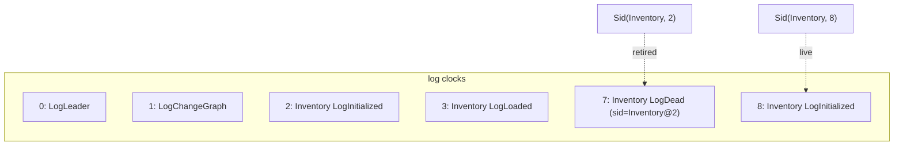

# Sid & clock

## Clock

The log is a dense, 0-based sequence. The **clock** of an event is its position:
the first event in an empty log has clock `0`, the next `1`, and so on. Clocks
are assigned by the [log backend](the-log.md) at append time — the caller does
not pick them.

!!! note "Backend-assigned clocks"
    When you append an event, its `clock`/`timestamp`/`formatVersion` fields are
    advisory. The backend overwrites `clock` with the next position and returns
    the rewritten event. This is handled uniformly by `ClockRewriter`, so all
    backends (in-memory, file, Postgres) agree on the contract: **first event =
    clock 0**.

## Sid

A **Sid** (`io.fom.Sid`) is the stable identifier of a *specific version* of a
process's state:

```java
public record Sid(String processName, int clock) { }
```

It pairs the process name with the clock at which that version's
`LogInitialized` was committed. Two states of the same process initialised at
different times are **different Sids**.



Above, `Inventory` was first initialised at clock 2 (`Sid(Inventory, 2)`). After
a re-init it is retired with `LogDead` at clock 7 and a new `Sid(Inventory, 8)`
becomes live.

## Why it matters

- **Routing & answers.** A query is served by whichever Sid is live when it is
  dispatched. The Sid uniquely says *which version answered*.
- **Reactive cascade.** When a producer's Sid changes (promotion from the old
  Sid to a new one), the engine fires the [cascade](reactive-cascade.md) to its
  reactive consumers, recording the transition as `LogDependencyChanged`.
- **Idempotent restart.** On restart the engine warm-loads the latest
  *non-retired* `LogInitialized` per process — i.e. the Sid whose clock has no
  later `LogDead`. See [Idempotent restart](idempotent-restart.md).

## In code

The current Sid of a process is visible via introspection
(`EngineReport.NodeReport.currentSid()`), inside user code via
`QueryableContext.sid()` / `ProcessContext.sid()`, and through observer
callbacks (`onSidPromotion`, `onInitCompleted`, …).
