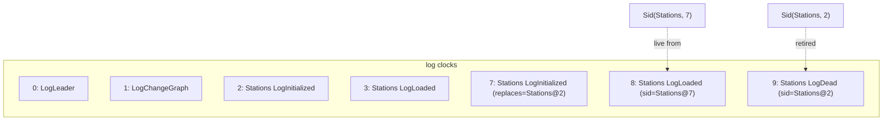

# Sid & clock

## Clock

Every event carries a **clock**: a monotonic counter assigned by the
[log backend](the-log.md) at append time — the caller does not pick it. The
first event in an empty log has clock `0`; each append gets the last event's
clock **+ 1**. Clocks strictly increase and are **never reused**, not even after
a [snapshot](snapshots.md) — as long as the log only moves forward.

!!! warning "Rewinding the log reissues clocks"
    The next clock is always computed from the log as it is *now*. Restoring an
    older copy of the log — an [archive](snapshots.md#restoring-an-archive) or a
    backup — or truncating it by hand rewinds the clock: the engine continues
    after that copy's last clock, so the clocks and Sids of the discarded
    timeline are **issued again**, for different events. Do not treat a Sid
    recorded before such a restore as naming the same state afterwards.

!!! note "Backend-assigned clocks"
    When you append an event, its `clock`/`timestamp`/`formatVersion` fields are
    advisory. The backend overwrites `clock` with
    `LogClocks.nextClock(lastEvent)` (last clock + 1, or `0` in an empty log)
    and returns the rewritten event, so all backends (in-memory, file, Postgres)
    agree on the contract.

A clock is not a **timestamp** either. An event's `timestamp` is taken with
`System.currentTimeMillis()` where the event is *created*, not when it is
appended, so under concurrent appends timestamps can go backwards while clocks
keep increasing. The clock is the ordering; the timestamp is wall-clock context.

A clock is not a **position**. `LogBackend.get`/`getBetween` address events by
position `[0, length())`. In a log that was never compacted the two coincide;
after a compaction the log is shorter but keeps the original clocks, so clocks
have gaps and differ from positions.

## Sid

A **Sid** (`io.fom.Sid`) is the stable identifier of a *specific version* of a
process's state:

```java
public record Sid(String processName, long clock) { }
```

The clock is a `long`. Clocks are permanent and never renumbered, so over a
long deployment they keep growing even when compaction keeps the log itself
small — past `Integer.MAX_VALUE` eventually. A `long` never realistically
overflows. Log *positions* stay `int`: they index a compacted log, which is small.

It pairs the process name with the clock at which that version's
`LogInitialized` was committed. Two states of the same process initialised at
different times are **different Sids**.


```mermaid
graph TD
  subgraph "log clocks"
    L0["0: LogLeader"]
    L1["1: LogChangeGraph"]
    L2["2: Stations LogInitialized"]
    L3["3: Stations LogLoaded"]
    L7["7: Stations LogInitialized (replaces=Stations@2)"]
    L8["8: Stations LogLoaded (sid=Stations@7)"]
    L9["9: Stations LogDead (sid=Stations@2)"]
  end
  S1["Sid(Stations, 2)"] -.retired.-> L9
  S2["Sid(Stations, 7)"] -.live from.-> L8
```

Above, `Stations` was first initialised at clock 2 (`Sid(Stations, 2)`). A
re-init writes the new version at clock 7 (`Sid(Stations, 7)`) while
`Stations@2` keeps serving; the `LogLoaded` at clock 8 makes `Stations@7` the
live one, and `Stations@2` is retired with `LogDead` at clock 9. Under
`ReinitStrategy.RELEASE_FIRST` the `LogDead` of the old Sid comes first and the
new `LogInitialized` after it (see [The log](the-log.md#reinit-events)).

## Why it matters

- **Routing & answers.** A query is served by whichever Sid serves when it is
  dispatched. The Sid uniquely says *which version answered*. During a re-init
  that is the old Sid until the new one is loaded; a compute the old version
  started finishes on it even after the switch.
- **Reactive cascade.** When a producer's Sid changes (promotion from the old
  Sid to a new one), the engine fires the [cascade](reactive-cascade.md) to its
  reactive consumers, recording the transition as `LogDependencyChanged`.
- **Idempotent restart.** On restart the engine warm-loads the live
  `LogInitialized` per process — the newest one that is not retired and, if it
  replaces another, has its `LogLoaded`. A written but unloaded replacement (a
  *candidate*) is loaded after the old one serves (under `RELEASE_FIRST` it is
  retired and the node cold-inits instead). See
  [Idempotent restart](idempotent-restart.md).

## In code

The current Sid of a process is visible via introspection
(`EngineReport.NodeReport.sid()`), inside user code via
`QueryableContext.sid()` / `ProcessContext.sid()`, and through observer
callbacks (`onSidPromotion`, `onInitCompleted`, …). `onSidPromotion` fires once
per new Sid; see [Observability](../guides/observability.md) for its
`previousSid`.

While a process is being re-initialised, `NodeReport.sid()` is the Sid that
answers queries — the old one — and `NodeReport.replacement()` says the new
version is `"Initializing"` or `"Loading"`. The new version's Sid (the
candidate) exists from its `LogInitialized` on: `onInitCompleted` reports it,
its `load` sees it in `ctx.sid()`, and `Engine.cancelInit(Sid)` takes it. The
serving version's Sid cancels nothing. `NodeReport.sid()` moves to the new Sid at
the switch, when `onSidPromotion(old, new)` fires.

Inside `init` there is no Sid yet: the Sid of the new state is its
`LogInitialized`'s clock, and that record is appended only after `init`
returns. So a cold init or a re-init sees a placeholder, `ctx.sid()` ==
`Sid(name, 0)`, even while the old version serves beside it (an `init` that
runs because loading the persisted state kept failing sees the Sid of that
state instead). Don't persist or compare it; the
real Sid is visible from `load` on.

## Sids across compaction

A Sid is **permanent**: it never repeats and never goes backwards, including
across snapshots (unless the log itself is rewound — see
[above](#clock)). A [snapshot](snapshots.md) keeps each live `LogInitialized`
(and a candidate still waiting to be loaded) with its **original** clock, so a process keeps its Sid through the snapshot
(no Sid change, no promotion), and a restart on the compacted log loads the
state under that same Sid. Events appended after the snapshot continue after the
highest clock the log ever used.

A Sid's clock is an identity, not a log position: don't pass it to
`LogBackend.get` — after a compaction the event sits at a smaller position.
