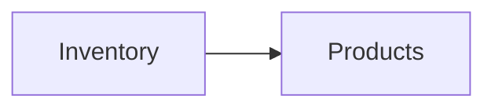

# Your first graph

The [quickstart](quickstart.md) had a single node. Real value comes from
**dependencies**: one process consumes another, and changes propagate.

We'll build two processes:

- **`Inventory`** — owns a catalogue of stock levels.
- **`Products`** — depends on `Inventory` and serves a denormalised product
  view built from it.



## Declaring the dependency

A dependency is just the producer's name passed to `add(...)`:

```java
Graph graph = new GraphBuilder()
    .add("Inventory", InventoryInit::new, InventoryInit::new)
        .handles(GetStock.class)
    .add("Products", ProductsInit::new, ProductsInit::new, "Inventory") // (1)!
        .handles(GetProductModel.class)
    .build();
```

1. The trailing `"Inventory"` declares `Products` depends on `Inventory`. Names
   passed this way become **reactive** dependencies (see below). The graph is
   spawned in topological order, so `Inventory` reaches `Serving` before
   `Products` starts.

## Querying a dependency during init/load

Because `Inventory` is live before `Products` starts, `Products`' `init`/`load`
can query it through the `QueryableContext`:

```java
final class ProductsInit implements ProcessInitializer, ProcessLoader {

    @Override
    public CompletionStage<Map<String, byte[]>> init(QueryableContext ctx) {
        // Query the declared dependency by name.
        return ctx.query("Inventory", new GetStock("PUB1"))
            .thenApply(stock -> Map.of("model", buildModel((Stock) stock)));
    }

    @Override
    public CompletionStage<Process> load(QueryableContext ctx, Map<String, byte[]> props) {
        byte[] model = props.get("model");
        Process live = (c, q) -> CompletableFuture.completedFuture(decode(model));
        return CompletableFuture.completedFuture(live);
    }
}
```

!!! warning "Only declared dependencies are queryable"
    `ctx.query("Inventory", …)` works only because `Products` declared
    `Inventory` as a dependency. Querying an undeclared process throws — this
    keeps the dependency graph honest and the topological spawn order correct.

## Reactive vs stable dependencies

The trailing-name form (`add(..., "Inventory")`) creates a **reactive**
dependency: when `Inventory`'s state changes, `Products` automatically
re-initialises. To opt out — a dependency you read once but don't want to track
— use an explicit `Dependency.stable(...)` via `addDeps`:

```java
import io.fom.Dependency;

new GraphBuilder()
    .add("Inventory", InventoryInit::new, InventoryInit::new)
    .addDeps("Products", ProductsInit::new, ProductsInit::new,
             Dependency.stable("Inventory"))   // read once, no cascade
    .build();
```

See [Reactive cascade](../concepts/reactive-cascade.md) for the full behaviour,
including how rapid changes are collapsed by the dedup window.

## Triggering a change

Force `Inventory` to re-initialise (e.g. its upstream source changed):

```java
engine.trigger("Inventory", new RefreshSignal("nightly"));
```

Because `Products` reactively depends on `Inventory`, it re-initialises too,
in order. To poll an external source automatically instead of triggering by
hand, register a [watcher](../concepts/triggers-and-watchers.md).

## The same graph in Kotlin

```kotlin
val graph = graph {
    process("Inventory", ::InventoryInit, ::InventoryInit)
        .handles<GetStock>()
    process("Products", ::ProductsInit, ::ProductsInit, dependsOn = listOf("Inventory"))
        .handles<GetProductModel>()
}
```

See the [Kotlin DSL guide](../guides/kotlin-dsl.md).
