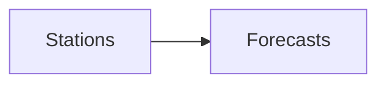

# Your first graph

The [quickstart](quickstart.md) had a single node. Real value comes from
**dependencies**: one process consumes another, and changes propagate.

We'll build two processes:

- **`Stations`** — owns the latest station readings.
- **`Forecasts`** — depends on `Stations` and serves a forecast built from
  those readings.


```mermaid
graph LR
  Stations --> Forecasts
```

## Declaring the dependency

A dependency is just the producer's name passed to `add(...)`:

```java
Graph graph = new GraphBuilder()
    .add("Stations", StationsInit::new, StationsInit::new)
        .handles(GetReadings.class)
    .add("Forecasts", ForecastsInit::new, ForecastsInit::new, "Stations") // (1)!
        .handles(GetForecastModel.class)
    .build();
```

1. The trailing `"Stations"` declares `Forecasts` depends on `Stations`. Names
   passed this way become **reactive** dependencies (see below). A node starts
   only once all its dependencies serve, so `Stations` reaches `Serving` before
   `Forecasts` starts (nodes without a dependency between them start
   concurrently).

## Querying a dependency during init/load

Because `Stations` is live before `Forecasts` starts, `Forecasts`' `init`/`load`
can query it through the `QueryableContext`:

```java
import io.fom.api.Process;   // not java.lang.Process

final class ForecastsInit implements ProcessInitializer, ProcessLoader {

    @Override
    public CompletionStage<Map<String, byte[]>> init(QueryableContext ctx) {
        // Query the declared dependency by name.
        return ctx.query("Stations", new GetReadings("ST-1"))
            .thenApply(readings -> Map.of("model", buildModel((Readings) readings)));
    }

    @Override
    public CompletionStage<Process> load(QueryableContext ctx, Map<String, byte[]> props) {
        byte[] model = props.get("model");
        Process live = (c, q) -> CompletableFuture.completedFuture(decode(model));
        return CompletableFuture.completedFuture(live);
    }
}
```

The `Process` above is a lambda, so it implements only `compute`. The whole
`io.fom.api.Process` contract is two methods:

```java
CompletionStage<?> compute(QueryableContext ctx, Object query);

default CompletionStage<Void> cleanUp(ProcessContext ctx) {
    return CompletableFuture.completedFuture(null);
}
```

Override `cleanUp` (which needs a class, not a lambda) whenever the `Process`
holds something to release — a connection, a temp file, an open transaction. It
runs when this `Sid` is retired, on `close()` and on `cancelInit`, with its own
`cleanupTimeout`; see
[Process lifecycle](../concepts/process-lifecycle.md#retries-backoff-timeouts).

!!! note "`load` must honour cancellation"
    The engine `cancel(true)`s the stage `load` returned as soon as the load is
    no longer wanted (a cancelled start, a pause, a removal, a graph swap,
    `close()`), or when it outruns `loadTimeout`. A loader that ignores
    that and completes later loses its `Process`: the engine calls `cleanUp` on
    it and never serves it. See
    [the load cancellation contract](../concepts/process-lifecycle.md#load-cancellation).

!!! warning "Only declared dependencies are queryable"
    `ctx.query("Stations", …)` works only because `Forecasts` declared
    `Stations` as a dependency. Querying an undeclared process throws
    `UndeclaredDependencyException` (a `QueryException`) — "No such dependency:
    &lt;name&gt;; declared: [&lt;the names it did declare&gt;]" — even for a name
    that *is* in the graph. This keeps the dependency graph honest and the
    spawn order correct.

    The failure is treated as **permanent**: no graph will grow the dependency
    by itself, so when it happens in `init` or `load` the engine does **not**
    back off and retry (nor fall back from `load` to a fresh `init`) — also when
    your own code caught, wrapped and rethrew it. The process fails immediately
    and `newGraph` throws this exception, instead of burning the whole
    `initTimeout` on retries and surfacing as an
    `InitializationTimeoutException` that says nothing about the real cause. The
    message naming what *is* declared is usually enough to spot the typo or the
    missing `.add(…, "Stations")`. Only the node that made the typo (the
    exception's `requester()`) is failed for good: its consumers see a
    dependency failure and retry as usual
    ([details](../reference/exceptions.md#undeclared-dependency-in-init)).

## Reactive vs stable dependencies

The trailing-name form (`add(..., "Stations")`) creates a **reactive**
dependency: when `Stations`'s state changes, `Forecasts` automatically
re-initialises. To opt out — a dependency you read once but don't want to track
— use an explicit `Dependency.stable(...)` via `addDeps`:

```java
import io.fom.Dependency;

new GraphBuilder()
    .add("Stations", StationsInit::new, StationsInit::new)
    .addDeps("Forecasts", ForecastsInit::new, ForecastsInit::new,
             Dependency.stable("Stations"))   // read once, no cascade
    .build();
```

See [Reactive cascade](../concepts/reactive-cascade.md) for the full behaviour,
including how rapid changes are collapsed by the dedup window.

## Triggering a change

Force `Stations` to re-initialise (e.g. its upstream source changed):

```java
engine.trigger("Stations", new RefreshSignal("nightly"));
```

Because `Forecasts` reactively depends on `Stations`, it re-initialises too,
in order. To poll an external source automatically instead of triggering by
hand, register a [watcher](../concepts/triggers-and-watchers.md).

## The same graph in Kotlin

```kotlin
val graph = graph {
    process("Stations", ::StationsInit, ::StationsInit)
        .handles<GetReadings>()
    process("Forecasts", ::ForecastsInit, ::ForecastsInit, dependsOn = listOf("Stations"))
        .handles<GetForecastModel>()
}
```

See the [Kotlin DSL guide](../guides/kotlin-dsl.md).
