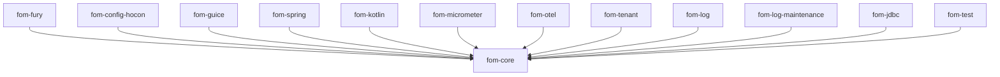

# Modules

FOM is a multi-module build. `fom-core` is the only required dependency;
everything else is optional and additive.

| Module | JPMS name | Depends on | Purpose |
|---|---|---|---|
| **fom-core** | `io.fom.core` | slf4j only | Runtime: `Engine`, `ProcessFSM`, `GraphMachine`, graph/builder, log SPI + `InMemory`/`LocalFile` backends, `JavaSerializableSerDe`, snapshots, triggers/watchers, reactive cascade, in-place graph swap, hot-reload, `EngineObserver` SPI |
| **fom-fury** | `io.fom.fury` | fom-core, Apache Fury | `FurySerDe` — compact, fast, schema-evolution-friendly binary serializer (**recommended for prod**) |
| **fom-config-hocon** | `io.fom.config.hocon` | fom-core, Typesafe Config, cron-utils | Parse `EngineConfig` from HOCON; Quartz cron → `SnapshotPolicy.FixedInterval` |
| **fom-guice** | `io.fom.guice` | fom-core, Guice | `GuiceFactories` — serializable suppliers resolving Guice bindings |
| **fom-spring** | `io.fom.spring` | fom-core, spring-context | `SpringFactories` — serializable suppliers resolving Spring beans |
| **fom-kotlin** | _(automatic module)_ | fom-core, kotlinx-coroutines | `graph { }` DSL, `SuspendingProcess`, suspend extensions |
| **fom-micrometer** | `io.fom.micrometer` | fom-core, Micrometer | `MicrometerEngineObserver` — counters/timers |
| **fom-otel** | `io.fom.otel` | fom-core, OpenTelemetry | `OtelEngineObserver` — spans for init/load/query |
| **fom-tenant** | `io.fom.tenant` | fom-core | `TenantAwareEngine` — per-tenant authz + lifecycle |
| **fom-log** | _(automatic module)_ | fom-core, picocli | Standalone CLI: `inspect`, `diagnose`, `migrate` |
| **fom-log-maintenance** | `io.fom.log.maintenance` (pkg `io.fom.maintenance`) | fom-core | `SizeBasedSnapshotPolicy`, `CompositeSnapshotPolicy` |
| **fom-jdbc** | `io.fom.jdbc` | fom-core, postgresql | `PostgresLogBackend` — multi-node leader coordination (advisory lock) |
| **fom-test** | `io.fom.test` | fom-core | `InterruptContractTest` — reusable interrupt-safety contract |

## Dependency direction

Everything points at `fom-core` and nothing else points across — you can adopt
any subset without pulling in serializers, DI, or databases you don't use.

## Key types by package (fom-core)

| Package | Highlights |
|---|---|
| `io.fom` | `Engine`, `EngineConfig`, `Graph`, `GraphBuilder`, `ProcessNode`, `Dependency`, `QueryRoute`, `Sid`, `ScheduledWatcher`, `SnapshotPolicy`, `EngineReport`, `Properties`/`TypedKey`/`Codec`/`Codecs`, `SerializableSupplier`/`SerializableFunction` |
| `io.fom.api` | `Process`, `ProcessInitializer`/`ProcessLoader` (+ `Param…` variants), `QueryableContext`, `ProcessContext`, `Routable`, `EngineObserver`, exceptions |
| `io.fom.log` | `LogBackend`, the `Log*` event records, `InMemoryLogBackend`, `LocalFileLogBackend`, `LogBackendReport` |
| `io.fom.serde` | `SerDe`, `JavaSerializableSerDe`, `ObjectInputFilters` |
