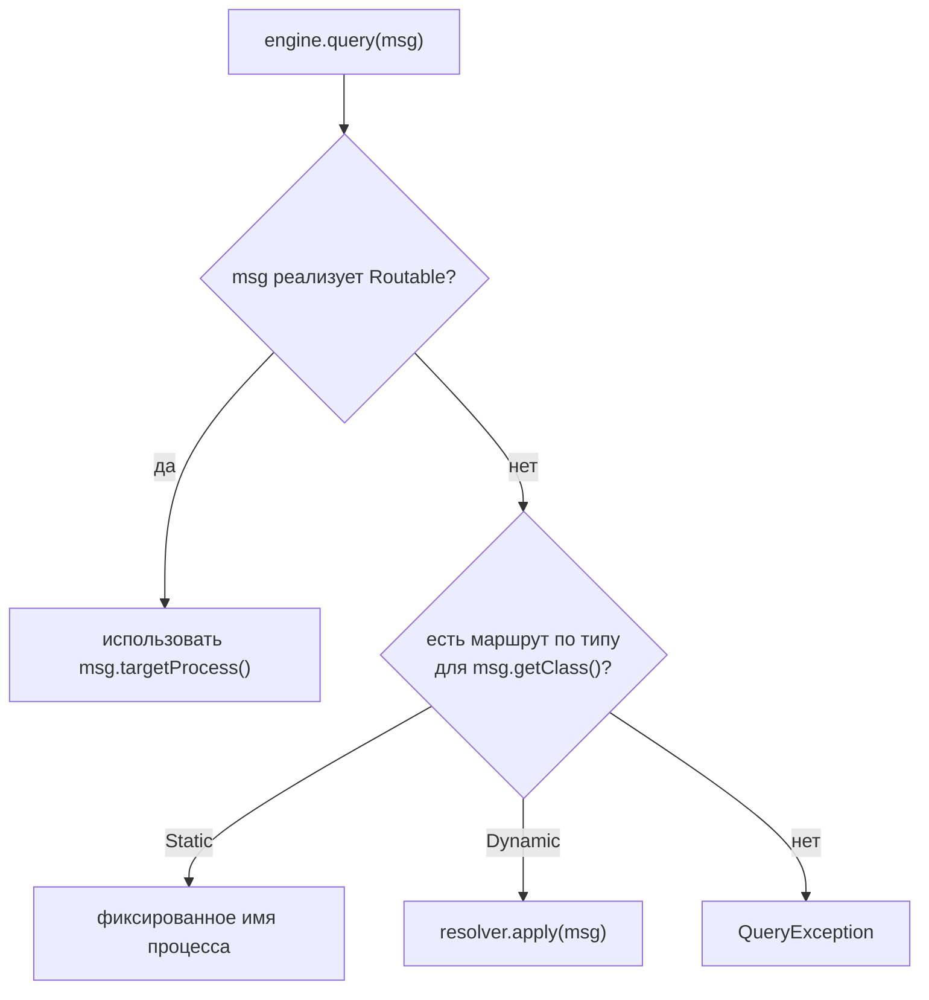

# Граф и маршрутизация

## Граф

`Graph` — это неизменяемое, провалидированное описание ваших процессов:

- **nodes** — по одному `ProcessNode` на процесс: имя, зависимости,
  опциональный типизированный `param`, фабрики `init`/`load`.
- **typeRouting** — отображение класса запроса в `QueryRoute` (как найти целевой
  процесс для запроса этого типа).
- **top** — последний добавленный узел (удобная ссылка).

Компактный конструктор валидирует граф сразу и бросает
`IllegalArgumentException` при:

- зависимости на неизвестный процесс,
- **цикле** (граф должен быть DAG),
- статическом маршруте на неизвестный процесс.

`Graph.topologicalOrder()` возвращает узлы **сначала зависимости** — порядок, в
котором движок их запускает, чтобы `init`/`load` потребителя мог обратиться к уже
`Serving` зависимости.

## Построение графа

Используйте `GraphBuilder`:

```java
Graph g = new GraphBuilder()
    .add("A", AInit::new, AInit::new)                 // без зависимостей
    .add("B", BInit::new, BInit::new, "A")            // B зависит от A (реактивно)
    .addDeps("C", CInit::new, CInit::new,             // явные виды зависимостей
             Dependency.reactive("A"), Dependency.stable("B"))
    .addWithParam("Tenant_X", TInit::new, TInit::new, // параметризованный узел
                  new TenantParam("X"))
    .build();
```

| Метод | Зависимости | Param |
|---|---|---|
| `add` | имена → все **реактивные** | — |
| `addDeps` | явные значения `Dependency` | — |
| `addWithParam` | имена → все **реактивные** | да (`ParamProcessInitializer/Loader`) |
| `addWithParamDeps` | явные значения `Dependency` | да |

См. [Реактивный каскад](reactive-cascade.md) о реактивных и стабильных.

## Маршрутизация запроса

`engine.query(msg)` разрешает целевой процесс в порядке приоритета:



1. **`Routable`** — если сообщение реализует `io.fom.api.Routable`, побеждает его
   `targetProcess()`. Лучше всего для multi-tenant сообщений, несущих собственный
   адрес.
2. **Маршрутизация по типу** — иначе движок ищет `msg.getClass()` (точное
   совпадение) в `typeRouting` графа:
    - `QueryRoute.Static(name)` — фиксированная цель, регистрируется через
      `.handles(MsgType.class)`.
    - `QueryRoute.Dynamic(resolver)` — резолвер вычисляет имя на каждый запрос,
      регистрируется через `.route(MsgType.class, resolver)`.
3. **Нет совпадения** — `QueryException`.

`engine.queryProcess(name, msg)` обходит всё это и адресует процесс напрямую.

### Статические маршруты

```java
new GraphBuilder()
    .add("Orders", OrdersInit::new, OrdersInit::new)
        .handles(GetOrder.class, ListOrders.class)   // оба → "Orders"
    .build();
```

`.handles(...)` нацеливается на последний добавленный узел. Чтобы привязать
маршруты к узлу по имени независимо от порядка добавления, используйте
`.handlesFor("Orders", GetOrder.class)`.

### Динамические маршруты

```java
new GraphBuilder()
    .add("Inventory_PUB1", …)
    .add("Inventory_PUB2", …)
    .route(GetInventory.class, q -> "Inventory_" + ((GetInventory) q).pub())
    .build();
```

Резолвер должен быть `SerializableFunction`, потому что сериализуется вместе с
графом в лог. (DSL Kotlin `route { … }` делает это за вас — см.
[руководство по Kotlin DSL](../guides/kotlin-dsl.md).)

### Routable-сообщения

```java
record GetInventory(String pub) implements Routable, Serializable {
    public String targetProcess() { return "Inventory_" + pub; }
}
```

`Routable` всегда побеждает маршрутизацию по типу, так что запись маршрута для них
не нужна.

## Межпроцессные запросы во время init/load

Внутри процесса `QueryableContext.query("Dep", msg)` запрашивает **объявленную**
зависимость. Запрос к необъявленному процессу падает — именно это гарантирует
достаточность топологического порядка запуска.

> [English version](../../concepts/graph-and-routing.md)
