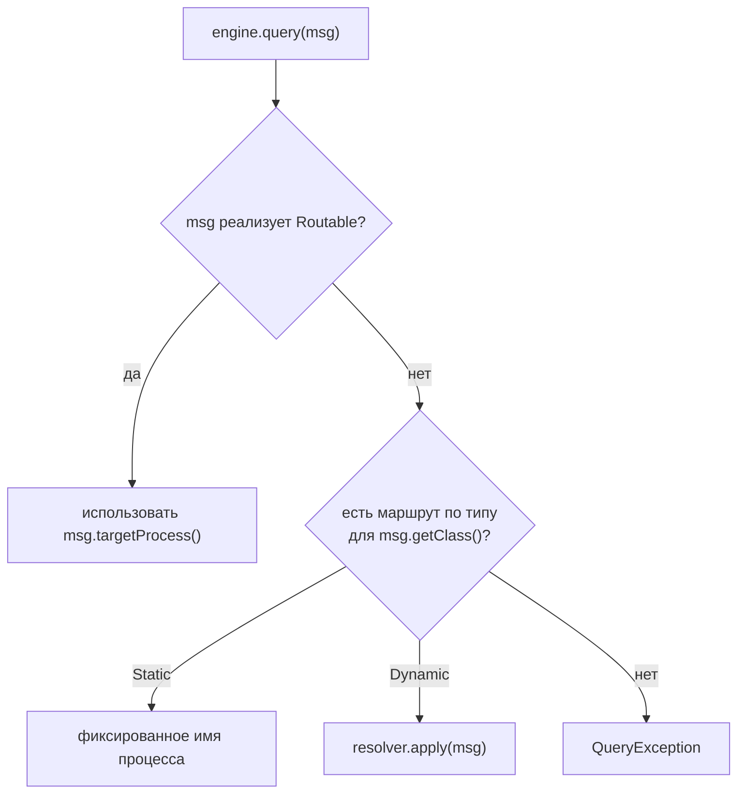

# Граф и маршрутизация

## Граф

`Graph` — это неизменяемое, провалидированное описание ваших процессов:

- **nodes** — по одному `ProcessNode` на процесс: имя, зависимости,
  опциональный типизированный `param`, фабрики `init`/`load`.
- **typeRouting** — отображение класса запроса в `QueryRoute` (как найти целевой
  процесс для запроса этого типа).
- **top** — последний добавленный узел (удобная ссылка).

Компактный конструктор валидирует граф сразу и бросает
`IllegalArgumentException` при:

- зависимости на неизвестный процесс,
- **цикле** (граф должен быть DAG),
- статическом маршруте на неизвестный процесс.

Имена проверяются раньше, при создании узла: пустое или состоящее из одних
пробелов имя процесса или зависимости отвергается с `IllegalArgumentException`
(«ProcessNode name must not be empty or blank», «dependency name must not be
empty or blank»), как и узел, дважды называющий одну и ту же зависимость, —
сообщение называет дубликат («ProcessNode '&lt;name&gt;' names dependency
'&lt;dep&gt;' more than once»). `GraphBuilder` отвергает имя процесса,
добавленное дважды («Duplicate process name: &lt;name&gt;»).

`Graph.topologicalOrder()` возвращает узлы **сначала зависимости** — порядок, в
котором движок их запускает, чтобы `init`/`load` потребителя мог обратиться к уже
`Serving` зависимости.

Между узлами, которые друг от друга **не** зависят, порядок этого *списка* не
произволен: `Graph` сохраняет **порядок вставки** той карты, из которой он
построен (узлы лежат в `LinkedHashMap`, намеренно не в копии с хеш-порядком),
поэтому `topologicalOrder()` **детерминирован** — один и тот же граф в любой JVM
возвращает один и тот же список.

!!! warning "Детерминированный порядок ≠ детерминированный порядок старта"
    Порядок *старта* — гарантия более слабая. `GraphMachine.startByDependencies` —
    им пользуются и первый `newGraph` (`startAll`), и каждая последующая смена
    графа (`applyGraphChange`) — идёт по этому списку, но старт каждого узла подвешивает на его зависимости
    (`thenComposeAsync(…, starter)` на executor'е «виртуальный поток на задачу»):
    узел стартует, как только всё, от чего он зависит, перешло в `Serving`, —
    поэтому узлы, **не связанные зависимостью, стартуют параллельно**.

    Что гарантировано:

    - узел не стартует раньше, чем каждая его зависимость окажется в `Serving`;
    - `topologicalOrder()` возвращает один и тот же список в любой JVM.

    Что **не** гарантировано: в каком порядке реально начнут два независимых
    узла. Их колбэки `onInitStarted` приходят почти каждый запуск в новой
    перестановке — не опирайтесь на этот порядок ни в продакшене, ни в тесте.
    Это верно для **любой** смены графа, а не только для первого `newGraph`:
    последующая смена запускает added- и changed-узлы ровно так же, как первая
    установка, — независимые параллельно. [Узел, который не запустился](graph-swap.md#если-узел-не-запустился),
    на обоих путях оставляет незапущенными только зависящие от него узлы, а не
    «всё, что идёт после него в списке».

## Построение графа

Используйте `GraphBuilder`:

```java
Graph g = new GraphBuilder()
    .add("A", AInit::new, AInit::new)                 // без зависимостей
    .add("B", BInit::new, BInit::new, "A")            // B зависит от A (реактивно)
    .addDeps("C", CInit::new, CInit::new,             // явные виды зависимостей
             Dependency.reactive("A"), Dependency.stable("B"))
    .addWithParam("Tenant_X", TInit::new, TInit::new, // параметризованный узел
                  new TenantParam("X"))
    .build();
```

| Метод | Зависимости | Param |
|---|---|---|
| `add` | имена → все **реактивные** | — |
| `addDeps` | явные значения `Dependency` | — |
| `addWithParam` | имена → все **реактивные** | да (`ParamProcessInitializer/Loader`) |
| `addWithParamDeps` | явные значения `Dependency` | да |

См. [Реактивный каскад](reactive-cascade.md) о реактивных и стабильных.

### Типизированные ссылки на процессы — `ProcessRef`

Процесс идентифицируется по **имени** — именно эта строка сохраняется в логе
(`Sid`, `LogInitialized`, …), поэтому долговечная идентичность — всегда имя.
Чтобы не разбрасывать строковые литералы по `add(...)`, спискам зависимостей и
`ctx.query(...)`, заведите по одной константе **`ProcessRef`** на процесс и
передавайте её. Билдер, обращения движка к конкретному процессу и контекст
принимают `ProcessRef` наравне с именем — `GraphBuilder.add`/`addWithParam`/`addDeps`/`addWithParamDeps`/`handlesFor`,
`Dependency.reactive`/`stable`, `Engine.queryProcess`/`trigger`/`remove`/`pause`/`resume`,
`QueryableContext.query`, а в Kotlin — `process`/`processWithParam`,
`queryProcessAwait` и `ctx.queryAwait`, — так что оба стиля совместимы:

```java
final class StationsInit implements ProcessInitializer, ProcessLoader {
    static final ProcessRef REF = ProcessRef.of("Stations");
    // …
}

new GraphBuilder()
    .add(StationsInit.REF, StationsInit::new, StationsInit::new)
        .handles(GetReadings.class)
    .add(ForecastsInit.REF, ForecastsInit::new, ForecastsInit::new,
         StationsInit.REF)          // зависимость по ссылке, не по строке
    .build();

// адресация процесса или зависимости:
engine.queryProcess(StationsInit.REF, msg);
engine.trigger(StationsInit.REF, signal);
ctx.query(StationsInit.REF, new GetReadings(stationId));   // внутри init/load/compute
```

`ProcessRef` — это исключительно compile-time удобство:
`ProcessRef.of("Stations")` оборачивает то же имя, что движок сохраняет, поэтому
формат на диске не меняется, а переименование самой *константы* никогда не влияет
на восстановление (влияет только смена строки). `Routable`-сообщение возвращает
имя через `REF.name()`.

Несколько API с именем пока принимают только строку; передавайте им `REF.name()`:
`Engine.trigger(Map)`, конструктор `ScheduledWatcher`, резолверы маршрутов
(`GraphBuilder.route`, Kotlin `route<Q>`) и, в `TenantAwareEngine` из
`fom-tenant`, пакетный `trigger(caller, Map)` и `Builder.globalProcesses`.
Его вызовы **с одним именем** `ProcessRef` принимают:
`queryProcess(caller, ref, msg)` — с таймаутом и без — и
`trigger(caller, ref, value)`, каждый с той же авторизацией, что и строковая
форма (см. [Мультитенантность](../guides/multi-tenancy.md#авторизованные-операции)).

`engine.query(msg)` разрешает целевой процесс в порядке приоритета:


```mermaid
graph TD
  Q["engine.query(msg)"] --> R{"msg реализует Routable?"}
  R -- да --> RT["использовать msg.targetProcess()"]
  R -- нет --> T{"есть маршрут по типу<br/>для msg.getClass()?"}
  T -- "Static" --> SP["фиксированное имя процесса"]
  T -- "Dynamic" --> DR["resolver.apply(msg)"]
  T -- нет --> X["QueryException"]
```

1. **`Routable`** — если сообщение реализует `io.fom.api.Routable`, побеждает его
   `targetProcess()`. Лучше всего для multi-tenant сообщений, несущих собственный
   адрес.
2. **Маршрутизация по типу** — иначе движок ищет `msg.getClass()` (точное
   совпадение) в `typeRouting` графа:
    - `QueryRoute.Static(name)` — фиксированная цель, регистрируется через
      `.handles(MsgType.class)`.
    - `QueryRoute.Dynamic(resolver)` — резолвер вычисляет имя на каждый запрос,
      регистрируется через `.route(MsgType.class, resolver)`.
3. **Нет совпадения** — `QueryException`.

Поскольку маршрутизация по типу сравнивает **точный** класс времени выполнения,
`GraphBuilder` отвергает — с `IllegalArgumentException` прямо при вызове
`.handles(...)` или `.route(...)` — тип запроса, который является интерфейсом,
абстрактным классом или примитивом: `getClass()` сообщения никогда не бывает
таким, и маршрут никогда бы не сработал. `Object.class` тоже отвергается: он
совпал бы лишь с голым `new Object()`, а не с «любым сообщением». Регистрируйте
каждый конкретный класс или делайте сообщение `Routable`. `Graph`, созданный
напрямую (не через `GraphBuilder`), проходит ту же проверку своего
`typeRouting`, так что обойти её этим путём не получится.

Одно исключение из «точного класса»: **константа enum с телом** (`PING { ... }`)
— анонимный подкласс своего enum, и её `getClass()` не совпадает с типом enum.
Движок маршрутизирует любую константу enum по её типу enum
(`getDeclaringClass()`), поэтому `.handles(Cmd.class)` ловит все константы `Cmd`
— с телом и без. Обратное отвергается: маршрут для класса тела константы
(`.handles(Cmd.PING.getClass())`) никогда бы не сработал, поэтому `GraphBuilder`
(и `Graph`, созданный напрямую) отклоняет его с `IllegalArgumentException`
(«Query type … is the body of an enum constant; register its enum … instead»).
Регистрируйте тип enum.

`engine.queryProcess(name, msg)` обходит всё это и адресует процесс напрямую.

Сообщения запросов передаются **по ссылке**: движок никогда их не сериализует и
не копирует (в лог они не пишутся), поэтому они не обязаны быть `Serializable`.
`compute` получает тот самый объект, который вы отправили, — возможно, позже,
если запрос был отложен в stash, пока узел инициализировался или загружался. Не
меняйте сообщение после отправки; безопасный выбор — неизменяемые записи.

### Статические маршруты

```java
new GraphBuilder()
    .add("Subscriptions", SubscriptionsInit::new, SubscriptionsInit::new)
        .handles(GetSubscription.class, ListSubscriptions.class)   // оба → "Subscriptions"
    .build();
```

`.handles(...)` нацеливается на последний добавленный узел. `.handlesFor("Subscriptions",
GetSubscription.class)` вместо этого называет цель по имени, поэтому позволяет привязать
маршруты к **любому уже добавленному узлу**, а не только к последнему: можно
добавить несколько узлов и затем вернуться к более раннему. Это не ссылка вперёд:
узел обязан к этому моменту уже существовать в builder'е, иначе `handlesFor`
бросает `IllegalArgumentException` («handlesFor(...) for unknown node: 'Subscriptions'»).

### Динамические маршруты

```java
new GraphBuilder()
    .add("Stations_PUB1", …)
    .add("Stations_PUB2", …)
    .route(GetStations.class, q -> "Stations_" + ((GetStations) q).pub())
    .build();
```

Резолвер — обычная `Function<Q, String>`. Как и фабрики init/load, он **никогда не
пишется в лог** — `LogChangeGraph` фиксирует только структуру графа (имена узлов,
зависимости и сериализованные параметры), — поэтому может захватывать что угодно.
После рестарта приложение заново устанавливает свой граф вместе с резолверами. У
типа запроса может быть только один маршрут: `.handles(...)` и `.route(...)` для
одного типа отклоняются с `IllegalArgumentException`. (В DSL Kotlin есть
`route<Q> { … }` — см. [руководство по Kotlin DSL](../guides/kotlin-dsl.md).)

### Routable-сообщения

```java
record GetStations(String pub) implements Routable, Serializable {
    public String targetProcess() { return "Stations_" + pub; }
}
```

`Routable` всегда побеждает маршрутизацию по типу, так что запись маршрута для них
не нужна.

## Межпроцессные запросы во время init/load

Внутри процесса `QueryableContext.query("Dep", msg)` запрашивает **объявленную**
зависимость. Запрос к необъявленному процессу падает — именно это гарантирует
достаточность топологического порядка запуска.

!!! warning "Внутри `compute` запрашивайте через `ctx`, а не через внешний `Engine`"
    `compute`, который вызывает внешний `Engine` (`engine.query(…)`,
    `engine.queryProcess(…)`) вместо `ctx.query(…)`, обходит проверку
    объявленных зависимостей — ничто не мешает ему запросить необъявленный
    процесс или **свой же** процесс, который топологический порядок не
    защищает. Объявите то, что нужно `compute`, зависимостью и используйте
    `ctx.query`.

    Дедлайны и отмена в обоих случаях одинаковы. Запрос, отправленный изнутри
    `compute` — через `ctx.query` или внешний `Engine`, в потоке, где выполняется
    `compute`, до того как он вернул свой stage, — привязан к вычисляемому
    запросу:

    - он наследует дедлайн этого запроса — `ctx.query` всегда, запрос через
      `Engine`, если этот дедлайн наступает раньше его собственного таймаута (через `Engine` он тогда падает с `TimeoutException` «Query
      to '&lt;name&gt;' did not complete within the deadline of the query whose
      compute sent it»; через `ctx.query` — «… within the deadline inherited
      from its calling query»); если этот дедлайн уже прошёл, запрос через
      `Engine` падает сразу, не будучи отправленным. Поскольку дедлайн у них
      общий, побеждает тот таймер, который сработал первым: вызывающий `Outer`
      может получить `TimeoutException` вложенного запроса — с именем `Inner`, а
      не `Outer`, — если `compute` у `Outer` передаёт эту ошибку дальше;
    - наблюдатели видят его как дочерний для этого запроса (`parentQueryId`);
    - он отменяется (`CancellationException` «the query that sent it is no
      longer waited for»), когда этот запрос падает — по таймауту, отмене или
      отказу.

    Эта привязка существует, только пока сам `compute()` выполняется в своём
    потоке (движок отслеживает выдавший запрос в thread-local, выставленном на
    время вызова). Запрос через внешний `Engine` из асинхронного продолжения —
    например, внутри `thenCompose` после того, как `compute` вернул stage, — к
    выдавшему запросу **не** привязан: у него свежий дедлайн, нет родителя и нет
    отмены. `ctx.query` несёт дедлайн (и id родителя) в самом контексте, поэтому
    наследует дедлайн и в асинхронных продолжениях; для всего, что запрашивает
    `compute`, используйте `ctx.query`.

> [English version](../../concepts/graph-and-routing.md)
