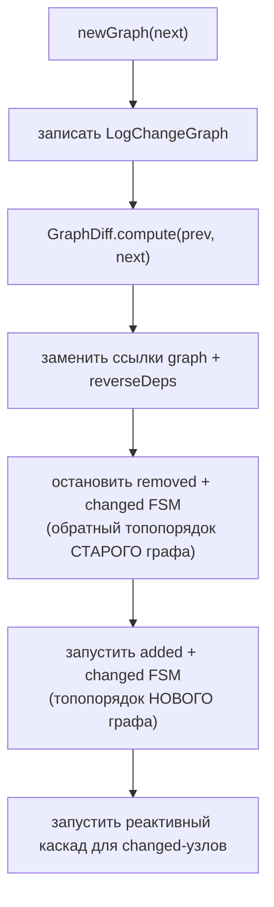

# Замена графа на лету

Можно изменить граф **работающего** движка, снова вызвав `newGraph(...)`. Движок
сравнивает новый граф с текущим и применяет только разницу — неизменённые процессы
сохраняют живое состояние; изменённые пересобираются.

```java
engine.newGraph(graphV1);   // первая установка → возвращает true
// ... работает ...
boolean changed = engine.newGraph(graphV2);  // замена на лету → true, если что-то отличалось
```

## Дифф

`GraphDiff.compute(prev, next)` классифицирует каждый процесс в одно из четырёх
множеств:

| Множество | Условие | Действие |
|---|---|---|
| **unchanged** | структурно идентичный узел | сохранить FSM и Sid как есть |
| **added** | имя только в `next` | запустить с нуля (холодный `init`) |
| **removed** | имя только в `prev` | остановить и удалить |
| **changed** | то же имя, другое определение | отозвать старый Sid, запустить с нуля |

Два узла **эквивалентны** (то есть *unchanged*), когда у них одинаковые имя,
одинаковый `param` (по значению) и одинаковый набор зависимостей (имя и вид
каждой). Идентичность фабрик `init`/`load` **намеренно не сравнивается** — лямбды
и ссылки на методы различаются при каждой сборке, поэтому их сравнение делало бы
каждый узел «изменённым».

## Что происходит при замене



- **removed** и **changed** узлы останавливаются в обратном топологическом
  порядке старого графа, каждый через *replace*-остановку, которая пишет `LogDead`
  для отозванного Sid (чтобы поздний рестарт холодно инициализировал новое
  определение, а не тёпло загружал устаревшее состояние).
- **added** и **changed** узлы запускаются в топологическом порядке нового графа,
  и вызов блокируется, пока каждый не достигнет `Serving`.
- Для каждого **changed**-узла движок запускает
  [реактивный каскад](reactive-cascade.md) с его реальным предыдущим Sid, чтобы
  его реактивные потребители переинициализировались против новой версии.

## Холодный init при изменении

Added- и changed-узлы при замене всегда **холодно инициализируются**, даже если
`LogInitialized` старого определения ещё в логе. Та старая запись устарела —
определение узла изменилось — поэтому тёплая загрузка была бы неверной. (Тёплая
загрузка между рестартами — отдельный путь: *первый* `newGraph` после старта JVM,
который действительно сверяется с логом. См.
[Идемпотентный рестарт](idempotent-restart.md).)

## Возвращаемое значение

`newGraph` возвращает:

- `true` при **первой** установке и
- при замене — `true`, если в диффе были изменения (`added ∪ removed ∪ changed`
  непусто), `false`, если новый граф структурно идентичен.

## Конкурентность

`newGraph` и `updateConfig` сериализуются внутренним control-lock'ом, поэтому два
конкурентных `newGraph` не могут оба создать graph machine, а замена никогда не
гонится с горячей перезагрузкой конфига.

> [English version](../../concepts/graph-swap.md)
