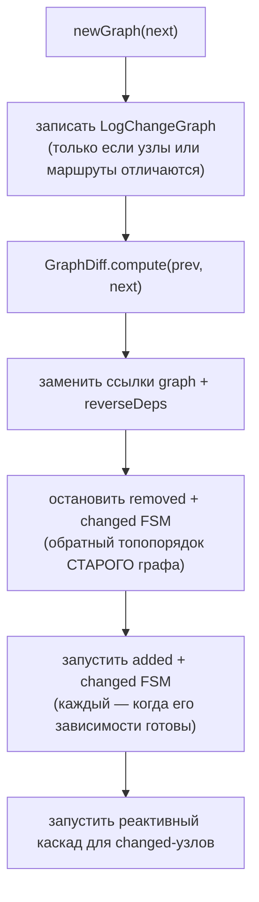

# Замена графа на лету

Можно изменить граф **работающего** движка, снова вызвав `newGraph(...)`. Движок
сравнивает новый граф с текущим и применяет только разницу — неизменённые процессы
сохраняют живое состояние; изменённые пересобираются.

```java
engine.newGraph(graphV1);   // первая установка → возвращает true
// ... работает ...
boolean changed = engine.newGraph(graphV2);  // замена на лету → true, если что-то отличалось (топология или маршрутизация)
```

## Дифф

`GraphDiff.compute(prev, next)` классифицирует каждый процесс в одно из четырёх
множеств:

| Множество | Условие | Действие |
|---|---|---|
| **unchanged** | структурно идентичный узел | сохранить FSM и Sid как есть |
| **added** | имя только в `next` | запустить с нуля (холодный `init`) |
| **removed** | имя только в `prev` | остановить и удалить |
| **changed** | то же имя, другое определение | отозвать старый Sid, запустить с нуля |

Маршрутизация живёт в графе, а не в FSM, поэтому замена, отличающаяся только
маршрутизацией по типам (`.handles()`, `.handlesFor()`, `.route(...)`), всё равно
возвращает `true`: запросы после неё действительно идут в другое место. Ни один
узел при этом не добавляется, не удаляется и не переинициализируется.

Отличием маршрутизации считается лишь то, что можно сравнить: у типа сообщения
появился или пропал маршрут, статический маршрут (`.handles`) указывает на другой
процесс, или маршрут сменился со статического на динамический и наоборот.
**Изменённую лямбду-резолвер `.route(...)` обнаружить нельзя** — лямбды
несравнимы, — поэтому замена, меняющая только резолвер, действует (запросы с
этого момента разрешает новая лямбда), но `newGraph` возвращает `false`.

Замена вообще без отличий — те же узлы и те же маршруты — **ничего не пишет в
лог**: `LogChangeGraph` не записывается, так что reconcile-цикл, повторно
применяющий тот же граф, не раздувает лог. Свою единственную работу она всё же
делает — перезапускает узлы, которые `Dead` или так и не стартовали.

Два узла **эквивалентны** (то есть *unchanged*), когда у них одинаковые имя,
одинаковый `param` (по значению) и одинаковый набор зависимостей (имя и вид
каждой). Идентичность фабрик `init`/`load` **намеренно не сравнивается** — лямбды
и ссылки на методы различаются при каждой сборке, поэтому их сравнение делало бы
каждый узел «изменённым».

[Стратегия reinit](process-lifecycle.md#переинициализация) узла
(`GraphBuilder.reinitStrategy(...)`) тоже не входит в его определение: замена,
меняющая только её, оставляет узел *unchanged* и возвращает `false`, а
работающий узел применяет новую стратегию со следующего reinit.

!!! warning "Замена одного лишь кода не переинициализирует работающий узел"
    Узел с тем же именем, зависимостями и `param`, но с изменённой
    **реализацией** `init` / `load` (новой фабрикой) — *unchanged*. Его
    работающая FSM сохраняет **старые** фабрики: она не перезапускается, и любой
    последующий reinit — триггер, реактивный каскад — по-прежнему выполняет
    старый код. Пути, создающие для узла *новую* FSM, используют **новые**
    фабрики: пауза + возобновление, перезапуск `Dead`-узла (через `trigger` или
    повторный `newGraph`), рестарт JVM. Поэтому то, какой код выполняет узел,
    может зависеть от того, перезапускался ли он.

    Чтобы переключить код детерминированно, сделайте определение другим:
    увеличьте поле версии в `param` (например,
    `new AlertsParams(..., /*codeVersion*/ 2)`), чтобы узел считался *changed*
    и холодно инициализировался с новым кодом, — или удалите его и добавьте
    снова.

!!! warning "Дайте типам `param` настоящий `equals`"
    Класс `param`, не переопределяющий `equals()`, никогда не равен `param`
    работающего узла (если это не тот же самый экземпляр), поэтому каждый
    `newGraph` считает узел *changed* и переинициализирует его. При замене
    движок логирует об этом `WARN`: «the param of '&lt;name&gt;' (&lt;class&gt;)
    does not override equals(), so it never equals the running one and every
    newGraph re-inits the process; use a record or implement equals()». То же
    происходит и при рестарте; см.
    [Идемпотентный рестарт](idempotent-restart.md).

    Параметры сравниваются через `equals()`, а сгенерированный `equals` у record
    сравнивает компонент-**массив** по ссылке (как и data class в Kotlin со
    свойством-массивом). Такой параметр никогда не равен своей сохранённой копии
    (и равному ему экземпляру, заново построенному для следующего `newGraph`),
    поэтому процесс холодно инициализируется
    при каждом рестарте и каждом `newGraph` — **без всякого `WARN`**: проверка
    выше ловит только классы, вовсе не переопределяющие `equals`. Используйте
    `List` вместо массива или переопределите `equals`/`hashCode` через
    `Arrays.equals` / `contentEquals`.

!!! warning "Держите классы `param` на classpath приложения"
    `param`, чей класс загружен **перезагружаемым classloader'ом** — Kotlin-скрипт,
    загрузчик плагинов или hot-reload, — после каждой перезагрузки имеет другой
    `Class`, даже если исходник не менялся. `equals` у record (или data class)
    требует того же класса, поэтому пересобранный параметр никогда не равен
    работающему: **каждая перезагрузка, вызывающая `newGraph`, переинициализирует
    узел**, и никакой `WARN` не объясняет почему (класс ведь переопределяет
    `equals`).

    Рестарт JVM ошибается в обратную сторону: `SerDe` не может загрузить класс
    записанного параметра с classpath приложения, поэтому движок пишет `WARN`
    «cannot decode the recorded param of '&lt;name&gt;' to verify its
    definition, so a changed param is NOT detected and the process warm-loads
    its old state …» и сохраняет старое состояние, даже если параметр
    изменился.

    Определяйте типы параметров в коде, который лежит на classpath приложения
    (например, в общем модуле, от которого зависят скрипты или плагины), а
    перезагружаемый код пусть только создаёт их экземпляры.

## Что происходит при замене


```mermaid
graph TD
  A["newGraph(next)"] --> B["записать LogChangeGraph<br/>(только если узлы или маршруты отличаются)"]
  B --> C["GraphDiff.compute(prev, next)"]
  C --> D["заменить ссылки graph + reverseDeps"]
  D --> E["остановить removed + changed FSM<br/>(обратный топопорядок СТАРОГО графа)"]
  E --> F["запустить added + changed FSM<br/>(каждый — когда его зависимости готовы)"]
  F --> G["запустить реактивный каскад для changed-узлов"]
```

- **removed** и **changed** узлы останавливаются в обратном топологическом
  порядке старого графа, каждый через *replace*-остановку, которая пишет `LogDead`
  для отозванного Sid (чтобы поздний рестарт холодно инициализировал новое
  определение, а не тёпло загружал устаревшее состояние). Замена дожидается
  остановки каждого из них, даже если вызывающий поток тем временем прервали, и
  потом восстанавливает флаг прерывания, так что зависимость никогда не
  разбирается, пока её потребители ещё работают. `cleanUp`, не уложившийся в
  бюджет очистки, обрывается по бюджету, и остановка узла завершается; в логе
  при этом виден `WARN` «FSM[X] cleanup failed:
  java.util.concurrent.TimeoutException: X cleanUp did not finish within its
  share of <budget> (the budget also covers draining in-flight queries)». Более
  редкий `WARN` «GraphMachine[…] X did not finish stopping within its cleanup
  budget of …» появляется, только если сама остановка узла не завершилась
  вовремя — примерно через бюджет плюс 250 мс, когда истекает собственный ответ
  FSM об остановке, с `ExecutionException`/`TimeoutException` без сообщения в
  качестве причины (см. [Жизненный цикл процесса](process-lifecycle.md#повторы-backoff-таймауты)).
- **Прерванный вызывающий поток.** В отличие от этих ожиданий остановки (и от
  `close()`, `pause()`), прерывание меняет то, как *стартуют* новые
  узлы: движок не запускает ни одного узла, который ещё не начал стартовать,
  даёт уже стартующим завершиться (не дольше одного бюджета старта) и
  возвращается. Если все узлы всё же поднялись, `newGraph` возвращается
  нормально; иначе бросает `IllegalStateException("Interrupted while starting
  the graph; not started, a retried newGraph starts them: [N2, …]")`. В обоих
  случаях флаг прерывания после вызова остаётся выставленным. Сама замена
  **применена** — удалённые узлы остановлены, новый граф установлен, — а
  повторный `newGraph` с тем же графом (на непрерванном потоке) запускает
  узлы, названные в сообщении. Не считайте это исключение признаком того, что
  замены не было.
- **added** и **changed** узлы запускаются так же, как первая установка
  запускает граф, — каждый, как только его собственные зависимости в новом графе
  обслуживают запросы, независимые параллельно, — и вызов блокируется, пока все
  они не завершат старт.
- Для каждого **changed**-узла движок запускает
  [реактивный каскад](reactive-cascade.md) с его реальным предыдущим Sid, чтобы
  его реактивные потребители переинициализировались против новой версии. Это
  верно, даже если узел переинициализировался в момент, когда замена его
  изменила: каскад использует Sid, который обслуживал запросы (при
  `RELEASE_FIRST` — тот, который заменял reinit).
- У удаляемого или изменённого узла, чей `init` ещё выполняется, stage init
  отменяется (см. [Жизненный цикл процесса](process-lifecycle.md#повторы-backoff-таймауты)).
  Идущий reinit `KEEP_OLD` отменяется так же, и через `LogDead` отзываются и
  обслуживавшая версия, и уже записанная (но не загруженная) новая. Изменённый
  узел всё равно холодно инициализируется по новому определению: замена графа
  не оставляет старую версию обслуживать запросы на это время — запросы к нему
  ждут новый FSM, как описано ниже.
- Запрос к изменённому узлу, пришедший между его старым и новым FSM, ждёт новый
  FSM (до своего дедлайна), а не падает с «Unknown process» или «is shutting
  down». Запросы, которые к началу замены уже были в старом FSM — ждали, когда он
  начнёт обслуживать, или пришли во время его очистки, — тоже передаются
  замене, со своим прежним дедлайном; каждый попадает к наблюдателям ровно один
  раз. Запросы, всё ещё
  ждущие *удалённый* узел, падают с `QueryRejectedException`. `introspect()`
  показывает такой узел один раз, как `Starting`, пока новый FSM не создан.
- Запрос, который в старом FSM уже **вычисляется**, сливается в пределах
  `cleanupTimeout`, как и при любой другой очистке: если вычисление не
  уложилось в бюджет, запрос падает с `QueryRejectedException`
  («… is shutting down: the query outlived the cleanup timeout»), а сама замена
  ждёт до конца бюджета, прежде чем завершиться.

## Холодный init при изменении

Added- и changed-узлы при замене всегда **холодно инициализируются**, даже если
`LogInitialized` старого определения ещё в логе. Та старая запись устарела —
определение узла изменилось — поэтому тёплая загрузка была бы неверной. (Тёплая
загрузка между рестартами — отдельный путь: *первый* `newGraph` после старта JVM,
который действительно сверяется с логом. См.
[Идемпотентный рестарт](idempotent-restart.md).)

## Если узел не запустился

Если added- или changed-узел не достиг `Serving` вовремя, `newGraph` бросает
исключение. Если сам узел упал окончательно, `newGraph` пробрасывает собственную
ошибку узла — например, `InitializationTimeoutException` с настоящим бюджетом
init; если же просто истекло ожидание, в исключении сказано, что узел
"did not reach Serving within <budget>". Движок всё равно записывает новый граф
и маршрутизирует по нему, а упавший узел остаётся `Dead`.

*Какие ещё* узлы останутся незапущенными, определяют **рёбра зависимостей**, а
не позиция в `topologicalOrder()`. Смена графа запускает added- и changed-узлы
**ровно так же, как первая установка**: и первый `newGraph`
(`GraphMachine.startAll`), и последующая смена (`GraphMachine.applyGraphChange`)
идут через `GraphMachine.startByDependencies`, который запускает узел, как только
его собственные зависимости перешли в `Serving`, поэтому независимые узлы
стартуют **параллельно** на обоих путях (см.
[Граф и маршрутизация](graph-and-routing.md#граф)). Поэтому на любом пути:

- узлы, зависящие от упавшего — **прямо или транзитивно**, — не стартуют вовсе,
  и движок логирует для каждого из них `WARN` «GraphMachine[<id>] not starting
  <node>: its dependency <dep> did not start»;
- каждый узел, **независимый** от упавшего, стартует в любом случае — неважно,
  добавили его в `GraphBuilder` до или после него;
- `newGraph` возвращается (или бросает исключение), когда все узлы завершили
  старт, и бросает **первый корневой** сбой — первого в топологическом порядке
  узла, чьи собственные зависимости поднялись;
- сломанные независимые узлы выжидают свой [бюджет старта](process-lifecycle.md#startup-budget)
  одновременно, поэтому весь старт стоит **один** бюджет старта, а не по
  одному на каждый сломанный узел.

Именно на это правило и может опираться тест. На любом пути *тайминг*
между независимыми узлами не фиксирован, поэтому не проверяйте в тесте, в
каком порядке они поднялись.

Если во время замены вызвать `Engine.close()`, замена **больше ничего не
запускает**: узлы, ещё ждущие свои зависимости, не стартуют, а `newGraph`
бросает `IllegalStateException` («Engine closed while 'X' was starting»).

Повторный вызов `newGraph` с тем же графом **повторяет попытку**:
отсутствующие и `Dead`-узлы — упавший узел и все зависимые, которые из-за него
не стартовали, — запускаются снова, и вызов возвращает `true` (новой записи
`LogChangeGraph` при этом нет: сам граф не изменился). Это верно и после
неудачной *первой* установки: движок к тому моменту уже установлен, поэтому
повтор идёт путём замены. Неудачный первый `newGraph` всё равно включает
настроенную [политику снапшотов](snapshots.md#автоматически--snapshotpolicy),
прежде чем бросить исключение, так что ротация работает, будете вы повторять
вызов или нет. (Раньше она оставалась выключенной: путь замены ротацию не
включает, поэтому после неудачной первой установки лог переставал ротироваться
до следующего старта JVM.)

## Удаление, пауза и возобновление процессов

Поверх замены есть три сокращения:

```java
engine.remove(Set.of("Subscriptions_PUB1"));   // замена на currentGraph().without(...)
engine.pause(Set.of("Subscriptions_PUB1"));    // остановить, сохранив состояние
engine.resume(Set.of("Subscriptions_PUB1"));   // тёпло загрузить сохранённое состояние
```

Каждый из них принимает и имена прямо в вызове (`String...`), и типизированные
ссылки (`ProcessRef...`): `engine.pause("Subscriptions_PUB1", "Subscriptions_PUB2")`,
`engine.remove(SUBSCRIPTIONS_PUB1)` (где
`static final ProcessRef SUBSCRIPTIONS_PUB1 = ProcessRef.of("Subscriptions_PUB1");`). Вызов **без** аргументов —
`engine.pause()` — не компилируется: он неоднозначен между
перегрузками `String...` и `ProcessRef...` (и всё равно ничего бы не сделал).
Если список собирается во время выполнения, передавайте пустую коллекцию.

- **`remove`** — замена на `Graph.without(names)`: процессы
  останавливаются, их состояние отзывается через `LogDead`, поэтому при
  добавлении обратно будет холодный init. Статические маршруты к ним удаляются.
  Падает с `IllegalArgumentException`, если оставшийся процесс зависит от
  удаляемого или если вызов удалил бы *все* процессы («Removing [...] would leave
  an empty graph») — вместо этого закройте движок. Вызов только удаляет:
  другие процессы в `Dead` или так и не стартовавшие остаются как есть (повторный
  `newGraph` с тем же графом по-прежнему их перезапускает).
- **`pause`** останавливает процессы **без** `LogDead`. Они остаются в
  графе; запросы к ним падают с `QueryRejectedException` ("paused"), а
  `introspect()` показывает их как `Paused`. Триггер или изменение
  реактивной зависимости, пришедшие в это время, запоминаются, и после
  возобновления процесс переинициализируется. Пауза процесса во время
  инициализации отменяет его stage init. Пауза посреди reinit зависит от
  [стратегии reinit](process-lifecycle.md#переинициализация):
    - `KEEP_OLD` (по умолчанию): пауза запоминает версию, которая обслуживала
      запросы, и именно её `sid` показывает `introspect()`, пока узел на паузе.
      Если новая версия ещё была в `init`, этот init отменяется и узел ставится
      на паузу устаревшим: `resume` тёпло загружает старую версию, обслуживает
      её и переинициализируется в фоне (один `init`). Если новая версия уже
      записана и загружалась, узел не устаревший: `resume` тёпло загружает
      старую версию, а затем рядом с ней загружает записанную, не запуская
      `init` заново, — если только к моменту возобновления узел не работает с
      `RELEASE_FIRST`: тогда записанная версия снимается, а узел
      инициализируется холодно. Удаление узла на паузе отзывает его состояние.
    - `RELEASE_FIRST`: старое состояние уже отозвано. Если узел поставили на
      паузу в `Initializing`, возобновление выполняет `init` один раз (а не
      дважды), и его реактивные потребители переинициализируются; пока он на
      паузе, `introspect()` показывает его `sid` как `null`. Если новое
      состояние уже было в `Loading`, возобновление тёпло загружает это
      сохранённое состояние, а не запускает `init` заново (один init, одно
      продвижение Sid), — именно это новое состояние и хранит узел на паузе, и
      удаление такого узла отзывает его.

    Пауза, пришедшая как раз в момент завершения reinit, сохраняет новое
    состояние и не вызывает повторного reinit при возобновлении.
  Потребителей нужно ставить на паузу
  вместе с их продюсерами. Пауза **сохраняется в логе** (`LogPaused`, снапшот
  переписывает её заново): после рестарта JVM процессы поднимаются на паузе, пока
  их не возобновят. Если в графе, установленном при рестарте, работающий процесс
  зависит от процесса на паузе, он тоже поднимается на паузе (с предупреждением),
  ведь до старта движка ничего возобновить нельзя. Такая пауза сохраняется как
  пауза **из-за зависимости** (`LogPaused.forDependency`) — в отличие от паузы,
  поставленной оператором, — и снапшоты это различие сохраняют;
  `engine.pausedByDependency()` возвращает такие процессы. Пока движок
  работает, возобновление зависимости их не возобновляет — вызовите для них
  `resume`. Но если движок перезапустится и ни одна из их зависимостей
  уже не на паузе, они просто стартуют (пишется `LogResumed`; если за время
  паузы процесс стал устаревшим, его reinit воспроизводится). Процесс, явно
  поставленный на паузу, всегда остаётся на паузе до возобновления; если процесс
  на паузе из-за зависимости поставить на паузу через `pause`, пауза
  становится такой же обычной операторской и больше не снимается вместе с
  зависимостями. У процесса на паузе, которого нет в графе, установленном при
  рестарте, пауза снимается (пишется `LogResumed`, в лог на уровне `INFO` —
  «Engine[…] paused process 'X' is not in the graph; its pause is cleared»),
  как и при удалении в работающем движке, — и более поздний `newGraph`, который
  вернёт его в граф, запустит его обычным образом. `pause` возвращается, только когда процессы
  остановились (или истёк их бюджет очистки): он продолжает ждать, даже если
  вызывающий поток прерван, и потом восстанавливает флаг прерывания.
- **`resume`** перезапускает процессы на паузе, начиная с зависимостей, и
  тёпло загружает их состояние. Зависимость возобновляемого процесса не должна
  оставаться на паузе. Если процесс не запустился, он остаётся на паузе и вызов
  можно повторить. То же верно, если вызывающий поток прервали, пока он ждёт
  запуска процесса: вызов бросает `IllegalStateException` («Interrupted while
  waiting for '&lt;name&gt;' to start; the call can be retried»), процесс остаётся на паузе, а флаг прерывания потока остаётся
  выставленным. Прежде чем бросить исключение, вызов останавливает узел, который
  успел запустить (ожидая до его бюджета очистки), так что повтор никогда не
  пересекается с брошенным запуском. Reinit, запомненный во время паузы, к моменту возврата из
  вызова **ещё не выполнен**: он идёт обычным путём триггера, поэтому запрос,
  отправленный сразу после `resume`, ещё примерно один
  [`dedupWindow`](reactive-cascade.md#окно-дедупликации) может быть отвечен из
  состояния до возобновления. Если нужно состояние после триггера, дождитесь
  нового Sid (`introspect()` / `onSidPromotion`).

!!! warning "Если лидерство потеряно на середине"
    Все три сохраняют своё изменение, поэтому на логе, который забрал другой
    инстанс, они бросают
    [`LeadershipLostException`](../reference/exceptions.md#leadership) — и
    сообщают, как далеко успели зайти, вместо того чтобы делать вид, что ничего
    не произошло. `remove`, заменивший граф, но не сумевший записать
    `LogDead` удалённых процессов, **называет эти процессы**: изменение графа
    остаётся в силе, но их состояние в логе живо, и следующий лидер тёпло
    загрузит его, если имя вернётся. `pause`, прерванный между двумя
    записями `LogPaused`, **называет то, что уже поставил на паузу** («already
    paused: [...]» либо «nothing was paused») — этот движок не может ни довести
    паузу до конца, ни отменить её. `resume`, чей узел не смог записать
    `LogResumed`, бросает исключение («… for &lt;name&gt;; it stays paused», плюс
    «already resumed: [...]»), снова останавливает этот узел и оставляет его
    `Paused` со своим последним Sid (никакого `Dead`, и `lastException` остаётся
    `null`), так что более позднее возобновление ещё может вернуть его в строй, —
    но узел, который перед этим холодно инициализировался, оставляет в логе
    состояние нового Sid; см.
    [Исключения](../reference/exceptions.md#leadership).

Все три отвергают имя, которого нет в текущем графе — в том числе имя, уже
удалённое предыдущим `remove`, — с `IllegalArgumentException`
(«Unknown process: '&lt;name&gt;'»), и ничего не применяют. Поэтому удаление
**не идемпотентно**: перед повторным вызовом сверяйтесь с `currentGraph()` (или
`introspect()`), а не повторяйте его вслепую.

`engine.resumeUnblocked(names)` атомарно, под control-lock'ом,
возобновляет только те из `names`, что всё ещё на паузе из-за зависимости и ни
одна зависимость которых не на паузе; имена, которые оператор тем временем
поставил на паузу, ещё заблокированные или неизвестные, не трогаются. Возвращает
возобновлённые имена. Если старт процесса отменила другая операция (например,
`pause` оператора), процесс остаётся на паузе и просто не попадает в
результат. При любом другом сбое на пути к `Serving` вызов бросает исключение,
процесс остаётся на паузе, и вызов можно повторить.
(`TenantAwareEngine.resumeTenant` возобновляет глобальные процессы через него.)

Пока процессы на паузе, замена графа не может добавить или оставить *работающий*
процесс, зависящий от одного из них. Удаление процесса на паузе отзывает его
состояние; *изменённый* процесс на паузе остаётся на паузе и при возобновлении
холодно инициализируется по новому определению.

## Read-modify-write: `updateGraph` { #read-modify-write-updategraph }

Чтобы изменить работающий граф *относительно установленного* — добавить узел,
убрать узел, перенаправить маршрут, — используйте `engine.updateGraph(change)`.
Он передаёт `change` граф, установленный сейчас, и ставит граф, который тот
вернул, — всё под control-lock'ом, так что между чтением и установкой не может
выполниться ни один другой вызов control plane (`newGraph`, `remove`,
`pause`, `resume`, вызов жизненного цикла тенанта, …):

```java
engine.updateGraph(current -> {
    var nodes = new LinkedHashMap<>(current.nodes());
    nodes.put(alertsNode.name(), alertsNode);    // построенный вами ProcessNode
    return new Graph(current.top(), nodes, current.typeRouting());
});
```

Чтобы **убрать** узлы, возвращайте `current.without(names)`, а не правьте
карту узлов вручную:

```java
engine.updateGraph(current -> current.without(Set.of("Subscriptions_PUB1")));
```

`Graph.without` заодно убирает маршруты по типу, ведущие на удалённый узел, и,
если удалённый узел — `top` графа, выбирает новый `top` (последний оставшийся
узел в топологическом порядке). Он бросает `IllegalArgumentException`, если
оставшийся узел всё ещё зависит от удалённого или если не останется ничего.
Ручная форма `new Graph(current.top(), nodes, current.typeRouting())` сохраняет
**старый** `top`: уберите из `nodes` узел, который является `top`, и
конструктор бросит `IllegalArgumentException` («top '…' is not present in nodes
map») — `change` упадёт, и ничего не установится.

Рукописный вариант, `engine.newGraph(modify(engine.currentGraph()))`, — это
read-modify-write, в который может вклиниться конкурентный вызов:
`remove`, выполнившийся между чтением и `newGraph`, отменяется
устаревшей копией, которая возвращает удалённые процессы в граф (с холодным
init — их старое состояние уже отозвано). Случай с тенантами — в
[Мультитенантности](../guides/multi-tenancy.md#adding-a-tenant-at-runtime).

- `updateGraph` возвращает то же, что вернул бы `newGraph` для получившегося
  графа (см. [Возвращаемое значение](#возвращаемое-значение)); `change`,
  вернувший граф без изменений, — это повторное применение того же графа.
- `change` должен быть быстрым и **не** должен вызывать control plane движка.
  Такой вызов повторно вошёл бы в (реентерабельный) control-lock и выполнился,
  а граф, который `change` затем вернёт, — вычисленный из графа, прочитанного
  до этого вызова, — молча бы его отменил. Поэтому `newGraph`, `updateGraph`,
  `remove`, `pause`, `resume` (и построенные на них
  вызовы тенантов) и `updateConfig` изнутри `change` **отклоняются** с
  `IllegalStateException` («&lt;call&gt; called from inside an updateGraph
  change function; the change must only compute the new graph»). Исключение
  выходит из `updateGraph`, если `change` его не перехватит, и ничего не
  устанавливается.
- Этот отказ видит только поток, **выполняющий `change`**. Вызов control plane,
  который `change` передаёт **другому потоку** и затем ждёт (`submit(...).get()`
  у executor'а, `CompletableFuture.supplyAsync(...).join()`, в Kotlin —
  `withContext(Dispatchers.IO)` или `runBlocking` на другом диспетчере), не
  отклоняется: он ждёт control-lock, который держит поток `change`, а `change`
  ждёт его. Движок **намертво блокируется** — включая `close()`, который ждёт
  того же lock'а (а каждый следующий `close()` ждёт его). Вычисляйте нужное
  *до* `updateGraph`, а последующие вызовы делайте *после* его возврата.
- Если `change` вернёт `null`, будет брошен `NullPointerException` («the change
  returned null») и ничего не установится.
- Бросает `IllegalStateException`, если граф ещё не установлен («No graph
  installed; call newGraph(graph) first») или движок закрыт.

## Возвращаемое значение

`newGraph` возвращает:

- `true` при **первой** установке и
- при замене — `true`, если что-то изменилось: в диффе были изменения (`added ∪
  removed ∪ changed` непусто), [отличается маршрутизация по типам](#дифф) **или**
  замена перезапустила узел, который был `Dead` или так и не стартовал. Такой
  узел считается *changed* (не стартовавший — *added*), поэтому повторное
  применение **идентичного** графа, перезапустившее такой узел, возвращает
  `true` — хотя, раз граф тот же, `LogChangeGraph` не пишется (см. [выше](#дифф)
  и [Если узел не запустился](#если-узел-не-запустился)). `false` возвращается,
  только если граф идентичен и все узлы уже работали (или стояли на паузе —
  узлы на паузе не перезапускаются).

## Конкурентность

`newGraph` и `updateConfig` сериализуются внутренним control-lock'ом, поэтому два
конкурентных `newGraph` не могут оба создать graph machine, а замена никогда не
гонится с горячей перезагрузкой конфига.

`currentGraph()` возвращает устанавливаемый граф сразу, как только замена
записала его в лог, поэтому во время замены он совпадает с `introspect()`. Если
замена падает на полпути, он по-прежнему отражает установленную топологию.

`remove` и `pause` берут тот же lock. Если его держит
`newGraph` или `resume`, ожидающий процесс, который завис на первом
запуске, то удаление или пауза этого процесса отменяет этот запуск, а не ждёт
исчерпания бюджета — причём и узел, зависший в `Loading`, а не только в
`Initializing`, так что вызов возвращается за миллисекунды вместо того чтобы
держать вызывающего весь бюджет старта; заблокированный `newGraph` или
`resume` тогда бросает `InitInProgressException` («Init of process '&lt;name&gt;' was cancelled»).
Отменяются только те запуски, которых ждёт держащая lock операция; init'ы и
load'ы других процессов не трогаются. Отклонённый `remove`/`pause`
(`IllegalArgumentException`, например, зависящий процесс продолжил бы работать)
никогда не отменяет init — даже если такой зависящий процесс добавил бы
`newGraph`, стоящий в очереди за текущим; это делает только принятый вызов.
Запрос, который будет отклонён, всё равно ждёт завершения текущего `newGraph`:
решение принимается по графу, действующему к тому моменту.

> [English version](../../concepts/graph-swap.md)
