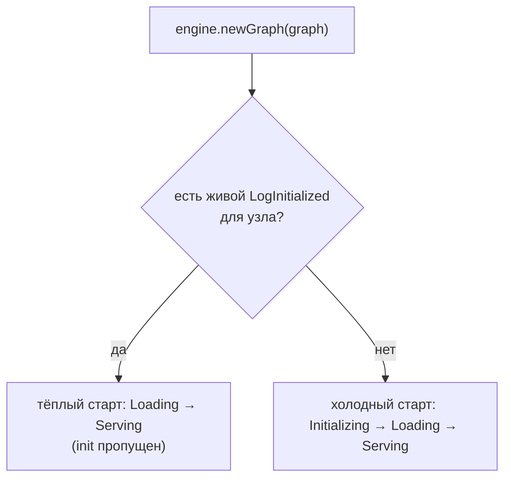

# Идемпотентный рестарт

Основное обещание: перезапуск JVM против **того же лога** восстанавливает
состояние каждого процесса **без повторного `init`**. Дорогая инициализация
происходит один раз; рестарты платят только за `load`.

## Как это работает

Когда вы вызываете `engine.newGraph(graph)` впервые в процессе, движок один раз
сканирует лог и для каждого узла графа находит **последний не-отозванный**
`LogInitialized`:

- `LogInitialized` на clock'е *c* **живой**, если нет более позднего `LogDead` для
  того же процесса с clock ≥ *c*;
- если живой `LogInitialized` есть, узел **тёпло стартует** — сразу в `Loading` с
  этими сохранёнными ячейками, пропуская `init`;
- иначе узел **холодно стартует** — `init`, затем `load`.

Так *один и тот же путь* — `newGraph` — даёт холодный старт при первом запуске и
тёплый при каждом последующем. Это и делает рестарт идемпотентным.

## Почему `init` и `load` разделены

Разделение и делает это возможным:

- **`init`** делает дорогую разовую работу и возвращает простые ячейки `byte[]`.
  Его вывод долговечен (`LogInitialized`).
- **`load`** — чистая функция от этих ячеек → живой `Process`. Дёшев и выполняется
  при каждом старте.

Проектируйте `init` как тяжёлую работу, а `load` — как быструю пересборку.

## Что отменяет тёплый старт

Узел холодно инициализируется вместо тёплой загрузки, когда:

- для него ещё нет `LogInitialized` (самый первый запуск), или
- его последний `LogInitialized` отозван `LogDead` (он был переинициализирован или
  заменён), или
- его определение изменилось при [замене графа на лету](graph-swap.md) — added- и
  changed-узлы всегда холодно инициализируются.

## Лидерство при рестарте

Восстановление — активность лидера. Одноузловое приложение передаёт
`leaderAtStart=true` конструктору `Engine` и заявляет лидерство при установке
графа. В multi-node блокировка бэкенда решает, кто восстанавливается; см.
[Несколько узлов](../guides/multi-node.md).

## Проверка

Рестарт должен показывать выполнение `load`, но **не** `init`. С
[`EngineObserver`](../guides/observability.md) вы увидите `onLoadStarted` /
`onLoadCompleted` для каждого узла и отсутствие `onInitStarted`. Встроенный
`MultiProcessTest` (`three_node_chain_warm_restart_skips_all_inits`) утверждает
именно это.

> [English version](../../concepts/idempotent-restart.md)
