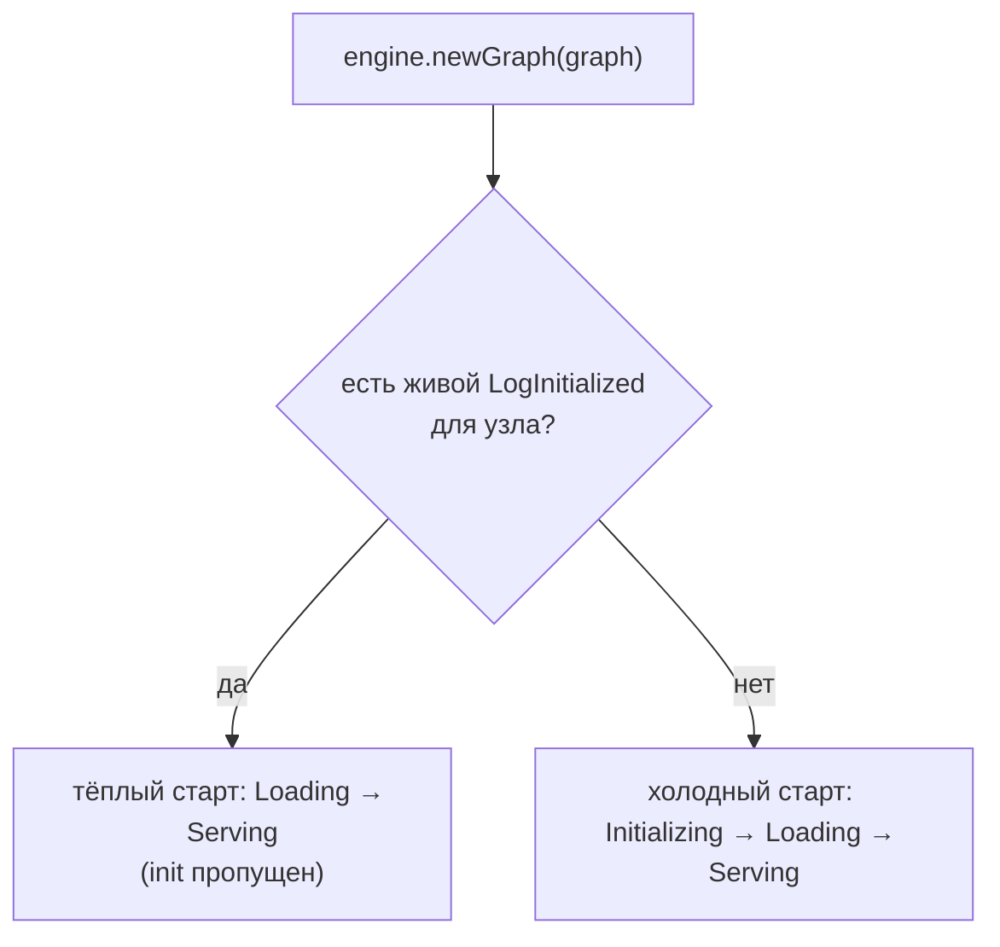

# Идемпотентный рестарт

Основное обещание: перезапуск JVM против **того же лога** восстанавливает
состояние каждого процесса **без повторного `init`**. Дорогая инициализация
происходит один раз; рестарты платят только за `load`.

## Как это работает

Когда вы вызываете `engine.newGraph(graph)` впервые в процессе, движок один раз
сканирует лог и для каждого процесса определяет его **живой** `LogInitialized`
(действующий) и не более одного **кандидата** — более нового `LogInitialized`,
записанного reinit'ом на замену действующему, но ещё не загруженного:

- `LogInitialized`, чей `replaces` называет живой действующий, становится
  кандидатом; любой другой `LogInitialized` (холодный init или тот, чей
  `replaces` уже отозван) становится живым и сбрасывает кандидата;
- `LogLoaded` кандидата продвигает его: теперь живой он;
- `LogDead` кандидата сбрасывает только кандидата; `LogDead` с clock ≥ clock'а
  действующего отзывает и действующий, и его кандидата;
- **более старый** `LogInitialized` никогда не становится живым снова, если его
  место занял более поздний, — даже если ни один `LogDead` его не называет:
  например, смена параметров, обнаруженная при рестарте, холодно инициализирует
  узел и пишет новый `LogInitialized` без `LogDead` для старого Sid. И движок не
  откатывается к более старому, если живой отозван.

Затем для каждого узла графа:

- если живой `LogInitialized` есть, узел **тёпло стартует** — сразу в `Loading` с
  этими сохранёнными ячейками, пропуская `init`;
- иначе узел **холодно стартует** — `init`, затем `load`.

```mermaid
graph TD
  S["engine.newGraph(graph)"] --> Q{"есть живой LogInitialized<br/>для узла?"}
  Q -- да --> W["тёплый старт: Loading → Serving<br/>(init пропущен)"]
  Q -- нет --> C["холодный старт: Initializing → Loading → Serving"]
```

Так *один и тот же путь* — `newGraph` — даёт холодный старт при первом запуске и
тёплый при каждом последующем. Это и делает рестарт идемпотентным.

## Почему `init` и `load` разделены

Разделение и делает это возможным:

- **`init`** делает дорогую разовую работу и возвращает простые ячейки `byte[]`.
  Его вывод долговечен (`LogInitialized`).
- **`load`** — чистая функция от этих ячеек → живой `Process`. Дёшев и выполняется
  при каждом старте.

Проектируйте `init` как тяжёлую работу, а `load` — как быструю пересборку.

## Что отменяет тёплый старт

Узел холодно инициализируется вместо тёплой загрузки, когда:

- для него ещё нет `LogInitialized` (самый первый запуск), или
- его живой `LogInitialized` отозван `LogDead` (узел удалили или заменили при
  замене графа, либо reinit `RELEASE_FIRST` остановился после вывода старого
  состояния и до записи нового), или
- его определение изменилось при [замене графа на лету](graph-swap.md) — added- и
  changed-узлы всегда холодно инициализируются, или
- его определение изменилось **между запусками**: имя узла, набор зависимостей
  или `param` отличаются от графа, под которым было сохранено состояние. Движок
  сравнивает с `LogChangeGraph`, записанным перед этим `LogInitialized`, по тому
  же структурному правилу, что и при замене графа (поэтому типам `param` нужен
  настоящий `equals`, например record). Если записанный граф не удаётся
  декодировать, движок пишет предупреждение в лог и загружает тёпло, как раньше.

Реактивный потребитель, чьё состояние построено на уже ушедшем состоянии
поставщика, загружается тёпло **и затем переинициализируется в фоне**, как только
начал обслуживать (старое состояние тем временем отвечает на запросы). Так
бывает, когда:

- одна из его **реактивных** зависимостей при этом старте холодно
  инициализируется (например, потому что `param` или зависимости этой
  зависимости изменились между запусками) — это распространяется транзитивно
  вниз по цепочке, или
- живой `LogInitialized` реактивной зависимости **новее**, чем собственный у
  узла: движок остановился после того, как поставщик переинициализировался, но
  до того, как [каскад](reactive-cascade.md) дошёл до потребителя, или
- тёплый `load` реактивной зависимости на этом старте падает, и она
  откатывается к свежему `init` до старта потребителя.

При `ReinitStrategy.RELEASE_FIRST` (для всего движка или для этого узла) такой
потребитель вместо этого холодно инициализируется. Потребитель **на паузе** в
любом из этих случаев не запускается: он помечается устаревшим и
переинициализируется при возобновлении.

## Рестарт посреди reinit { #restart-mid-reinit }

Reinit (триггер, watcher, каскад) может оборваться падением или `close()` в
любой точке. При стратегии по умолчанию `KEEP_OLD` следующий старт всегда сначала
обслуживает старое состояние и доводит reinit в фоне:

| Остановились… | На следующем старте |
|---|---|
| после запроса (`LogTrigger` / `LogDependencyChanged`), до нового `LogInitialized` | старое состояние загружается тёпло и обслуживает; reinit воспроизводится в фоне («replaying the re-init of 'X' requested before the last shutdown») |
| после `LogInitialized(новый, replaces=старый)`, до `LogLoaded(новый)` | старое состояние загружается тёпло и обслуживает, затем кандидат загружается в фоне **без повторного `init`**. Если кандидат не загружается, он отзывается `LogDead` и выполняется свежий `init`, а старое состояние тем временем обслуживает |
| после `LogLoaded(новый)` | загружается новое состояние; старое не загружается (отсутствие `LogDead(старый)` ничего не меняет) |

Неудавшийся reinit, от которого движок отказался до остановки, попадает в первую
строку: запрос новее живого состояния, поэтому следующий старт повторит его.
Кандидат доводится, только если он записан при текущем определении узла; если
определение изменилось между запусками, узел холодно инициализируется, как выше.

При `RELEASE_FIRST` запрос, записанный до остановки, воспроизводится так же (узел
загружается тёпло, обслуживает, затем переинициализируется в своём порядке);
остановка после `LogDead` старого состояния и до нового `LogInitialized` не
оставляет живого состояния, и узел холодно инициализируется. См.
[Переинициализация](process-lifecycle.md#переинициализация).

Кандидат, записанный reinit'ом с `KEEP_OLD`, **никогда не загружается** узлом,
который при старте работает с `RELEASE_FIRST` (стратегия сменилась между
запусками — для всего движка или для этого узла): загрузить его рядом со старым
состоянием значило бы держать в памяти две версии. Стартует ли узел при
рестарте, по `resume` или позже (ждал своих зависимостей) — кандидат
отбрасывается, а узел инициализируется холодно, поэтому его реактивные
потребители переинициализируются вместе с ним. Узел, который при старте
остаётся на паузе, не запускается: вместо этого он помечается устаревшим и
переинициализируется при возобновлении.

Кандидат, который никогда не будет обслуживать, **не всегда получает
собственный `LogDead`**. Где движок может, он его пишет (кандидат, который не
удалось загрузить, снимается через `LogDead(кандидат)`, по возможности). Другие
пути оставляют `LogInitialized` кандидата как есть — например, узел, поставленный
на паузу, пока его кандидат загружался, а затем удалённый, или узел с
`RELEASE_FIRST`, который возобновляется или рестартует с кандидатом. Лог при
этом остаётся корректным по [правилам сканирования](#как-это-работает):
следующий холодный `LogInitialized` узла или `LogDead` с часами не меньше, чем у
действующей версии (как при удалении), отбрасывает кандидата, и он никогда не
загружается.

Каждый узел стартует, как только его собственные зависимости обслуживают
запросы, поэтому независимые ветви загружаются или инициализируются параллельно.
Упавший узел не даёт стартовать только зависящим от него узлам; см.
[Жизненный цикл процесса](process-lifecycle.md).

!!! warning "Дайте типам `param` настоящий `equals`"
    Класс `param`, не переопределяющий `equals()`, никогда не равен своей
    сохранённой копии, поэтому процесс холодно инициализируется при **каждом**
    рестарте. Обнаружив это, движок пишет в лог `WARN` с именем класса.
    Используйте record (или реализуйте `equals`/`hashCode`).

    Параметры сравниваются через `equals()`, а сгенерированный `equals` у record
    сравнивает компонент-**массив** по ссылке (как и data class в Kotlin со
    свойством-массивом). Такой параметр никогда не равен своей сохранённой копии
    (и равному ему экземпляру, заново построенному для следующего `newGraph`),
    поэтому процесс холодно инициализируется
    при каждом рестарте и каждом `newGraph` — **без всякого `WARN`**: проверка
    выше ловит только классы, вовсе не переопределяющие `equals`. Используйте
    `List` вместо массива или переопределите `equals`/`hashCode` через
    `Arrays.equals` / `contentEquals`.

## Обновления: переименованные процессы и перенесённые классы { #upgrades }

- **Переименование процесса** для движка — это удаление одного процесса и
  добавление другого: имя процесса — его долговечная идентичность. Новое имя
  проходит холодный init. Что станет с состоянием старого имени, зависит от
  того, *как* переименование выкатывается:
    - **Через рестарт** (остановить JVM, запустить новую версию с
      переименованным графом): состояние старого имени **остаётся в логе**
      неотозванным, без каких-либо сообщений — новый граф его просто не
      упоминает. Откатите обновление — и старое имя снова тёпло загрузит это
      состояние (пока его не выбросит снапшот: снапшот хранит состояние лишь
      текущего графа). Чтобы отозвать его намеренно, удалите старое имя через
      `remove` до переименования (или вместо него).
    - **В работающем движке** (`newGraph` / `updateGraph` с переименованным
      графом): старое имя — *удалённый* узел замены, а удалённый узел
      останавливается replace-остановкой, которая пишет `LogDead` для его Sid
      (см. [Замену графа](graph-swap.md#что-происходит-при-замене)). Старое
      состояние **отозвано**: при откате старое имя проходит холодный init.
- **Перенос или переименование класса `param`** делает записанный в логе param
  недекодируемым (обычно глубоко в цепочке причин — `ClassNotFoundException`).
  Тогда движок не может понять, изменился ли param, поэтому пишет `WARN` —
  «cannot decode the recorded param of 'X' to verify its definition, so a
  changed param is NOT detected and the process warm-loads its old state …», со
  всей цепочкой причин, — и загружает процесс тёпло **без обнаружения
  изменений**. Так повторяется при каждом рестарте, пока процесс не
  переинициализируется и не будет записан новый `LogInitialized` под текущим
  графом. Поэтому после такого обновления один раз вызовите `trigger` для
  каждого затронутого процесса. Так ведёт себя `JavaSerializableSerDe`.
  **Разрешающий `FurySerDe`** (`new FurySerDe()`) на ненайденном классе не
  бросает исключение: он декодирует записанный param в объект-заглушку, который
  никогда не равен вашему param. Поэтому каждый затронутый процесс при этом
  рестарте проходит **холодный init** — только с `INFO` «process 'X' definition
  changed since its state was persisted …; cold-initialising» и без `WARN`:
  корректно, но может стать дорогим сюрпризом на множестве процессов.
- **Изменение полей класса `param`** даёт тот же эффект при
  `JavaSerializableSerDe` по умолчанию, если в классе **не объявлен
  фиксированный `serialVersionUID`**. Тогда Java-сериализация выводит UID из
  формы класса, поэтому добавление поля в Java-класс или свойства в Kotlin
  data class меняет его, и записанный param не декодируется —
  `InvalidClassException` («local class incompatible: stream classdesc
  serialVersionUID = …»). Вы получите тот же `WARN` и ту же тёплую загрузку
  старого состояния без обнаружения изменений при каждом рестарте, пока
  процесс не получит `trigger`. Чтобы этого избежать:
    - объявляйте в классах param фиксированный `serialVersionUID`
      (`private static final long serialVersionUID = 1L;` или
      `private const val serialVersionUID = 1L` в `companion object` Kotlin).
      Тогда старый записанный param декодируется, а добавленное поле получает
      значение по умолчанию (`null`, `0`, `false`). Это значение не равно новому
      param, поэтому изменение **обнаруживается** и процесс, как и должен,
      проходит холодный init. В Kotlin не-null свойство при этом может
      оказаться `null`, так как десериализация не вызывает конструктор (и его
      значения по умолчанию). Для сравнения это не страшно, но нигде больше
      такой декодированный param не используйте; или
    - делайте param **записями (records)**. Проверка UID к записям не
      применяется: старая записанная запись, в которую с тех пор добавили
      компонент, декодируется с новым компонентом в значении по умолчанию,
      объявлен `serialVersionUID` или нет.

    Оба способа покрывают **только добавленные поля**. Поле или компонент, у
    которого **сменился тип** (`int` → `long`, `String` → enum), по-прежнему не
    декодируется (`InvalidClassException`, «incompatible types for field …»),
    то есть идёт по пути `WARN` выше: тёплая загрузка без обнаружения
    изменений, пока процесс не получит `trigger`.
- **Откат на старую версию приложения** тоже не обнаруживается, если v2
  добавила компонент записи (или поле — при фиксированном `serialVersionUID`):
  v1 декодирует param, записанный v2, и молча **отбрасывает** незнакомый
  компонент. Если остальные компоненты равны param v1, v1 тёпло загружает
  состояние, которое v2 построила **с другим param**, без единой строки в логе.
  После отката вызовите `trigger` для процессов, чей param v2 меняла. Рестарт со
  старым графом также **снимает операторские паузы** процессов, которых в этом
  графе нет (см. [Замену графа](graph-swap.md#удаление-пауза-и-возобновление-процессов)):
  поставьте их на паузу снова, если v2 их добавила, а позже вы снова выкатите v2.
- **Обновление `PostgresLogBackend` через смену ключа advisory-lock** требует
  выкатки «остановить, затем запустить», а не rolling-обновления. Ключ
  блокировки теперь — хеш схемы **и** имени таблицы (прежние версии хешировали
  только имя таблицы), поэтому узел старой и узел новой версии на одном логе
  держат *разные* блокировки и оба считают себя лидером. Остановите все старые
  узлы, прежде чем запускать новый. Если они всё же пересеклись, барьер записи
  нового узла отказывает его append'ам, как только старый узел захватит лог, но
  старый узел так себя не ограждает. Подробности:
  [Несколько узлов](../guides/multi-node.md#выбор-бэкенда) и
  [Бэкенды хранения](../guides/persistence-backends.md#postgreslogbackend).

### Эволюция самого состояния { #state-evolution }

Ячейки, которые возвращает `init`, — это ваши байты; движок в них не
заглядывает, и **хука миграции нет** между «в логе состояние v1» и «на нём
выполняется `load` v2». Тёплый старт отдаёт `load` версии v2 то, что записал
`init` версии v1. Варианты, от дешёвых к дорогим:

- **Пишите ячейки, которые остаются читаемыми.** Java-сериализация с
  фиксированным `serialVersionUID` (и `readObject` для всего, что сложнее
  добавленных полей), версионированный формат (байт версии в начале; Protobuf,
  Avro или JSON с необязательными полями) или кодек, который понимает старые
  байты и заполняет значения по умолчанию.
- **Меняйте param** (или другую часть определения) вместе с несовместимым
  изменением состояния: сохранённое состояние больше не соответствует
  определению, и процесс проходит холодный init вместо загрузки.
- **Дайте `load` упасть.** `load`, который бросает исключение на непонятных
  байтах, откатывается к свежему `init` (см.
  [Повторы, backoff, таймауты](process-lifecycle.md#повторы-backoff-таймауты)),
  так что несовместимое состояние перестраивается, а не обслуживается.
  Бросайте понятное исключение — `load`, который наполовину прочитал старые
  байты и обслуживает неверные данные, — единственный исход, которого нужно
  избежать.

## Лидерство при рестарте

Восстановление — активность лидера. Движок заявляет лидерство (`LogLeader`), когда
`newGraph` устанавливает первый граф, и затем восстанавливается. В multi-node
блокировка бэкенда решает, кто восстанавливается; см.
[Несколько узлов](../guides/multi-node.md).

## Проверка

Рестарт должен показывать выполнение `load`, но **не** `init`. С
[`EngineObserver`](../guides/observability.md) вы увидите `onLoadStarted` /
`onLoadCompleted` для каждого узла и отсутствие `onInitStarted`. Встроенный
`MultiProcessTest` (`three_node_chain_warm_restart_skips_all_inits`) утверждает
именно это.

> [English version](../../concepts/idempotent-restart.md)
