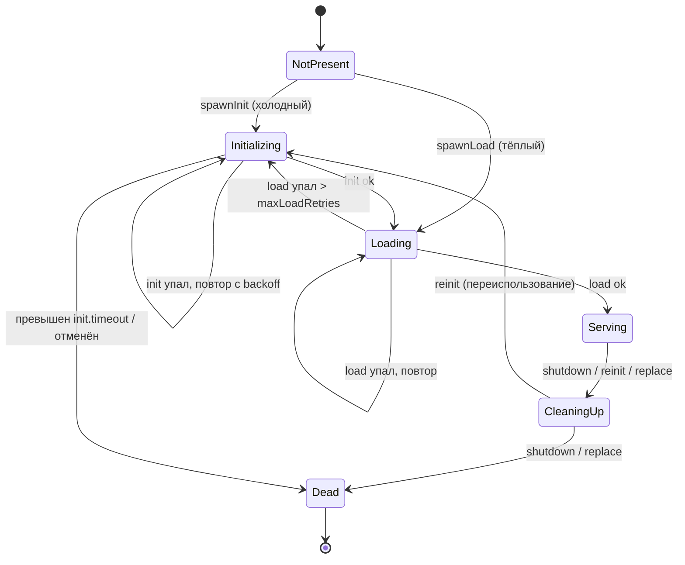

# Жизненный цикл процесса

Каждым процессом управляет один `ProcessFSM` — конечный автомат в стиле актора с
единственным **диспетчером на виртуальном потоке**, который читает мейлбокс
конвертов и сопоставляет их с текущим состоянием. Пользовательский код (`init`,
`load`, `compute`, `cleanUp`) выполняется на **отдельных** виртуальных потоках,
поэтому диспетчер никогда не блокируется.

## Состояния

| Состояние | Смысл |
|---|---|
| **NotPresent** | Только что создан; ничего ещё не происходило. |
| **Initializing** | Выполняется `init`. При сбое — повторы с экспоненциальным backoff, пока не исчерпан общий бюджет `init.timeout`. |
| **Loading** | Выполняется `load`. При сбое — повторы до `maxLoadRetries`, затем откат к `Initializing`. |
| **Serving** | Живой и отвечает на запросы. Объект `Process` хранится в FSM. |
| **CleaningUp** | Выполняется `cleanUp` процесса; поставленные в очередь запросы завершаются с ошибкой. |
| **Dead** | Терминальное. Поток диспетчера завершается. |

## Холодный старт против тёплого

- **Холодный старт** (`spawnInit`): `NotPresent → Initializing → Loading →
  Serving`. Когда сохранённого состояния нет.
- **Тёплый старт** (`spawnLoad`): `NotPresent → Loading → Serving`. При
  [рестарте](idempotent-restart.md), когда движок нашёл живой `LogInitialized` —
  `init` пропускается.

Какой путь выбрать, движок решает при установке графа: он сканирует лог в поисках
последнего не-отозванного `LogInitialized` для каждого процесса.

## Повторы, backoff, таймауты

- **Init** повторяется при каждом сбое с [экспоненциальным backoff + джиттером](#backoff),
  но *общее* настенное время в `Initializing` ограничено `defaultInitTimeout`.
  Превышение переводит в `Dead` с `InitializationTimeoutException`. Каждая
  отдельная попытка `init` также ограничена `defaultInitTimeout`.
- **Load** повторяется до `maxLoadRetries` раз; после этого FSM откатывается к
  свежему циклу `init`. Каждая попытка `load` ограничена `defaultLoadTimeout`.
- **Compute** (запрос) ограничен дедлайном запроса, производным от `queryTimeout`
  (или таймаута конкретного вызова).
- **Cleanup** ограничен `defaultCleanupTimeout`.

Всё это берётся из [`EngineConfig`](../guides/configuration.md).

### Backoff { #backoff }

`BackoffPolicy` даёт `delay = min(max, min · 2^(attempt-1)) · jitter`, где
`jitter` равномерно из `[0.5, 1.5)`. Границы — `backoffMin` и `backoffMax`.
Умножение защищено от переполнения (насыщается на `backoffMax`).

## Запросы до перехода в Serving

Запрос, пришедший в `Initializing` или `Loading`, **складывается в stash** и
воспроизводится при достижении `Serving`. Запрос в `NotPresent` падает с
`InitInProgressException`; в `CleaningUp`/`Dead` — с `QueryRejectedException`. См.
[Исключения](../reference/exceptions.md).

## Переинициализация

[Триггер](triggers-and-watchers.md) или
[изменение реактивной зависимости](reactive-cascade.md) вызывают *reinit*: FSM
пишет `LogDead` для текущего [Sid](sid-and-clock.md), выполняет `cleanUp`, затем
переиспользуется через `Initializing`, чтобы получить **новый Sid**. Внутри
различаются три пути очистки:

- **shutdown** — штатная остановка; `LogDead` не пишется, поэтому последующий
  рестарт ещё может тёпло загрузить состояние (идемпотентный рестарт сохраняется).
- **reinit** — `LogDead` записан, затем переиспользование в `Initializing`.
- **replace** — `LogDead` записан, затем терминальное `Dead` (используется
  [заменой графа](graph-swap.md)).

## Наблюдаемость

FSM выдаёт колбэки в [`EngineObserver`](../guides/observability.md) на каждый
переход, событие init/load/query/compute/cleanup и продвижение Sid. Колбэки
выполняются на потоках движка и обёрнуты так, что неисправный наблюдатель не может
сломать FSM.

> [English version](../../concepts/process-lifecycle.md)
