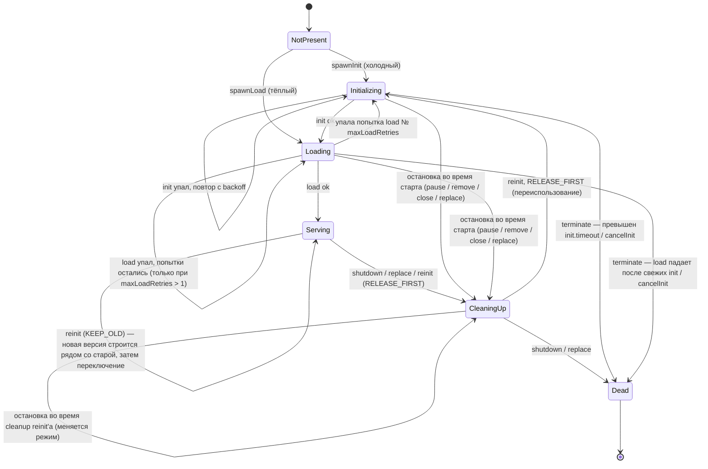

# Жизненный цикл процесса

Каждым процессом управляет один `ProcessFSM` — конечный автомат в стиле актора с
единственным **диспетчером на виртуальном потоке**, который читает мейлбокс
конвертов и сопоставляет их с текущим состоянием. Пользовательский код (`init`,
`load`, `compute`, `cleanUp`) выполняется на **отдельных** виртуальных потоках,
поэтому диспетчер никогда не блокируется.

## Состояния


```mermaid
stateDiagram-v2
    [*] --> NotPresent
    NotPresent --> Initializing : spawnInit (холодный)
    NotPresent --> Loading : spawnLoad (тёплый)
    Initializing --> Initializing : init упал, повтор с backoff
    Initializing --> Loading : init ok
    Loading --> Loading : load упал, попытки остались (только при maxLoadRetries > 1)
    Loading --> Initializing : упала попытка load № maxLoadRetries
    Loading --> Serving : load ok
    Serving --> Serving : reinit (KEEP_OLD) — новая версия строится рядом со старой, затем переключение
    Serving --> CleaningUp : shutdown / replace / reinit (RELEASE_FIRST)
    Initializing --> CleaningUp : остановка во время старта (pause / remove / close / replace)
    Loading --> CleaningUp : остановка во время старта (pause / remove / close / replace)
    CleaningUp --> CleaningUp : остановка во время cleanup reinit'а (меняется режим)
    CleaningUp --> Initializing : reinit, RELEASE_FIRST (переиспользование)
    CleaningUp --> Dead : shutdown / replace
    Initializing --> Dead : terminate — превышен init.timeout / cancelInit
    Loading --> Dead : terminate — load падает после свежих init / cancelInit
    Dead --> [*]
```

«Paused» — не состояние FSM: у узла на паузе FSM нет вовсе. Тем не менее пауза
вызывает `onStateTransition(name, <последнее состояние>, "Paused")` — из
состояния, в котором остановилась его FSM (`Dead` после cleanup паузы;
`NotPresent` для узла, у которого FSM ещё не было), в `"Paused"`, — чтобы
наблюдатель, отслеживающий состояния (например, gauge `Dead`-процессов), увидел,
что узел это состояние покинул. `introspect()` тоже показывает узел на паузе с
состоянием `Paused`.

`introspect()` читает состояние и Sid узла **согласованно**: сообщаемая пара —
та, в которой FSM действительно была, а не новое состояние со старым Sid или
наоборот. Пока создаётся новый Sid и ни одна версия не обслуживает запросы,
сообщается `sid = null`: пока узел в `Initializing` и во время `CleaningUp` при
reinit с `RELEASE_FIRST` (старый Sid уже отозван в логе, а нового ещё нет). Узел
при этом по-прежнему складывает запросы в stash, как описано ниже; пуст только
сообщаемый Sid. Во время [reinit](#переинициализация) с `KEEP_OLD` узел остаётся в
`Serving` и сообщает Sid, который отвечает на запросы, — старый до
переключения, — а `NodeReport.replacement` равен `"Initializing"` или
`"Loading"` и `NodeReport.stale == true`.

| Состояние | Смысл |
|---|---|
| **NotPresent** | Только что создан; ничего ещё не происходило. |
| **Initializing** | Выполняется `init`. При сбое — повторы с экспоненциальным backoff, пока не исчерпан общий бюджет `init.timeout`. |
| **Loading** | Выполняется `load`. `maxLoadRetries` — это **общее** число попыток load (по умолчанию `1`, т. е. без повторов): когда столько попыток упало, откат к `Initializing`. |
| **Serving** | Живой и отвечает на запросы. Объект `Process` хранится в FSM. Во время [reinit](#переинициализация) с `KEEP_OLD` новая версия инициализируется и загружается рядом с обслуживающей, которая отвечает до переключения; состояние всё это время — `Serving`. |
| **CleaningUp** | Выполняется `cleanUp` процесса. Что будет с *ожидающими* запросами, зависит от причины: при **reinit** с `RELEASE_FIRST` они складываются в stash и обслуживаются уже из нового состояния, при **замене** (замена графа) передаются новой FSM, при настоящей **остановке** (пауза, удаление, `close()`) падают с `QueryRejectedException` («&lt;name&gt; is shutting down»). Запрос, который уже *вычисляется*, при любой причине сливается в пределах бюджета очистки и падает, если не уложился в него. |
| **Dead** | Терминальное. Поток диспетчера завершается. Снова запустить процесс может только [`trigger`](#restarting-a-dead-process) или повторный `newGraph`. Сюда попадает процесс, чей результат собственного холодного `init`/`load` не удалось записать, потому что лог забрал другой инстанс, — с `LeadershipLostException` в `lastException`. Неудачный [reinit](#переинициализация) при `KEEP_OLD` (по умолчанию) сюда **не** приводит: старая версия продолжает обслуживать. При `RELEASE_FIRST` приводит — старое состояние снимается до нового `init`, поэтому reinit, который сдался (или потерял лидерство после этого `LogDead`), оставляет узел в `Dead` с `sid == null`, и он отвечает на запросы `QueryRejectedException`. |

## Холодный старт против тёплого

- **Холодный старт** (`spawnInit`): `NotPresent → Initializing → Loading →
  Serving`. Когда сохранённого состояния нет.
- **Тёплый старт** (`spawnLoad`): `NotPresent → Loading → Serving`. При
  [рестарте](idempotent-restart.md), когда движок нашёл живой `LogInitialized` —
  `init` пропускается.

Какой путь выбрать, движок решает при установке графа: он сканирует лог в поисках
последнего не-отозванного `LogInitialized` для каждого процесса.

Любой `newGraph` — и первая установка, и последующая
[смена графа](graph-swap.md#если-узел-не-запустился) — запускает каждый узел, **как только его собственные
зависимости обслуживают запросы**, поэтому независимые ветви стартуют
параллельно, а не по одному узлу за раз. Упавший узел не останавливает
несвязанные с ним узлы: они продолжают стартовать, не запускаются только
зависящие от упавшего. Когда все узлы завершили старт, `newGraph` бросает первый
*корневой* сбой (узла, чьи зависимости поднялись, в топологическом порядке). Пока
идёт старт, `introspect()` показывает ещё не запущенные узлы в состоянии
`Starting`. Если во время
этого ожидания (или ожидания замены графа) вызвать `Engine.close()`, ожидание сразу
прекращается, больше ни один узел не запускается, и `newGraph`
бросает `IllegalStateException` («Engine closed while 'X' was starting»), а не
ждёт весь бюджет init. Первый `newGraph`, бросивший исключение, всё равно
оставляет граф установленным, а настроенную
[политику снапшотов](snapshots.md#автоматически--snapshotpolicy) — включённой,
так что ротация работает и до повтора (и без него); см.
[Замену графа](graph-swap.md#если-узел-не-запустился).

### Бюджет старта { #startup-budget }

Каждому узлу даётся **`initTimeout` + `loadTimeout`** (минута при
значениях по умолчанию), чтобы дойти до `Serving`; отсчёт идёт с момента, когда
его собственные зависимости начали обслуживать запросы. Узел, который не успел,
роняет запустивший его вызов обычным `java.lang.RuntimeException`, где названо
состояние, в котором узел застрял:

```text
Node 'Stations' did not reach Serving within PT1M (state=Loading)
```

Если у узла уже была неудачная попытка, к сообщению добавляется
`"; last failure: …"`. Последующая замена графа, `resume` и
[перезапуск `Dead`](#restarting-a-dead-process) используют тот же бюджет и
сообщают о нём так же.

Это терпение *старта*, а не бюджет узла: узел он не останавливает.
`introspect()` сразу после такого сбоя вполне может показывать узел в `Loading`
с `lastException == null` — о чём и говорит `state=Loading` выше: его собственная
попытка `init`/`load` ещё не вышла за своё время и продолжает работать.

## Повторы, backoff, таймауты

- **Init** повторяется при каждом сбое с [экспоненциальным backoff + джиттером](#backoff),
  но *общее* настенное время в `Initializing` ограничено `initTimeout` и
  никогда не превышается: попытка получает только остаток бюджета. Если backoff
  не помещается, повтор наступает раньше — на середине оставшегося времени, за
  вычетом места на попытку такой же длины, как предыдущая, — но никогда не
  раньше [нижней границы backoff](#backoff), половины `backoffMin`, чтобы
  быстро падающий `init` не засыпал свой источник очередью повторов под конец
  бюджета. Если в остаток не помещается даже эта граница (плюс попытка такой же
  длины, как предыдущая), узел сдаётся сразу, не дожидаясь конца бюджета. Поэтому
  бюджет 30 с исчерпывается не позже чем через 30 с, а не на один backoff позже.
  Отказ завершается `InitializationTimeoutException` («Init for X ran
  out of its PT30S budget (total across retries); last failure: …», последний
  сбой — в причине). Узел, который после этого уходит в `Dead` (холодный старт или
  reinit с `RELEASE_FIRST`), пишет в лог `ERROR` «FSM[X] giving up: …». Reinit с
  `KEEP_OLD` оставляет обслуживать старую версию, пишет только `WARN` «re-init gave
  up; keeps serving …» и [повторяется позже](#when-a-re-init-fails).
- **Отклонённый результат init не повторяется.** Если `init` завершился
  успешно, но бэкенд лога наотрез отказывается сохранить результат
  (`IllegalArgumentException`, например `LogInitialized` сверх
  [лимитов полезной нагрузки лога](../guides/serialization.md#усиление-полезной-нагрузки-лога-автоматически)),
  повторный запуск того же `init` не поможет. Процесс сразу уходит в `Dead`,
  `NodeReport.lastException` содержит сообщение бэкенда (с перечнем лимитов), а
  `newGraph` бросает это `IllegalArgumentException`. Прочие сбои записи
  считаются неудачными попытками и повторяются, как описано выше.
- **`Error` — тоже неудачная попытка.** `OutOfMemoryError` (или любой другой
  `Error`), брошенный `init`/`load` или пока движок записывает его результат в
  лог (скажем, сериализуя большое состояние), проваливает эту попытку и
  повторяется, как любой другой сбой, — узел не застревает в `Initializing`
  или `Loading`. Повтор, которому нужна та же память, обычно падает так же,
  пока не исчерпан бюджет. Во время reinit с `KEEP_OLD` старая версия всё это
  время обслуживает запросы, а `OutOfMemoryError` считается временным сбоем:
  reinit повторяется через `reinitRetryBackoffMin`. См.
  [FAQ о размере heap](../faq.md#сколько-нужно-heap-и-можно-ли-ограничить-число-одновременных-init).
- Каждая отдельная попытка `init` также измеряется против `initTimeout`,
  и `loadTimeout` / `cleanupTimeout` работают так же: бюджет —
  **настенное время всей попытки**, а не только ожидания на возвращённом ею
  stage. Работа, сделанная *до* того как `CompletionStage` отдан наружу
  (синхронный `init`, который всё вычисляет и возвращает
  `CompletableFuture.completedFuture(...)`), тоже измеряется, и попытка,
  исчерпавшая свой бюджет, считается таймаутом, даже если её stage уже завершён.
  `init` или `load`, который **блокируется до возврата своего stage**, —
  синхронное вычисление или вызов JDBC/HTTP без таймаута — тоже завершается по
  бюджету: сторож на стороне планировщика вскоре после исчерпания бюджета
  проваливает попытку с `TimeoutException` («X init attempt N exceeded PT1S
  (init had not even returned its stage)» или аналог для `load`), и дальше
  узел повторяет попытку или уходит в `Dead` точно так же, как при любом другом
  таймауте. Поэтому синхронный `init`, крутящийся 4 с при бюджете 1 с,
  падает примерно через 1 с, а узел сдаётся с
  `InitializationTimeoutException`, когда исчерпан общий бюджет. Но
  завершение попытки **не останавливает работу**: поток, на котором идут ваши
  `init` или `load`, из-за истёкшего бюджета не прерывается, так что этот
  `init` продолжает считать в своём потоке все 4 с, а его поздний результат
  отбрасывается. Прерывает этот поток только явная остановка
  ([см. ниже](#cancelling-an-init)) — ограничивайте блокирующие вызовы их
  собственными таймаутами, чтобы брошенные попытки не копились. Попытка,
  вышедшая за время, падает с сообщением вроде `X init attempt 2 exceeded PT0.999S`:
  попытка init называет время, которое ей было выделено, — остаток общего
  бюджета на момент её старта, — а не настроенный `initTimeout` (попытка
  load, `X load attempt N exceeded …`, называет полный `loadTimeout`).
  Именно это сообщение затем показывает
  [`NodeReport.lastException`](../guides/observability.md#снимок-на-момент-времени--introspect).
- Когда попытка `init` выходит за этот бюджет или во время `init` процесс
  отменяют ([`cancelInit`](#cancelling-an-init)), ставят на паузу, удаляют,
  заменяют при замене графа, он умирает или движок закрывается, движок вызывает `cancel(true)`
  на stage, который вернул `init`, — его результат всё равно был бы отброшен.
  Для обычного `CompletableFuture` это лишь завершает future и не прерывает
  стоящую за ним работу, поэтому длинный `init` должен по-прежнему кооперативно
  проверять отмену; для Kotlin
  [`SuspendingInitializer`](../guides/kotlin-dsl.md#suspend-init-и-load)
  отменяется корутина.
- **Фабрика, вернувшая `null`**, проваливает попытку с `IllegalStateException`,
  называющим процесс, — «the init factory of 'X' returned null» (или «the load
  factory of 'X' returned null»); о ней сообщается и она повторяется, как любая
  другая неудачная попытка.
- **Load** выполняется не более `maxLoadRetries` раз **всего** — вопреки
  названию настройка считает попытки, а не повторы, поэтому значение по
  умолчанию `1` означает *отсутствие* повторов load: первый же упавший `load`
  откатывается к свежему циклу `init` (`2` — один повтор и т. д.). Если затем `load` снова падает на только что
  инициализированном состоянии, каждый следующий откат к `init` ждёт задержку
  [backoff](#backoff) (`backoffMin`..`backoffMax`), а весь цикл ограничен
  `initTimeout` (отсчёт с первого отката): когда он исчерпан, процесс
  уходит в `Dead` с `InitializationTimeoutException` («Load for X kept failing
  after N fresh inits …»). Каждая попытка `load` ограничена `loadTimeout`.
  Stage `load`, вышедший за этот бюджет, **отменяется** — точно так же, как и
  load, ставший ненужным по другой причине (отмена всё равно не прерывает поток
  загрузчика); см.
  [контракт отмены load](#load-cancellation).
- **Необъявленная зависимость не повторяется никогда.** `ctx.query` к имени,
  которое узел не объявил, в `init` или в `load`, бросает
  `UndeclaredDependencyException`, и процесс сразу уходит в `Dead`: ни повтора
  init, ни повтора load, ни отката от `load` к свежему `init`. Так же и когда ваш
  код обернул и перебросил исключение — тогда `onInitFailed`/`onLoadFailed` и
  `NodeReport.lastException` несут вашу обёртку, а `newGraph` получает голый
  `UndeclaredDependencyException`. Вердикт касается только спросившего процесса —
  `requester()` исключения. Потребителя, получившего опечатку *зависимости*
  (внутри `QueryRejectedException`, когда эта зависимость умирает, или просто как
  ответ её `compute`), это не касается: он повторяет попытку, как после любого
  другого неудачного запроса к зависимости. См.
  [Исключения](../reference/exceptions.md#undeclared-dependency-in-init).
- **Compute** (запрос) ограничен дедлайном запроса, производным от `queryTimeout`
  (или таймаута конкретного вызова). Когда ответ завершается ошибкой — таймаут
  вызывающего, отмена или унаследованный дедлайн запроса к зависимости, — движок
  отменяет stage вычисления (`toCompletableFuture().cancel(true)`) и сразу
  освобождает его слот «в полёте». Для обычного Java-future это лишь завершает
  future, поэтому длинные циклы должны по-прежнему кооперативно проверять
  `ctx.currentQueryDeadline()`; для Kotlin
  [`SuspendingProcess`](../guides/kotlin-dsl.md#suspend-процессы) отменяется
  корутина. Запрос, достигший дедлайна, падает с
  `java.util.concurrent.TimeoutException`, в сообщении которого названа цель
  («Query to '&lt;name&gt;' did not complete within &lt;timeout&gt;»; запрос, ещё
  ждущий старта узла, может вместо этого сообщить «&lt;name&gt; did not start
  before the query deadline»). Вложенный `ctx.query(dep, …)`, упёршийся в
  дедлайн, унаследованный от вызвавшего запроса, сообщает «Query to
  '&lt;dep&gt;' did not complete within the deadline inherited from its calling
  query» — побеждает тот дедлайн, который сработал первым. Запрос, отправленный
  изнутри `compute` через внешний `Engine`, так же наследует дедлайн, если он
  наступает раньше его собственного таймаута («Query to '&lt;name&gt;' did not
  complete within the deadline of the query whose compute sent it»), и оба вида
  запросов отменяются, когда падает запрос, чей `compute` их отправил, — см.
  [Граф и маршрутизация](graph-and-routing.md#межпроцессные-запросы-во-время-initload).
  Поскольку вложенный запрос делит дедлайн с вызвавшим его, вызывающий `Outer`
  может получить `TimeoutException`, в котором названа **вложенная** цель
  («Query to 'Inner' did not complete within the deadline inherited from its
  calling query»), а не `Outer`: оба таймера выставлены на один и тот же момент,
  и если вложенный срабатывает первым, а `compute` у `Outer` передаёт эту ошибку
  дальше, её и видит вызывающий. Не считайте цель, названную в сообщении,
  звеном, которое тормозило.
  Запрос, у которого
  истёк таймаут или который отменили, пока он ещё **ждал** — в почтовом ящике
  или в stash, пока узел инициализируется или загружается, — после перехода
  узла в `Serving` вообще не вычисляется: его ответ никто не прочтёт, поэтому
  `compute` для него не вызывается.
- **Cleanup** ограничен `cleanupTimeout` на каждый процесс. Этот бюджет покрывает слив
  запросов «в полёте». Запрос, у которого истёк таймаут или который отменили,
  сразу освобождает слот «в полёте» своего вычисления, **даже если вычисление
  нельзя остановить** — оно всё ещё блокировано внутри `compute()`, не вернув
  stage, или его stage игнорирует `cancel()` (например,
  `minimalCompletionStage()`). Такое вычисление *брошено*: оно продолжает
  работать в фоне, но больше не держит reinit, паузу или закрытие на бюджет
  очистки, не считается неудачей очистки и не сообщает `onComputeDuration`,
  даже если позже завершится. Поэтому `cleanUp` может выполняться,
  пока брошенное вычисление ещё работает со старым состоянием.
  Запросы, которые всё ещё вычисляются, когда бюджет исчерпан, падают с
  `QueryRejectedException` («… is shutting down: the query outlived the cleanup
  timeout»), а их вычисления отменяются — они не висят до собственного дедлайна.
  Это относится к **любой** очистке, а не только к паузе, удалению и `close()`:
  старая версия после reinit с `KEEP_OLD`, reinit с `RELEASE_FIRST` и замена
  графа, подменяющая узел, точно так же роняют запрос «в полёте». Reinit с
  `KEEP_OLD` к этому моменту уже переключился на новую версию, так что ждёт
  только `cleanUp` старой; reinit с `RELEASE_FIRST` или swap сам ждёт до конца
  оставшегося бюджета. `cleanUp`, не уложившийся в остаток бюджета, считается неудачным
  (`onCleanupCompleted` с `ok=false`), и его stage отменяется
  (`toCompletableFuture().cancel(true)`). Бюджет ограничивает *узел* — и для
  `cleanUp`, который блокируется *до* возврата своего stage: движок вызывает
  `cleanUp` в отдельном потоке, и бюджет ограничивает и вызов, и stage. По
  истечении бюджета узел идёт дальше — reinit с `RELEASE_FIRST` продолжается, и
  отложенные для него запросы обслуживает новое поколение, `pause`/`close()` возвращают
  управление, — и `onCleanupCompleted(ok=false)` приходит тогда же, по бюджету
  ([Наблюдаемость](../guides/observability.md#engineobserver)). Но **тело
  `cleanUp` ничто не прерывает**: поток из-за истёкшего бюджета не прерывается, а
  отмена stage, который тело ещё не вернуло (или который уже завершён), на него
  никак не действует — блокирующее тело дорабатывает до конца в фоне. При
  **reinit** с `RELEASE_FIRST` это значит, что тело `cleanUp` старого поколения
  может ещё работать, когда уже стартует `init` следующего (например, порт или
  файловая блокировка ещё не освобождены); новый `init` восстанавливается
  обычными повторами. При `KEEP_OLD` версии и так пересекаются: новая
  инициализируется и загружается, пока старая обслуживает, а `cleanUp` старой
  идёт только после переключения. Ресурсу, который одновременно может держать
  лишь одна версия (порт, эксклюзивная файловая блокировка), нужен `RELEASE_FIRST`.
  `cleanUp`, упавший *после* истечения бюджета, логируется на `WARN` («cleanUp
  failed after its budget had run out: …»), а не теряется. Быстро завершившийся
  `cleanUp` **не** считается неудачным, если бюджет израсходовало *слияние
  запросов*: ему всё равно дают 100 мс форы, и уложившийся в них получает
  `ok=true`.
  Остановить можно лишь тот `cleanUp`, который на момент исчерпания бюджета ждёт на своём stage, и
  только если он следит за отменой. Поэтому возвращайте stage рано, реагируйте
  на отмену и держите `cleanupTimeout` больше ожидаемого времени
  вычислений, если триггер не должен обрывать запросы.
- **`close()`** останавливает процессы начиная с самых глубоких (потребителей),
  а процессы на одной глубине зависимостей — параллельно, поэтому в худшем
  случае он занимает около (число уровней зависимостей) × `cleanupTimeout`,
  а не (число процессов) × этот бюджет. `close()`, `pause()` и удаление
  продолжают ждать остановки каждого узла, даже если вызывающий поток прерван, и
  потом восстанавливают флаг прерывания — поэтому зависимость никогда не
  разбирается, пока её потребители ещё работают, а `pause` не
  возвращается раньше, чем узел остановился. `cleanUp`, не уложившийся в бюджет
  очистки, обрывается по бюджету, поэтому остановка узла всё равно завершается;
  в лог — и на пути `close()` тоже — попадает `WARN` «FSM[X] cleanup failed:
  java.util.concurrent.TimeoutException: X cleanUp did not finish within its
  share of <budget> (the budget also covers draining in-flight queries)». Более
  редкий `WARN` «GraphMachine[…] X did not finish stopping within its cleanup
  budget of …» появляется, только если сама остановка узла не завершилась
  вовремя: собственный ответ FSM об остановке истекает через бюджет плюс 250 мс,
  поэтому `WARN` срабатывает примерно через **бюджет + 250 мс** (внешний
  дедлайн вызывающего, бюджет + 500 мс, до этого не доходит). Цепочка причин
  тогда — просто
  `java.util.concurrent.ExecutionException: java.util.concurrent.TimeoutException`
  без сообщения: это таймаут ответа об остановке, а не исключение вашего
  кода.

  Каждый процесс также ждёт, пока его **поток записи в лог** (`fom-log-<name>`,
  см. [потоки](#virtual-threads)) допишет записи, поставленные до остановки, —
  не дольше `cleanupTimeout`. Если бэкенд завис, движок логирует `WARN`
  «FSM[X] log writes still pending after &lt;бюджет&gt;; not waiting for them
  any longer», и `close()` всё равно возвращается. Застрявшая запись может
  тогда попасть в лог **уже после** возврата `close()`. Такая поздняя запись —
  корректная: следующий старт читает её как любую другую (кандидата доводит или
  отбрасывает, запрос воспроизводит).
- **`shutdown(timeout)`** останавливает все процессы так же — сначала
  потребителей, процессы одной глубины вместе, каждому бюджет `timeout`, — но
  оставляет лог, планировщик и бэкенд открытыми, поэтому движок можно
  переиспользовать последующим `newGraph`. Возвращает `CompletionStage<Done>`,
  который завершается, когда каждый процесс остановился или исчерпал бюджет.
  `close()` закрывает и всё остальное — и нужен большинству вызывающих.
  **Переиспользование работает только пока этот движок остаётся лидером своего
  лога.** `shutdown` оставляет graph machine установленной, поэтому последующий
  `newGraph` идёт по пути замены графа на месте, а он пишет в лог —
  `LogChangeGraph`, если граф отличается от работающего, и в любом случае
  `LogInitialized`/`LogLoaded` перезапущенных узлов (идентичный граф
  `LogChangeGraph` не добавляет), — и лидерство захватывает лишь самый первый
  `newGraph` на свежем движке. У движка, чей лог перехватили, эти записи будут
  отклонены, и
  `newGraph` бросит
  [`LeadershipLostException`](../reference/exceptions.md#leadership): смещённый
  движок нельзя оживить связкой `shutdown` + `newGraph` — его нужно закрыть и
  открыть вместо него новый.

Всё это берётся из [`EngineConfig`](../guides/configuration.md).

### Контракт отмены load { #load-cancellation }

Когда load больше не нужен — [`cancelInit`](#cancelling-an-init), пауза,
удаление или [замена графа](graph-swap.md), отменяющие ещё идущий старт,
завершение узла, `close()`, — а также когда он просто вышел за
`loadTimeout`, движок вызывает `cancel(true)` на
`CompletionStage`, который вернул `ProcessLoader.load`. **Уважайте отмену:**
остановитесь и освободите то, что уже успели выделить (для Kotlin
[`SuspendingLoader`](../guides/kotlin-dsl.md#suspend-init-и-load) корутина
отменяется за вас).

Запрос на [reinit](#переинициализация) в этот список **не** входит: триггер или
каскад, пришедшие, пока узел в `Initializing` или `Loading`, запоминаются, идущий
старт доводится до конца (или до конца своего бюджета), и reinit начинается
только после того как узел дошёл до `Serving`. Запрос, пришедший, пока reinit с
`KEEP_OLD` уже строит новую версию, её тоже не отменяет: он выполняется, когда
та переключится (или сдастся).

Загрузчик, который отмену игнорирует и завершается позже, **теряет свой
`Process`**: обслуживать его уже никто не будет, а после отмены стейджа его
значение уже недоступно движку — освободить такой `Process` обязан сам
загрузчик. Там, где результат движку ещё виден, он его освобождает: `Process`,
чей load просто вышел за `loadTimeout`, и тот, чей `LogLoaded` не удалось
записать, получают `cleanUp` по принципу best-effort — на отдельном виртуальном
потоке и в пределах `cleanupTimeout`, — а при сбое пишется `WARN`. Каждый
`Process` освобождается ровно один раз, каким бы путём это ни происходило.

`Process.cleanUp` получает ту же отмену, но с более слабыми гарантиями: не
уложившийся в свою долю `cleanupTimeout` считается неудачным (`ok=false`),
и его stage отменяется, но его поток никогда не прерывается. Сам узел дольше
бюджета не ждёт — `cleanUp` вызывается в отдельном потоке, поэтому
`pause`/`close()` возвращают управление, а reinit с `RELEASE_FIRST` продолжается по
истечении бюджета, — но `cleanUp`, который делает работу *до* того как вернёт
свой stage, отмена не останавливает, и его тело доходит до конца в фоне, уже
после их возврата. Возвращайте stage рано и уважайте отмену, если хотите, чтобы
*работа* `cleanUp` была ограничена на практике.

### Backoff { #backoff }

`BackoffPolicy` даёт `delay = min(max, min · 2^(attempt-1)) · jitter`, где
`jitter` равномерно из `[0.5, 1.5)`. `backoffMin` и `backoffMax` ограничивают
**базовую** задержку до джиттера, поэтому `backoffMax` — не жёсткий потолок:
реальная задержка может достигать примерно `1.5 × backoffMax` (и опускаться до
`0.5 × backoffMin`). Умножение защищено от переполнения (база насыщается на
`backoffMax`).

`0.5 × backoffMin` — жёсткая нижняя граница для повторов init: она соблюдается
и под конец бюджета init, где движок укорачивает не помещающийся backoff. Если в
оставшийся бюджет не помещается даже она, узел сдаётся сразу
(см. [Повторы, backoff, таймауты](#повторы-backoff-таймауты)).

### Отмена init { #cancelling-an-init }

```java
engine.cancelInit("Stations");          // или cancelInit(ProcessRef)
engine.cancelInit(sid);                  // только для этого Sid
```

`cancelInit(String)` / `cancelInit(ProcessRef)` отменяют тот init или load,
который процесс выполняет прямо сейчас. Используйте эту форму для холодного init
или reinit с `RELEASE_FIRST`: у них ещё нет Sid (`introspect()` в это время
показывает `sid=null`), — и для reinit с `KEEP_OLD`, чья новая версия ещё в `init`.
`cancelInit(Sid)` срабатывает, только пока процесс загружает этот Sid или
переинициализируется после сбоя его load; иначе ничего не делает. В обоих случаях
stage init отменяется, и процесс уходит в `Dead`; ожидавший его получает
`InitInProgressException` ("Init of process '&lt;name&gt;' was cancelled"), а
`NodeReport.lastException` после этого содержит «InitInProgressException: Init
of process '&lt;name&gt;' was cancelled». Если процесс не
инициализируется и не загружается, ничего не происходит; для неизвестного
процесса или процесса на паузе возвращённый stage падает с
`IllegalArgumentException`.

Во время [reinit](#переинициализация) с `KEEP_OLD` отменяется только новая
версия. `cancelInit(name)` останавливает её `init` или `load`; `cancelInit(Sid)`
срабатывает на Sid новой версии (когда её `LogInitialized` уже записан) и ничего
не делает для Sid, который обслуживает. Старая версия продолжает обслуживать,
узел остаётся в `Serving` со `stale == true`, уже записанная новая версия
снимается через `LogDead`, а наблюдатель получает `onReinitFailed` с
`InitInProgressException`. Отменённый reinit движок сам не повторяет. Запрос на
reinit, пришедший за это время, — стоящий в очереди за отменённой заменой, —
вместе с ней не отбрасывается: он запускается сразу. Иначе reinit выполнит
следующий `trigger` или следующий старт.

`cancelInit(name)` отменяет и автоматический повтор reinit, который пока только
запланирован (reinit с `KEEP_OLD` сдался и ждёт `reinitRetryBackoffMin`; движок
логирует `INFO` «cancelling the scheduled re-init retry; &lt;sid&gt; keeps
serving»). Узел продолжает обслуживать, остаётся `stale`, и автоматически не
повторяется — его переинициализирует следующий `trigger` или старт.
`cancelInit(Sid)` запланированный повтор не трогает.

Об отменённом init — через `cancelInit`, паузу, удаление, замену графа или
`close()` — наблюдатель узнаёт один раз: `onInitFailed` с
`io.fom.api.AttemptCancelledException` приходит до того, как процесс покинет
`Initializing` (то есть до завершения stage, возвращённого `cancelInit`).
Прерванный так же load получает с ним `onLoadFailed`.
`AttemptCancelledException` — подкласс `CancellationException`, зарезервированный
для остановок, **инициированных движком**, чтобы наблюдатель мог отличить
остановку оператором от настоящего сбоя. Обычный `CancellationException`,
брошенный *вашим* `init`/`load` (таймаут внутри него, отменённый future, который
вы дождались), — это обычная неудачная попытка: она повторяется и расходует
бюджет, как любое другое исключение.

Отчёт определяется тем, **кто остановил попытку**, а не тем, кто заметил это
первым. Остановка движком отменяет stage попытки и прерывает её поток, поэтому
ваш `init`/`load` может проснуться и упасть сам раньше — с обычным
`CancellationException`, `InterruptedException` или чем бы это ни кончилось.
Такая попытка всё равно сообщается как `AttemptCancelledException`, ровно один
раз. Ваше исключение не сообщается, и попытка не повторяется.

!!! warning "Явная остановка прерывает поток, исчерпанный бюджет — нет"

    Эти же пять операций **прерывают** виртуальный поток, на котором работает ваш
    `init` или `load`: остановка не должна ждать работу, результат которой никому
    не нужен. Реализация, которая делает работу *до* возврата
    `CompletionStage` (блокирующий JDBC-вызов, `Thread.sleep`), получит там
    `InterruptedException` вместо того, чтобы держать `newGraph`,
    `pause` или `close()` до конца своего бюджета. Воспринимайте
    прерывание как «остановись и освободи ресурсы» и не проглатывайте флаг.
    Просто **исчерпанный** бюджет не прерывает ничего: попытка сообщается как
    таймаут, отменяется только stage, а работа, начатая внутри вызова,
    досчитывается до конца.

### Перезапуск Dead-процесса { #restarting-a-dead-process }

`Dead` терминально для FSM, но `engine.trigger(name, value)` (или
`trigger(Map)`) для процесса в `Dead` сразу **перезапускает** его: мёртвый FSM
заменяется свежим, который тёпло загружает сохранённое состояние процесса, если
живое состояние есть, и инициализирует его с нуля, если нет. Запрос, отправленный
сразу после триггера, ждёт перезапущенный процесс, а не отклоняется. `trigger`
возвращается сразу, для одного процесса одновременно выполняется только один
перезапуск, неудачный перезапуск логируется на `WARN`. `LogTrigger`
записывается **до** перезапуска, как и у любого другого триггера: запрос
переживает остановку JVM и воспроизводится на следующем старте, а на логе,
которым владеет другой инстанс, `trigger` бросает
[`LeadershipLostException`](../reference/exceptions.md#leadership) и ничего не
перезапускает. Когда процесс начинает
обслуживать запросы, запускаются и зависящие от него узлы, которые из-за него не
стартовали. Перезапуск использует граф, действующий в момент самого перезапуска:
если движок в это время занят заменой графа, перезапуск дожидается её конца и
затем поднимает процесс (если он всё ещё `Dead`) уже по новому графу — граф до
замены он никогда не устанавливает обратно.

## Запросы до перехода в Serving

Запрос, пришедший в `NotPresent`, `Initializing` или `Loading`, **складывается в
stash** и воспроизводится при достижении `Serving` — поэтому запрос, гонящийся с
процессом, который как раз (пере)запускается (например, `resume`), тоже
ждёт. Во время [reinit](#переинициализация) с `KEEP_OLD` никто не ждёт: до
переключения сразу отвечает старая версия, после — новая. Во время reinit с
`RELEASE_FIRST` (`CleaningUp`, затем `Initializing`/`Loading`) запрос
складывается в stash так же и отвечает из нового состояния, когда процесс снова
начнёт обслуживать, — отказа не будет. С
`QueryRejectedException` он падает, только если процесс действительно
останавливается («is shutting down»: пауза, удаление или `close()`) или уже
`Dead`. Запрос, гонящийся с паузой или удалением (он нашёл процесс прямо перед
тем, как того убрали из графа), получает «&lt;name&gt; is shutting down», а не
«is Dead»: узел остановили по запросу, он не упал. Запросы из
stash процесса, чей init [отменён](#cancelling-an-init), падают с
`QueryRejectedException`, причина (cause) которого — `InitInProgressException`
(«Init of process '&lt;name&gt;' was cancelled»). Сообщение говорит, кто
отменил: если старт отменила **пауза или удаление**, ждущий узла запрос
получает «&lt;name&gt; is shutting down» (узел остановили по запросу);
пользовательский **`cancelInit`** оставляет узел `Dead`, и запрос получает
«&lt;name&gt; is Dead». См. [Исключения](../reference/exceptions.md).

То же относится к узлу графа, у которого прямо сейчас **нет работающего FSM**, —
при старте он ещё ждёт свои зависимости (`Starting` в `introspect()`) или
находится между старым и новым FSM, пока замена графа его пересоздаёт: запрос к
нему (`engine.query`/`queryProcess` или `ctx.query` из другого процесса) ждёт
узел до своего дедлайна — как бы ни была выбрана цель: по имени, сообщением
`Routable`, статическим маршрутом `.handles` или динамическим `.route(...)`.
Такой ждущий запрос
[виден наблюдателям](../guides/observability.md#queries-that-wait-for-a-node)
с момента начала ожидания. Процесс на паузе по-прежнему отклоняет запрос
(«is paused»). Запросы, которые всё ещё ждут, когда узел удаляют или ставят на
паузу либо движок закрывается, падают с `QueryRejectedException`; запрос, чей
дедлайн истёк, — с `TimeoutException` (см. [выше](#повторы-backoff-таймауты)).
На закрытом движке
`engine.query` и `queryProcess` не бросают исключение: возвращённый stage падает
с `IllegalStateException` («Engine &lt;id&gt; is closed»).

Цель, которой **в графе нет вообще**, падает сразу, но исключение зависит от
пути:

| Путь | Ошибка |
|---|---|
| `queryProcess(name)` / `queryProcess(ProcessRef)` | `QueryRejectedException` («Unknown process: '&lt;name&gt;'») |
| `ctx.query(name, …)` из другого процесса | `UndeclaredDependencyException`, наследник `QueryException` («No such dependency: &lt;name&gt;; declared: [&lt;имена&gt;]») — имя проверяется по **объявленным** зависимостям вызывающего, поэтому любое другое имя падает так же, независимо от того, есть оно в графе или нет. Возникнув в `init` или `load` — и когда ваш код его обернул, — он окончателен: ни повтора, ни отката от load к init, процесс падает сразу ([подробнее](../reference/exceptions.md#undeclared-dependency-in-init)). Окончательно падает только спросивший процесс (`requester()`): если это опечатка *зависимости* — внутри её `QueryRejectedException` или как ответ её `compute`, — потребитель повторяет попытку |
| `engine.query(msg)` с целью из `Routable` или динамическим резолвером `.route(...)` | `QueryException` — полученное имя пустое или отсутствует в графе |
| `engine.query(msg)`, чей статический маршрут `.handles` удалён вместе с узлом | `QueryException` («No route for type &lt;class&gt;») — `Graph.without` выбрасывает статические маршруты на удалённые узлы |

!!! tip "Повторяйте временно отклонённые запросы"
    Процесс на паузе, останавливающийся или `Dead` отклоняет запросы с
    `QueryRejectedException` («is paused», «is shutting down» — в том числе для
    запроса, гонящегося с паузой или удалением, или ждавшего старта, который
    пауза или удаление отменили, — «is Dead», в том числе после `cancelInit`;
    отменённый init тогда — причина `InitInProgressException`);
    такие запросы повторяйте с небольшим backoff. Для reinit и замены графа
    повтор не нужен — ответит старая версия (`KEEP_OLD`) или запрос дождётся
    нового состояния. А вот
    «Unknown process» для имени, которого в графе действительно нет, —
    окончательный отказ.

## Переинициализация

[Триггер](triggers-and-watchers.md), watcher или
[изменение реактивной зависимости](reactive-cascade.md) вызывают *reinit*:
процесс строит новую версию своего состояния — новый [Sid](sid-and-clock.md) —
через `init` и `load`. Что в это время происходит с обслуживающей версией,
задаёт `EngineConfig.reinitStrategy` ([конфигурация](../guides/configuration.md)),
а узел может переопределить это через `GraphBuilder.reinitStrategy(...)`:

| Стратегия | Во время reinit | Если reinit не удался | Память |
|---|---|---|---|
| `KEEP_OLD` (по умолчанию) | на запросы отвечает старая версия | старая версия продолжает обслуживать; reinit повторяется позже | старая + новая + рабочий набор `init`, пока старая не освободится — ненадолго больше, если триггеры продолжают приходить (см. ниже) |
| `RELEASE_FIRST` | сначала снимается старая версия; запросы ждут | узел `Dead`, без состояния | одна версия за раз |

Переопределение на узле не входит в определение узла: [замена графа](graph-swap.md),
меняющая только стратегию, ничего не перезапускает, и работающий узел применяет
новую стратегию к следующему reinit.

### KEEP_OLD: старая версия обслуживает, пока не начнёт новая

1. Приходит запрос. Пока ничего не пишется. Движок логирует `INFO`
   «FSM[X] re-init started; &lt;старый Sid&gt; keeps serving (cause=…)» и вызывает
   `onReinitStarted(name, servingSid)`.
2. Выполняется `init` с обычными [повторами, backoff и бюджетом
   `initTimeout`](#повторы-backoff-таймауты). На запросы сразу отвечает старая
   версия — в stash ничего не складывается. `introspect()` показывает узел в
   `Serving` со старым Sid, `replacement = "Initializing"` и `stale = true`.
3. `init` удался: пишется `LogInitialized(new, replaces = old)`, `replacement`
   становится `"Loading"`. Старая версия по-прежнему отвечает.
4. `load` удался: пишется `LogLoaded(new)`, и за один шаг диспетчера
   обслуживающей становится новая версия — каждый следующий запрос идёт к ней.
   Срабатывает `onSidPromotion(old, new)`, движок логирует `INFO`
   «Process 'X' replaced &lt;старый Sid&gt; with &lt;новый Sid&gt;», и
   дописывается `LogDead(old)` (если эта запись не удалась, пишется только
   `WARN`: живой версию уже сделал `LogLoaded`).
5. Старая версия доводит начатые вычисления в пределах `cleanupTimeout`; не
   уложившееся падает с `QueryRejectedException` («… is shutting down: the query
   outlived the cleanup timeout»). Затем выполняется её `cleanUp`, пишется
   `LogCleanedUp(old)` и срабатывает `onCleanupCompleted` для старого Sid.

Узел не покидает `Serving`, поэтому во время reinit `onStateTransition` не
срабатывает. Если `load` новой версии упал `maxLoadRetries` раз, записанная
версия снимается через `LogDead` и запускается свежий `init`, а старая версия
продолжает обслуживать.

Триггер или изменение зависимости, пришедшие, пока строится новая версия, её не
прерывают: такие запросы сливаются в один, и он стартует, когда новая версия
начнёт обслуживать (новая версия могла увидеть изменение, а могла и нет,
поэтому выполняется ещё один цикл).

!!! warning "Пиковая память: две версии — не предел"
    Пока старая версия не освободилась, JVM держит старое состояние, новое и всё,
    что понадобилось `init`, чтобы его построить. Две — не потолок: запрос,
    слитый во время reinit (см. выше), запускает следующий reinit сразу, как
    только новая версия начинает обслуживать, — пока старая ещё дорабатывает, —
    поэтому узел может держать **три версии сразу**: дорабатывающую,
    обслуживающую и строящуюся (и ещё по одной дорабатывающей на каждый
    следующий цикл, завершившийся раньше, чем освободилась предыдущая). Как это
    ограничить:

    - держите `cleanupTimeout` коротким, чтобы дорабатывающая версия
      обрывалась и очищалась раньше (тело `cleanUp` никогда не прерывается,
      поэтому пусть оно освобождает память быстро);
    - увеличьте `dedupWindow`, чтобы всплеск триггеров или изменений
      зависимостей сливался в меньшее число reinit;
    - для узла, который не помещается в памяти дважды, используйте
      `RELEASE_FIRST` — для всего движка или только для этого узла, — он держит
      одну версию за раз.

### Если reinit не удался { #when-a-re-init-fails }

Каким бы ни был сбой — исчерпан бюджет `init` (`InitializationTimeoutException`),
`load` упорно падает, `OutOfMemoryError`, отклонённая запись, — новая версия
бросается, а старая продолжает обслуживать:

- идущий `init`/`load` отменяется, а уже записанная, но не загруженная новая
  версия снимается через `LogDead`;
- движок логирует `WARN` «FSM[X] re-init gave up; keeps serving &lt;старый Sid&gt;:
  &lt;класс исключения&gt;: &lt;сообщение&gt;»;
- `introspect()` показывает узел в `Serving` со старым Sid, `replacement = null`,
  `stale = true` и сбоем в `lastException`;
- наблюдатель получает `onReinitFailed(name, keptSid, cause)`.

Что дальше:

- Запрос, пришедший во время неудачной попытки, сразу запускает новый reinit.
- Иначе reinit **повторяется автоматически** через `reinitRetryBackoffMin`
  (по умолчанию `max(initTimeout, 30 с)`), удваиваясь с джиттером до
  `reinitRetryBackoffMax` (по умолчанию 10 мин); движок логирует `INFO`
  «FSM[X] retrying the re-init in N ms». `Duration.ZERO` это отключает. Новый
  триггер повтора не ждёт: он сразу запускает reinit, а запланированный повтор
  отменяется.
- **Постоянные** сбои не повторяются: потеря лидерства, запись, которую лог
  отклоняет с `IllegalArgumentException`, `UndeclaredDependencyException` и
  [`cancelInit`](#cancelling-an-init) оператора (он отменяет и повтор, который
  пока только запланирован). После потери лидерства инстанс больше не может
  писать в лог. О потере сообщается один раз на обслуживающий Sid —
  `onInitFailed`/`onLoadFailed` неудачной попытки и `onReinitFailed` с
  `LeadershipLostException`, — а последующие запросы для узла молча
  отбрасываются без запуска `init`; узел остаётся `stale`.
- Запрос остаётся в логе, новее обслуживаемого состояния, поэтому следующий
  старт в любом случае выполнит его снова.

### Рестарт, пауза и удаление посреди reinit

- **Рестарт.** Движок сразу обслуживает старое состояние и доводит reinit в
  фоне: если `LogInitialized` новой версии ещё не был записан, reinit
  выполняется снова; если записан, но не загружен, он загружается без нового
  `init` (не загружающийся снимается, и запускается свежий `init`); после её
  `LogLoaded` тёпло загружается уже новая версия. Узел, который к следующему
  старту работает с `RELEASE_FIRST`, вместо этого снимает такого кандидата и
  инициализируется холодно (см. ниже). См.
  [Идемпотентный рестарт](idempotent-restart.md).
- **Пауза** запоминает обслуживающий Sid. Новая версия, которая уже
  загружается, сохраняется: `resume` загрузит её без второго `init` (если к тому
  времени действует `RELEASE_FIRST` — отбросит её и сделает холодный init). Версия, ещё
  находящаяся в `init`, отбрасывается, узел встаёт на паузу как `stale`, и
  `resume` его переинициализирует.
- **Удаление** (или `newGraph` без этого узла) снимает обслуживающую версию, а
  вместе с ней и уже записанную новую. Новая версия не всегда получает
  собственный `LogDead` (например, если узел поставили на паузу, пока она
  загружалась); `LogDead` обслуживающей версии всё равно отбрасывает её из
  лога — см. [Идемпотентный рестарт](idempotent-restart.md#restart-mid-reinit).
- **`close()`** сразу отменяет reinit — а также запланированный
  автоматический повтор или слитый запрос, ждущий старта, — и возвращается,
  когда очищены все версии, которые держит узел, и дописаны его поставленные в
  очередь записи в лог (их ждут не дольше `cleanupTimeout`, см.
  [`close()`](#повторы-backoff-таймауты) выше). Уже записанная новая версия
  остаётся в логе и загружается при следующем старте.
- **Замена графа с изменённым узлом** работает как раньше: узел
  [заменяется холодно](graph-swap.md), какой бы reinit он ни выполнял.

### RELEASE_FIRST: сначала снять, потом инициализировать

Прежний порядок: FSM пишет `LogDead` для текущего Sid, сливает запросы и
выполняет `cleanUp`, затем переиспользуется через `Initializing` и `Loading` до
нового Sid. Пришедшие за это время запросы складываются в stash и получают ответ
от новой версии. Внутри различаются три пути очистки:

- **shutdown** — штатная остановка; `LogDead` не пишется, поэтому последующий
  рестарт ещё может тёпло загрузить состояние (идемпотентный рестарт сохраняется).
- **reinit** — `LogDead` записан, затем переиспользование в `Initializing`.
- **replace** — `LogDead` записан, затем терминальное `Dead` (используется
  [заменой графа](graph-swap.md)).

!!! danger "При RELEASE_FIRST reinit снимает текущее состояние до запуска нового `init`"
    `LogDead` для текущего Sid пишется **первым** — до `cleanUp` и до старта
    нового `init`. Если новый `init` затем падает весь свой бюджет `initTimeout`
    (например, источник данных недоступен), узел оказывается в **`Dead` без
    состояния** (`sid == null`). Запросы к нему отклоняются с
    `QueryRejectedException` («… is Dead»), пока его не перезапустит `trigger`, а
    рестарт JVM тоже не сможет загрузить его тёпло: старое состояние снято,
    поэтому рестарт делает холодный init — и падает так же, пока источник
    недоступен.

    Поэтому либо оставьте `KEEP_OLD` по умолчанию, либо делайте `init`
    устойчивым (возвращайте внутри `init` последнюю удачную копию, которую храните
    сами), либо не запускайте reinit, пока источник заведомо лежит.

Все три пути сначала сливают запросы «в полёте» в пределах `cleanupTimeout`:
вычисление, не уложившееся в бюджет, отменяется, а его запрос падает с
`QueryRejectedException` («… the query outlived the cleanup timeout») — то есть
обычный триггер обрывает долгий запрос так же, как пауза или замена графа.
`cleanUp`, не уложившийся в остаток бюджета, тоже отменяется — и логируется с
указанием процесса и бюджета («`<name>` cleanUp did not finish within its share
of `PT…`; the budget also covers draining in-flight queries»).

На старте узел с `RELEASE_FIRST`, который нужно перестроить, потому что его
реактивный продюсер изменился, пока движок не работал, делает холодный init, а
не обслуживает сначала старое состояние. То же относится к узлу с
`RELEASE_FIRST`, который находит кандидата, сохранённого ранее reinit'ом с
`KEEP_OLD` (стратегия сменилась между запусками): при рестарте, по `resume` или
при более позднем старте кандидат отбрасывается (не всегда собственным
`LogDead`: его отбрасывает из лога холодный `LogInitialized` узла) — рядом со
старым состоянием он никогда не загружается, — и узел инициализируется холодно; его реактивные
потребители переинициализируются вместе с ним. Узел, который при старте
остаётся на паузе, вместо этого помечается устаревшим и переинициализируется при
возобновлении.

Reinit с `RELEASE_FIRST`, чей `LogDead` **не удаётся сохранить**,
**отбрасывается**: FSM логирует `ERROR` и продолжает обслуживать то состояние,
которое уже есть, вместо того чтобы снять его и остаться `Dead` вообще без
состояния. Чтение остаётся корректным, но состояние теперь заведомо устарело
(`NodeReport.stale == true`), и записать для этого процесса что-либо
долговременное больше нельзя. Постоянными считаются три ответа бэкенда, и все
три заканчиваются так:

- запись **отклонена** (бэкенд вернул пустой `Optional` — между принятым триггером
  и самим reinit'ом, после дедупа, лог забрал другой инстанс). Движок поднимает
  собственное
  [`LeadershipLostException`](../reference/exceptions.md#leadership) — «cannot
  re-initialise `<name>`: no longer the leader of the log».
- бэкенд сам **бросает** `LeadershipLostException` (огороженный инстанс
  [Postgres](../guides/persistence-backends.md)). Тогда и исключение, и его
  сообщение — бэкендовские.
- бэкенд бросает `IllegalArgumentException` — событие, которое он не сможет
  сохранить ни при каких условиях (например, полезная нагрузка сверх
  [лимитов лога](../guides/serialization.md#усиление-полезной-нагрузки-лога-автоматически)).
  Повторять это вечно бессмысленно, поэтому reinit тоже отбрасывается, а
  сообщается именно это `IllegalArgumentException`.

Всё остальное (таймаут, обрыв соединения) считается временным: reinit не
отбрасывается, а **повторяется** с init-[backoff](#backoff).

Об отбрасывании сразу узнаёт [наблюдатель](../guides/observability.md): ему
приходит `onInitFailed` с попыткой `1` и тем из трёх исключений выше, которое
сработало, и это же исключение попадает в `NodeReport.lastException`, пока
`state` узла всё ещё `Serving`. Сообщается это **один раз на застрявшее
состояние**: движок помнит [Sid](sid-and-clock.md), на котором сдался, поэтому
череда триггеров против того же состояния отбрасывается молча и не заваливает
наблюдателя. Как только reinit действительно случится — его `LogDead` записан, и
узел уходит через `Initializing` — узел забывает об отбрасывании, и следующее
будет сообщено снова.

Потеря лидерства при записи результата *собственного* `init` или `load` процесса —
другой случай: там узел действительно становится `Dead`, а это исключение
попадает в его `NodeReport.lastException`.

## На каких потоках выполняется ваш код { #virtual-threads }

Каждый вызов `init`, `load`, `compute` и `cleanUp` выполняется на виртуальном
потоке, причём каждый `compute` — на **новом** (рабочий executor процесса
запускает новый виртуальный поток на каждую задачу; их имена — в разделе
[Как читать дамп потоков](#thread-dumps)). Два следствия:

- **Кэши в `ThreadLocal` никогда не переиспользуются.** `ThreadLocal`
  (`SimpleDateFormat`, буфер, парсер), заполненный в одном `compute`, к
  следующему уже пропал: каждый вызов снова платит за инициализацию. Храните такие
  объекты в самом `Process` (потокобезопасными или неизменяемыми) или в пуле.
- **Не блокируйтесь, будучи закреплённым (pinned).** В JDK 21 виртуальный поток,
  блокирующийся внутри `synchronized`-блока или метода (или нативного фрейма),
  *закрепляет* свой поток-носитель (carrier). Носителей столько же, сколько ядер
  CPU, поэтому несколько закреплённых `compute` могут остановить **весь движок** —
  все диспетчеры, все прочие `compute` и даже таймауты запросов, потому что
  дедлайны тоже завершаются на виртуальных потоках. Хуже всего — ждать другой
  запрос внутри `synchronized`, например
  `ctx.query(dep, msg).toCompletableFuture().get()`: вычислению зависимости может
  понадобиться носитель, который сам закреплён и ждёт вас.

  ```java
  // Нельзя: закрепляет носитель, пока ждёт другой процесс
  public synchronized CompletionStage<?> compute(QueryableContext ctx, Object query) {
      Object unit = ctx.query("Units", query).toCompletableFuture().join();
      return CompletableFuture.completedFuture(convert(unit));
  }

  // Можно: скомпонуйте stage и вообще не блокируйтесь ...
  public CompletionStage<?> compute(QueryableContext ctx, Object query) {
      return ctx.query("Units", query).thenApply(this::convert);
  }

  // ... а состояние, которое нужно защищать, защищайте ReentrantLock: он паркует
  // виртуальный поток и освобождает носитель
  private final ReentrantLock lock = new ReentrantLock();
  ```

  Используйте `java.util.concurrent.locks.ReentrantLock` вместо `synchronized`
  везде, где защищённый код может блокироваться, и никогда не ждите
  `ctx.query(...).get()`, удерживая монитор, — лучше верните скомпонованный
  `CompletionStage`. Чтобы найти закрепления, запустите с
  `-Djdk.tracePinnedThreads=full` (JDK 21): он печатает стек каждый раз, когда
  виртуальный поток блокируется в закреплённом состоянии.
- **Не гоняйте CPU-bound циклы на виртуальных потоках.** Виртуальные потоки
  JDK 21 **не вытесняются по времени**: поток, который ни разу не паркуется,
  держит свой carrier, пока не закончит. Все виртуальные потоки JVM — и ваши, и
  движка — делят один планировщик по умолчанию, а его пул carrier'ов не больше
  числа ядер CPU. Поэтому виртуальные потоки приложения, которые никогда не
  паркуются (цикл активного ожидания, долгий расчёт, запущенный через
  `Thread.ofVirtual()` или `newVirtualThreadPerTaskExecutor()`, тяжёлые по CPU
  вызовы `compute` или `init`), могут занять **все** carrier'ы, и собственные
  виртуальные потоки движка — диспетчеры, очистки, таймауты дедлайнов — не
  смогут выполниться, пока те их не отпустят. Симптомы похожи на ошибки движка:
  запросы падают по таймауту, а `pauseTenant` (или любая остановка) ждёт весь
  бюджет очистки и пишет в лог «cleanUp did not finish within its share of …»,
  хотя сам ваш `cleanUp` мгновенный — ему просто не досталось carrier'а.
  Выполняйте CPU-bound работу в **пуле платформенных потоков** (например,
  `Executors.newFixedThreadPool(n)` с `n` меньше числа ядер) и возвращайте
  результат как `CompletionStage`; виртуальные потоки оставьте для работы,
  которая блокируется на I/O или блокировках.

### Как читать дамп потоков { #thread-dumps }

Движок называет свои потоки по процессу, на который они работают, поэтому
у зависшего `init` или занятого диспетчера видно, чей он:

| Имя потока | Вид | Что на нём выполняется |
|---|---|---|
| `fom-fsm-<name>` | виртуальный | **диспетчер** процесса: его mailbox, смена состояний, логирование жизненного цикла |
| `fom-worker-<name>-<N>` | виртуальный | вызовы `init`, `load` и `compute` процесса и задачи, отправленные в `ctx.executor()`, — по потоку на задачу, `N` считается с 0. Во время reinit с `KEEP_OLD` здесь бок о бок идут `init`/`load` новой версии и вычисления старой |
| `fom-log-<name>` | виртуальный | **поток записи в лог** процесса: дописывает записи reinit с `KEEP_OLD` (`LogInitialized` и `LogLoaded` новой версии, `LogDead` старой, `LogDead` снимаемого кандидата, повторно записанный `LogTrigger`) по порядку и вне диспетчера, так что медленный лог не задерживает запросы к старой версии. Через него идут и записи остановки, и `LogDead` reinit'а с `RELEASE_FIRST` — диспетчер их дожидается; `close()` ждёт его не дольше `cleanupTimeout` (затем `WARN` «log writes still pending …», и застрявшая запись может попасть в лог после возврата `close()`). Запускается по требованию; завершается примерно через секунду простоя |
| `fom-budget-<name>` | виртуальный | сторож, завершающий попытку init/load, у которой исчерпан бюджет |
| `fom-cleanup-<name>`, `fom-cleanup-call-<name>` | виртуальный | дренаж выполняющихся запросов и вызов `cleanUp` при остановке или для старой версии после reinit |
| `fom-discard-<name>` | виртуальный | best-effort `cleanUp` для `Process`, который построил `load`, но который никогда не будет обслуживать запросы (устаревший или поздний результат) |
| `fom-cascade-<name>` | виртуальный | запись изменения продюсера для его потребителей и запуск их переинициализации |
| `fom-restart-<name>` | виртуальный | перезапуск процесса в `Dead` (`trigger`) |
| `fom-observer` | виртуальный | колбэки `EngineObserver` по запросам (`onQueryCompleted`, `onQueryFailed`, `onComputeDuration`) |
| `fom-watcher-<N>` | виртуальный | проверки `ScheduledWatcher`, у которого нет своего executor |
| `fom-scheduler-<instanceId>` | платформенный | единственный поток-таймер движка (`instanceId` сам имеет вид `fom-<uuid>`) |
| `fom-query-deadlines`, `fom-query-deadline` | платформенный / виртуальный | таймауты запросов |
| `fom-engine-task`, `fom-size-policy` | виртуальный | снапшоты и работа при остановке; проверки `SizeBasedSnapshotPolicy` |
| `fom-start-<N>` | виртуальный | запуск узла при `newGraph` (первый граф или замена): выбирает тёплый или холодный старт, пишет «warm start for X» / «cold start for X» и ждёт, пока узел начнёт обслуживать, — по потоку на узел, `N` с 0. Возобновление запускает узлы на потоке вызывающего |

Почти все они — **виртуальные потоки**, а `jstack` (как и `kill -3`) печатает
**только платформенные** — диспетчеров и воркеров в его выводе просто нет.
Снимайте дамп виртуальных потоков через `jcmd`:

```bash
jcmd <pid> Thread.dump_to_file -format=text /tmp/threads.txt
jcmd <pid> Thread.dump_to_file -format=json /tmp/threads.json
```

Файл не должен существовать заранее. У припаркованного виртуального потока
виден его стек (например, диспетчер, ждущий свой mailbox, или воркер,
заблокированный в вашем `init`).

## Наблюдаемость

FSM выдаёт колбэки в [`EngineObserver`](../guides/observability.md) на каждый
переход, событие init/load/query/compute/cleanup и продвижение Sid; reinit с
`KEEP_OLD` добавляет `onReinitStarted` и, если сдался, `onReinitFailed`. Колбэки
выполняются на потоках движка и обёрнуты так, что неисправный наблюдатель не может
сломать FSM. Колбэк, который продолжает бросать исключения, логируется на `WARN`
только при 1-м, 2-м, 4-м, 8-м… сбое для процесса (в остальных случаях — на
`DEBUG`).

Каждая строка, которую пишет диспетчер процесса, — включая встроенные строки
жизненного цикла (старт, завершение и длительность init/load, повторы, «giving
up»), — несёт два ключа [MDC](https://www.slf4j.org/manual.html#mdc):
**`fom.engine`** (id инстанса движка) и **`fom.process`** (имя процесса). По ним
можно различить два движка в одной JVM с одноимёнными процессами, например
`%X{fom.engine} %X{fom.process}` в шаблоне Logback или в JSON-энкодере. Они
выставляются только на потоке диспетчера, а не на потоках, где выполняются ваши
`init`/`load`/`compute`, — с одним исключением: строка `GraphMachine` «warm start
for X from clock N» / «cold start for X» тоже их несёт, хотя пишется на потоке
`fom-start-<N>` (или вызывающего). `slf4j-simple` MDC игнорирует; чтобы их видеть, нужен
биндинг с поддержкой MDC (Logback, Log4j 2).

> [English version](../../concepts/process-lifecycle.md)
