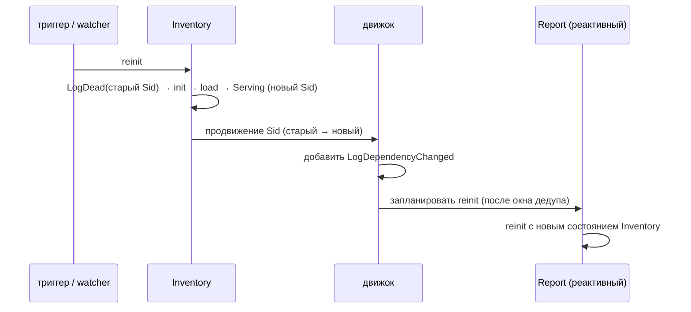

# Реактивный каскад

Когда процесс-поставщик переинициализируется, его [Sid](sid-and-clock.md)
меняется. FOM может автоматически переинициализировать потребителей, зависящих от
него, в порядке зависимостей. Это распространение и есть **реактивный каскад**.

## Реактивные и стабильные

Каждое ребро зависимости — одного из двух видов:

| Вид | Создаётся | При смене Sid поставщика |
|---|---|---|
| **Реактивная** | `add(..., "Producer")`, `Dependency.reactive("Producer")` | потребитель переинициализируется |
| **Стабильная** | `Dependency.stable("Producer")` (через `addDeps`) | ничего — потребитель сохраняет состояние |

Используйте **реактивную**, когда состояние потребителя производно от поставщика и
должно оставаться согласованным. **Стабильную** — когда потребитель читает
поставщика один раз при init и не интересуется поздними изменениями.

```java
new GraphBuilder()
    .add("Inventory", InventoryInit::new, InventoryInit::new)
    .addDeps("Report", ReportInit::new, ReportInit::new,
             Dependency.reactive("Inventory"))   // перезапускать Report при смене Inventory
    .addDeps("Audit",  AuditInit::new,  AuditInit::new,
             Dependency.stable("Inventory"))      // Audit фиксирует Inventory один раз
    .build();
```

## Как распространяется каскад



1. `Inventory` переинициализируется и продвигается со старого Sid на новый.
2. Движок добавляет `LogDependencyChanged`, фиксируя переход.
3. Для каждого **реактивного** потребителя движок планирует reinit.
4. Потребитель, который сам является поставщиком, каскадирует дальше —
   распространение идёт по DAG.

## Окно дедупликации

Reinit'ы для процесса дебаунсятся **окном дедупликации** (`EngineConfig.dedupWindow`,
по умолчанию 100 мс). Несколько изменений в пределах окна **схлопываются в один
reinit**:

- Первое изменение планирует reinit через `dedupWindow`.
- Дальнейшие изменения в окне считаются, но не добавляют работы.
- При срабатывании окна выполняется один reinit; если схлопнулось больше одного
  изменения, вызывается `onDedupCollapsed(process, count)` наблюдателя.

Это не даёт всплеску upstream-изменений (или ромбу fan-in, где меняются несколько
поставщиков сразу) перезапускать потребителя много раз подряд. Окно должно быть
строго положительным; задайте малое значение (например, 1 мс), чтобы практически
отключить дебаунс.

## Первая установка против поздних изменений

При **первой** установке графа каскада нет: потребители ещё не запущены, и каждый
стартует с нуля в топологическом порядке. Каскад срабатывает только на
*последующие* продвижения Sid — триггеры, watcher'ы, upstream-reinit'ы и
[замены графа](graph-swap.md).

> [English version](../../concepts/reactive-cascade.md)
