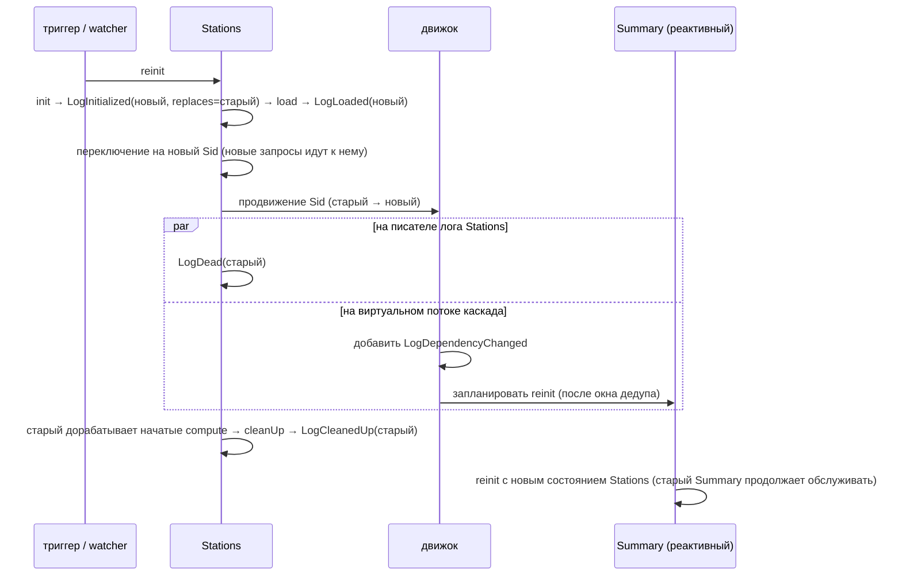

# Реактивный каскад

Когда процесс-поставщик переинициализируется, его [Sid](sid-and-clock.md)
меняется. FOM может автоматически переинициализировать потребителей, зависящих от
него, в порядке зависимостей. Это распространение и есть **реактивный каскад**.

## Реактивные и стабильные

Каждое ребро зависимости — одного из двух видов:

| Вид | Создаётся | При смене Sid поставщика |
|---|---|---|
| **Реактивная** | `add(..., "Producer")`, `Dependency.reactive("Producer")` | потребитель переинициализируется |
| **Стабильная** | `Dependency.stable("Producer")` (через `addDeps`) | ничего — потребитель сохраняет состояние |

Используйте **реактивную**, когда состояние потребителя производно от поставщика и
должно оставаться согласованным. **Стабильную** — когда потребитель читает
поставщика один раз при init и не интересуется поздними изменениями.

```java
new GraphBuilder()
    .add("Stations", StationsInit::new, StationsInit::new)
    .addDeps("Summary", SummaryInit::new, SummaryInit::new,
             Dependency.reactive("Stations"))   // перезапускать Summary при смене Stations
    .addDeps("Audit",  AuditInit::new,  AuditInit::new,
             Dependency.stable("Stations"))      // Audit фиксирует Stations один раз
    .build();
```

## Как распространяется каскад


```mermaid
sequenceDiagram
    participant T as триггер / watcher
    participant I as Stations
    participant E as движок
    participant R as Summary (реактивный)
    T->>I: reinit
    I->>I: init → LogInitialized(новый, replaces=старый) → load → LogLoaded(новый)
    I->>I: переключение на новый Sid (новые запросы идут к нему)
    I->>E: продвижение Sid (старый → новый)
    par на писателе лога Stations
        I->>I: LogDead(старый)
    and на виртуальном потоке каскада
        E->>E: добавить LogDependencyChanged
        E->>R: запланировать reinit (после окна дедупа)
    end
    I->>I: старый дорабатывает начатые compute → cleanUp → LogCleanedUp(старый)
    R->>R: reinit с новым состоянием Stations (старый Summary продолжает обслуживать)
```

Сначала объявляется продвижение — как только новая версия начинает обслуживать.
Затем `LogDead` старой версии добавляется на собственном писателе лога
`Stations`, параллельно с записями `LogDependencyChanged` каскада — друг
относительно друга они не упорядочены. Старая версия очищается (и пишется её
`LogCleanedUp`) только после того, как завершит уже начатые compute.

1. `Stations` переинициализируется и продвигается со старого Sid на новый.
   При стратегии по умолчанию `ReinitStrategy.KEEP_OLD` старая версия отвечает
   на запросы до этого момента; при `RELEASE_FIRST` она сначала выводится, и
   запросы ждут. См. [Переинициализация](process-lifecycle.md#переинициализация).
2. Движок добавляет `LogDependencyChanged`, фиксируя переход, — по одному на
   каждого работающего реактивного потребителя, каждый до триггера этого
   потребителя.
3. Для каждого **реактивного** потребителя движок планирует reinit. Потребитель
   заменяется так же: его старая версия обслуживает, пока новая, построенная на
   новом `Stations`, не загружена.

   Шаги 2–3 выполняются на отдельном виртуальном потоке, а не на диспетчере
   поставщика: каждая запись — это добавление в лог (`fsync` на файловом
   бэкенде), и широкий каскад иначе не давал бы поставщику отвечать на запросы,
   пока все они не записаны. Поскольку запись каждого потребителя по-прежнему
   предшествует его триггеру, рестарт воспроизводит ровно те reinit'ы, которые
   ещё не произошли.
4. Потребитель, который сам является поставщиком, каскадирует дальше —
   распространение идёт по DAG.

Каскад начинается с **продвижения**, а не с триггера: пока `Stations` строит
новую версию, потребителей не трогают, а если этот reinit не удался, `Stations`
продолжает обслуживать старую версию, и каскада нет.

Триггер или изменение зависимости, пришедшие к процессу, **который уже
заменяется**, замену не прерывают: они запоминаются и выполняются ещё одним
reinit сразу после того, как новая версия начала обслуживать (несколько таких
запросов сливаются в один). Потребитель в середине замены всё равно получает свой
`LogDependencyChanged` — у него есть живой Sid, старый, — поэтому он приходит к
новому состоянию поставщика, даже если его собственный reinit уже прочитал старое.

Реактивный потребитель, **удалённый, пока идёт каскад** (`remove`,
замена графа без него), просто пропускается: каскад продолжается для остальных
потребителей.

Помимо reinit, каскад срабатывает и когда поставщик, у которого упал `load`,
[откатывается к свежему `init`](process-lifecycle.md#повторы-backoff-таймауты)
(его состояние уже могли обслужить), и когда
[замена графа](graph-swap.md) меняет узел, пока он переинициализируется.

## Окно дедупликации

Reinit'ы для процесса дебаунсятся **окном дедупликации** (`EngineConfig.dedupWindow`,
по умолчанию 100 мс). Несколько изменений в пределах окна **схлопываются в один
reinit**:

- Первое изменение планирует reinit через `dedupWindow`.
- Дальнейшие изменения в окне считаются, но не добавляют работы.
- При срабатывании окна выполняется один reinit; если схлопнулось больше одного
  изменения, вызывается `onDedupCollapsed(process, count)` наблюдателя.

Это не даёт всплеску upstream-изменений (или нескольким поставщикам, изменившимся
в пределах одного окна) перезапускать потребителя много раз подряд. Окно должно быть
строго положительным; задайте малое значение (например, 1 мс), чтобы практически
отключить дебаунс.

!!! note "Ромбы согласуются в итоге, но не координируются"
    Пусть `Summary` реактивно зависит и от `Alerts`, и от `Stations`, а `Alerts`
    сам реактивно зависит от `Stations`. Движок не координирует эти два пути: при
    всплеске триггеров `Summary` может переинициализироваться после изменения
    `Stations`, но до того, как `Alerts` догонит, и временно оказаться
    построенным из **разных версий поставщиков**. Каждое следующее изменение
    планирует ещё один reinit, поэтому `Summary` сходится, когда триггеры
    прекращаются.

    Окно дедупа эти два пути тоже **не** объединяет. Одно изменение `Stations`
    всегда переинициализирует `Summary` **дважды**: один раз по прямому ребру,
    спустя `dedupWindow` после изменения, и ещё раз через `Alerts`, чей
    собственный reinit сам откладывается на окно, и лишь его новый Sid
    планирует `Summary` ещё через одно окно. Два изменения `Summary` разнесены
    минимум на окно, поэтому в одно они никогда не схлопываются.

## Первая установка против поздних изменений

При **первой** установке графа каскада нет: потребители ещё не запущены, и каждый
стартует, как только его собственные зависимости обслуживают запросы (независимые
ветви стартуют параллельно). Каскад срабатывает только на
*последующие* продвижения Sid — триггеры, watcher'ы, upstream-reinit'ы и
[замены графа](graph-swap.md).

**Рестарт** при этом тоже сохраняет согласованность реактивных рёбер. Когда
движок ставит первый граф после старта JVM, реактивный потребитель считается
построенным на выведенном состоянии, если его реактивная зависимость на этом
старте холодно инициализируется (например, её `param` или зависимости изменились
между запусками — транзитивно вниз по цепочке), если живой `LogInitialized`
зависимости новее, чем у потребителя (движок остановился после reinit
поставщика, но до того, как каскад дошёл до потребителя), или если тёплый `load`
зависимости на этом старте падает и она откатывается к свежему `init` до старта
потребителя. Такой потребитель тепло загружается и обслуживает своё состояние, а
когда начал обслуживать, переинициализируется в фоне. При
`ReinitStrategy.RELEASE_FIRST` он вместо этого холодно инициализируется.
Потребитель на паузе помечается устаревшим и переинициализируется при
возобновлении. См.
[Идемпотентный рестарт](idempotent-restart.md#что-отменяет-тёплый-старт).

> [English version](../../concepts/reactive-cascade.md)
