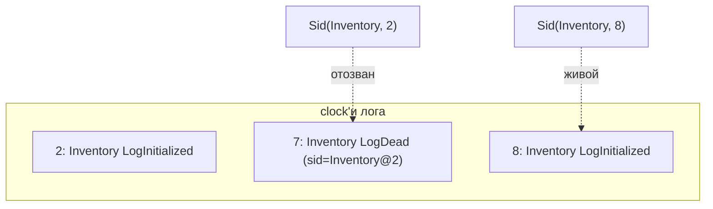

# Sid и clock

## Clock

Лог — это плотная последовательность, нумерация с нуля. **Clock** события — это
его позиция: первое событие в пустом логе имеет clock `0`, следующее `1` и так
далее. Clock'и назначаются [бэкендом лога](the-log.md) при добавлении — вызывающий
их не выбирает.

!!! note "Clock назначает бэкенд"
    Когда вы добавляете событие, его поля `clock`/`timestamp`/`formatVersion` —
    лишь рекомендательные. Бэкенд перезаписывает `clock` следующей позицией и
    возвращает переписанное событие. Это делается единообразно через
    `ClockRewriter`, поэтому все бэкенды (in-memory, файл, Postgres) согласны с
    контрактом: **первое событие = clock 0**.

## Sid

**Sid** (`io.fom.Sid`) — это стабильный идентификатор *конкретной версии*
состояния процесса:

```java
public record Sid(String processName, int clock) { }
```

Он связывает имя процесса с clock'ом, на котором был зафиксирован `LogInitialized`
этой версии. Два состояния одного процесса, инициализированные в разное время, —
это **разные Sid'ы**.



Выше `Inventory` сначала инициализирован на clock 2 (`Sid(Inventory, 2)`). После
reinit он отзывается через `LogDead` на clock 7, и живым становится новый
`Sid(Inventory, 8)`.

## Почему это важно

- **Маршрутизация и ответы.** Запрос обслуживается тем Sid'ом, который живой в
  момент диспетчеризации. Sid однозначно говорит, *какая версия ответила*.
- **Реактивный каскад.** Когда Sid поставщика меняется (продвижение от старого
  Sid к новому), движок запускает [каскад](reactive-cascade.md) для его
  реактивных потребителей, записывая переход как `LogDependencyChanged`.
- **Идемпотентный рестарт.** При рестарте движок тёпло загружает последний
  *не-отозванный* `LogInitialized` для каждого процесса — то есть Sid, у clock'а
  которого нет более позднего `LogDead`. См.
  [Идемпотентный рестарт](idempotent-restart.md).

## В коде

Текущий Sid процесса виден через интроспекцию
(`EngineReport.NodeReport.currentSid()`), внутри пользовательского кода через
`QueryableContext.sid()` / `ProcessContext.sid()` и через колбэки наблюдателя
(`onSidPromotion`, `onInitCompleted`, …).

> [English version](../../concepts/sid-and-clock.md)
