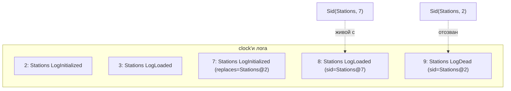

# Sid и clock

## Clock

Каждое событие несёт **clock** — монотонный счётчик, который назначает
[бэкенд лога](the-log.md) при добавлении; вызывающий его не выбирает. Первое
событие в пустом логе получает clock `0`, каждое следующее — clock последнего
события **+ 1**. Clock'и строго возрастают и **никогда не используются
повторно** — даже после [снапшота](snapshots.md), пока лог движется только
вперёд.

!!! warning "Откат лога выдаёт clock'и повторно"
    Следующий clock всегда вычисляется по логу в его *текущем* виде.
    Восстановление более старой копии лога — [архива](snapshots.md#восстановление-архива)
    или бэкапа — либо ручное усечение лога откатывает clock: движок продолжает
    после последнего clock'а этой копии, поэтому clock'и и Sid'ы отброшенной
    линии истории **выдаются повторно** — другим событиям. Не считайте, что Sid,
    записанный до такого восстановления, после него обозначает то же состояние.

!!! note "Clock назначает бэкенд"
    Когда вы добавляете событие, его поля `clock`/`timestamp`/`formatVersion` —
    лишь рекомендательные. Бэкенд перезаписывает `clock` значением
    `LogClocks.nextClock(lastEvent)` (последний clock + 1 или `0` в пустом
    логе) и возвращает переписанное событие, так что все бэкенды (in-memory,
    файл, Postgres) следуют одному контракту.

Clock — это и не **timestamp**. `timestamp` события берётся через
`System.currentTimeMillis()` там, где событие *создаётся*, а не в момент
добавления, поэтому при параллельных добавлениях timestamp'ы могут идти назад,
пока clock'и продолжают расти. Порядок задаёт clock; timestamp — лишь контекст
по стенным часам.

Clock — это не **позиция**. `LogBackend.get`/`getBetween` адресуют события по
позиции `[0, length())`. В логе, который ни разу не компактизировали, они
совпадают; после компакции лог короче, но сохраняет исходные clock'и, поэтому в
clock'ах появляются пропуски и они расходятся с позициями.

## Sid

**Sid** (`io.fom.Sid`) — это стабильный идентификатор *конкретной версии*
состояния процесса:

```java
public record Sid(String processName, long clock) { }
```

Clock имеет тип `long`. Clock'и постоянны и никогда не перенумеровываются,
поэтому за долгую эксплуатацию они растут, даже если компакция держит сам лог
маленьким, и со временем могут превысить `Integer.MAX_VALUE`. `long` на практике
не переполнится. *Позиции* в логе остаются `int`: они индексируют
компактизированный лог, а он небольшой.

Он связывает имя процесса с clock'ом, на котором был зафиксирован `LogInitialized`
этой версии. Два состояния одного процесса, инициализированные в разное время, —
это **разные Sid'ы**.


```mermaid
graph TD
  subgraph "clock'и лога"
    L2["2: Stations LogInitialized"]
    L3["3: Stations LogLoaded"]
    L7["7: Stations LogInitialized (replaces=Stations@2)"]
    L8["8: Stations LogLoaded (sid=Stations@7)"]
    L9["9: Stations LogDead (sid=Stations@2)"]
  end
  S1["Sid(Stations, 2)"] -.отозван.-> L9
  S2["Sid(Stations, 7)"] -.живой с.-> L8
```

Выше `Stations` сначала инициализирован на clock 2 (`Sid(Stations, 2)`). Reinit
пишет новую версию на clock 7 (`Sid(Stations, 7)`), пока `Stations@2` продолжает
обслуживать; `LogLoaded` на clock 8 делает живым `Stations@7`, а `Stations@2`
отзывается через `LogDead` на clock 9. При `ReinitStrategy.RELEASE_FIRST` сначала
идёт `LogDead` старого Sid, а новый `LogInitialized` — после него (см.
[Лог](the-log.md#reinit-events)).

## Почему это важно

- **Маршрутизация и ответы.** Запрос обслуживается тем Sid'ом, который
  обслуживает в момент диспетчеризации. Sid однозначно говорит, *какая версия
  ответила*. Во время reinit это старый Sid, пока новый не загружен; compute,
  начатый старой версией, завершается на ней и после переключения.
- **Реактивный каскад.** Когда Sid поставщика меняется (продвижение от старого
  Sid к новому), движок запускает [каскад](reactive-cascade.md) для его
  реактивных потребителей, записывая переход как `LogDependencyChanged`.
- **Идемпотентный рестарт.** При рестарте движок тёпло загружает живой
  `LogInitialized` каждого процесса — самый новый не отозванный, а если он
  заменяет другой, то имеющий свой `LogLoaded`. Записанная, но не загруженная
  замена (*кандидат*) загружается после того, как старая версия начала
  обслуживать (при `RELEASE_FIRST` он вместо этого снимается, а узел
  инициализируется холодно). См.
  [Идемпотентный рестарт](idempotent-restart.md).

## В коде

Текущий Sid процесса виден через интроспекцию
(`EngineReport.NodeReport.sid()`), внутри пользовательского кода через
`QueryableContext.sid()` / `ProcessContext.sid()` и через колбэки наблюдателя
(`onSidPromotion`, `onInitCompleted`, …). `onSidPromotion` вызывается один раз
на каждый новый Sid; про его `previousSid` см.
[Наблюдаемость](../guides/observability.md).

Пока процесс переинициализируется, `NodeReport.sid()` — это Sid, который отвечает
на запросы, то есть старый, а `NodeReport.replacement()` говорит, что новая
версия в `"Initializing"` или `"Loading"`. Sid новой версии (кандидата)
существует начиная с его `LogInitialized`: его сообщает `onInitCompleted`, его
видит `load` в `ctx.sid()`, его принимает `Engine.cancelInit(Sid)`. Sid
обслуживающей версии ничего не отменяет. `NodeReport.sid()` переходит на новый
Sid в момент переключения, когда вызывается `onSidPromotion(old, new)`.

Внутри `init` Sid ещё нет: Sid нового состояния — это clock его
`LogInitialized`, а эта запись дописывается только после того, как `init`
вернулся. Поэтому холодный init или reinit видит заглушку: `ctx.sid()` ==
`Sid(name, 0)`, даже пока рядом обслуживает старая версия (`init`, запущенный потому, что загрузка сохранённого состояния
раз за разом падала, видит вместо неё Sid этого состояния). Не сохраняйте и не
сравнивайте её; настоящий Sid виден начиная с `load`.

## Sid и компактизация

Sid **постоянен**: он никогда не повторяется и не идёт назад, в том числе через
снапшоты (если только сам лог не откатили — см. [выше](#clock)). [Снапшот](snapshots.md) сохраняет каждый живой `LogInitialized`
(и кандидата, ещё ждущего загрузки) с его **исходным** clock'ом, поэтому процесс проходит через снапшот с тем же Sid (ни
смены Sid, ни продвижения), а рестарт на компактизированном логе загружает
состояние под тем же Sid. События, добавленные после снапшота, продолжают отсчёт
после наибольшего clock'а, который когда-либо был в логе.

Clock в Sid — это идентичность, а не позиция в логе: не передавайте его в
`LogBackend.get` — после компакции событие лежит на меньшей позиции.

> [English version](../../concepts/sid-and-clock.md)
