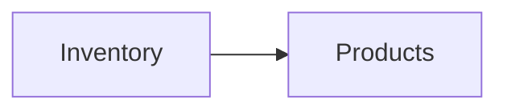

# Ваш первый граф

В [быстром старте](quickstart.md) был один узел. Настоящая польза — в
**зависимостях**: один процесс потребляет другой, и изменения распространяются.

Построим два процесса:

- **`Inventory`** — владеет каталогом остатков.
- **`Products`** — зависит от `Inventory` и отдаёт денормализованное
  представление товара, построенное из него.



## Объявление зависимости

Зависимость — это просто имя поставщика, переданное в `add(...)`:

```java
Graph graph = new GraphBuilder()
    .add("Inventory", InventoryInit::new, InventoryInit::new)
        .handles(GetStock.class)
    .add("Products", ProductsInit::new, ProductsInit::new, "Inventory") // (1)!
        .handles(GetProductModel.class)
    .build();
```

1. Завершающее `"Inventory"` объявляет, что `Products` зависит от `Inventory`.
   Переданные так имена становятся **реактивными** зависимостями (см. ниже). Граф
   запускается в топологическом порядке, поэтому `Inventory` достигает `Serving`
   раньше, чем стартует `Products`.

## Запросы к зависимости во время init/load

Поскольку `Inventory` живой до старта `Products`, его `init`/`load` могут
обращаться к нему через `QueryableContext`:

```java
final class ProductsInit implements ProcessInitializer, ProcessLoader {

    @Override
    public CompletionStage<Map<String, byte[]>> init(QueryableContext ctx) {
        // Запросить объявленную зависимость по имени.
        return ctx.query("Inventory", new GetStock("PUB1"))
            .thenApply(stock -> Map.of("model", buildModel((Stock) stock)));
    }

    @Override
    public CompletionStage<Process> load(QueryableContext ctx, Map<String, byte[]> props) {
        byte[] model = props.get("model");
        Process live = (c, q) -> CompletableFuture.completedFuture(decode(model));
        return CompletableFuture.completedFuture(live);
    }
}
```

!!! warning "Запрашивать можно только объявленные зависимости"
    `ctx.query("Inventory", …)` работает только потому, что `Products` объявил
    `Inventory` зависимостью. Запрос к необъявленному процессу бросает исключение —
    это держит граф зависимостей честным, а топологический порядок запуска —
    корректным.

## Реактивные и стабильные зависимости

Форма с завершающим именем (`add(..., "Inventory")`) создаёт **реактивную**
зависимость: когда состояние `Inventory` меняется, `Products` автоматически
переинициализируется. Чтобы отказаться от этого — зависимость, которую вы читаете
один раз и не хотите отслеживать, — используйте явный `Dependency.stable(...)`
через `addDeps`:

```java
import io.fom.Dependency;

new GraphBuilder()
    .add("Inventory", InventoryInit::new, InventoryInit::new)
    .addDeps("Products", ProductsInit::new, ProductsInit::new,
             Dependency.stable("Inventory"))   // прочитать один раз, без каскада
    .build();
```

См. [Реактивный каскад](../concepts/reactive-cascade.md) для полного поведения,
включая схлопывание частых изменений окном дедупликации.

## Триггер изменения

Заставить `Inventory` переинициализироваться (например, изменился его источник):

```java
engine.trigger("Inventory", new RefreshSignal("nightly"));
```

Поскольку `Products` реактивно зависит от `Inventory`, он тоже
переинициализируется — по порядку. Чтобы опрашивать внешний источник
автоматически, зарегистрируйте [watcher](../concepts/triggers-and-watchers.md).

## Тот же граф на Kotlin

```kotlin
val graph = graph {
    process("Inventory", ::InventoryInit, ::InventoryInit)
        .handles<GetStock>()
    process("Products", ::ProductsInit, ::ProductsInit, dependsOn = listOf("Inventory"))
        .handles<GetProductModel>()
}
```

См. [руководство по Kotlin DSL](../guides/kotlin-dsl.md).

> [English version](../../getting-started/first-graph.md)
