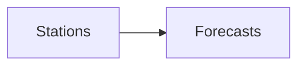

# Ваш первый граф

В [быстром старте](quickstart.md) был один узел. Настоящая польза — в
**зависимостях**: один процесс потребляет другой, и изменения распространяются.

Построим два процесса:

- **`Stations`** — хранит последние показания станций.
- **`Forecasts`** — зависит от `Stations` и отдаёт прогноз, построенный по
  этим показаниям.


```mermaid
graph LR
  Stations --> Forecasts
```

## Объявление зависимости

Зависимость — это просто имя поставщика, переданное в `add(...)`:

```java
Graph graph = new GraphBuilder()
    .add("Stations", StationsInit::new, StationsInit::new)
        .handles(GetReadings.class)
    .add("Forecasts", ForecastsInit::new, ForecastsInit::new, "Stations") // (1)!
        .handles(GetForecastModel.class)
    .build();
```

1. Завершающее `"Stations"` объявляет, что `Forecasts` зависит от `Stations`.
   Переданные так имена становятся **реактивными** зависимостями (см. ниже). Узел
   стартует, только когда все его зависимости обслуживают запросы, поэтому
   `Stations` достигает `Serving` раньше, чем стартует `Forecasts` (узлы, не
   связанные зависимостью, стартуют параллельно).

## Запросы к зависимости во время init/load

Поскольку `Stations` живой до старта `Forecasts`, его `init`/`load` могут
обращаться к нему через `QueryableContext`:

```java
import io.fom.api.Process;   // не java.lang.Process

final class ForecastsInit implements ProcessInitializer, ProcessLoader {

    @Override
    public CompletionStage<Map<String, byte[]>> init(QueryableContext ctx) {
        // Запросить объявленную зависимость по имени.
        return ctx.query("Stations", new GetReadings("ST-1"))
            .thenApply(readings -> Map.of("model", buildModel((Readings) readings)));
    }

    @Override
    public CompletionStage<Process> load(QueryableContext ctx, Map<String, byte[]> props) {
        byte[] model = props.get("model");
        Process live = (c, q) -> CompletableFuture.completedFuture(decode(model));
        return CompletableFuture.completedFuture(live);
    }
}
```

`Process` выше — лямбда, поэтому она реализует только `compute`. Весь контракт
`io.fom.api.Process` — это два метода:

```java
CompletionStage<?> compute(QueryableContext ctx, Object query);

default CompletionStage<Void> cleanUp(ProcessContext ctx) {
    return CompletableFuture.completedFuture(null);
}
```

Переопределяйте `cleanUp` (для него нужен класс, а не лямбда), когда `Process`
держит что-то, что надо освободить: соединение, временный файл, открытую
транзакцию. Он вызывается, когда этот `Sid` выводится из работы, а также на
`close()` и `cancelInit`, и у него свой `cleanupTimeout`; см.
[Жизненный цикл процесса](../concepts/process-lifecycle.md#повторы-backoff-таймауты).

!!! note "`load` должен уважать отмену"
    Движок вызывает `cancel(true)` на stage, который вернул `load`, как только
    загрузка перестаёт быть нужной (отменённый старт, пауза, удаление, замена
    графа, `close()`), а также когда он выходит за `loadTimeout`.
    Загрузчик, который это игнорирует и завершается позже,
    теряет свой `Process`: движок вызывает у него `cleanUp` и никогда его не
    обслуживает. См.
    [контракт отмены load](../concepts/process-lifecycle.md#load-cancellation).

!!! warning "Запрашивать можно только объявленные зависимости"
    `ctx.query("Stations", …)` работает только потому, что `Forecasts` объявил
    `Stations` зависимостью. Запрос к необъявленному процессу бросает
    `UndeclaredDependencyException` (наследник `QueryException`) — «No such
    dependency: &lt;name&gt;; declared: [&lt;объявленные имена&gt;]» — даже если
    такой процесс *есть* в графе. Это держит граф зависимостей честным, а
    порядок запуска — корректным.

    Такой сбой считается **окончательным**: сам по себе граф зависимость не
    отрастит, поэтому в `init` или `load` движок **не** делает backoff и не
    повторяет попытку (и не откатывается от `load` к свежему `init`) — даже если
    ваш код перехватил, обернул и перебросил исключение. Процесс падает сразу, и
    `newGraph` бросает это исключение, а не тратит весь `initTimeout` на
    повторы, чтобы в итоге выдать `InitializationTimeoutException`, ничего не
    говорящий о настоящей причине. Сообщение с перечнем того, что *объявлено*,
    обычно сразу показывает опечатку или забытый `.add(…, "Stations")`.
    Окончательно падает только узел, допустивший опечатку (`requester()`
    исключения): его потребители видят
    сбой зависимости и повторяют попытку как обычно
    ([подробнее](../reference/exceptions.md#undeclared-dependency-in-init)).

## Реактивные и стабильные зависимости

Форма с завершающим именем (`add(..., "Stations")`) создаёт **реактивную**
зависимость: когда состояние `Stations` меняется, `Forecasts` автоматически
переинициализируется. Чтобы отказаться от этого — зависимость, которую вы читаете
один раз и не хотите отслеживать, — используйте явный `Dependency.stable(...)`
через `addDeps`:

```java
import io.fom.Dependency;

new GraphBuilder()
    .add("Stations", StationsInit::new, StationsInit::new)
    .addDeps("Forecasts", ForecastsInit::new, ForecastsInit::new,
             Dependency.stable("Stations"))   // прочитать один раз, без каскада
    .build();
```

См. [Реактивный каскад](../concepts/reactive-cascade.md) для полного поведения,
включая схлопывание частых изменений окном дедупликации.

## Триггер изменения

Заставить `Stations` переинициализироваться (например, изменился его источник):

```java
engine.trigger("Stations", new RefreshSignal("nightly"));
```

Поскольку `Forecasts` реактивно зависит от `Stations`, он тоже
переинициализируется — по порядку. Чтобы опрашивать внешний источник
автоматически, зарегистрируйте [watcher](../concepts/triggers-and-watchers.md).

## Тот же граф на Kotlin

```kotlin
val graph = graph {
    process("Stations", ::StationsInit, ::StationsInit)
        .handles<GetReadings>()
    process("Forecasts", ::ForecastsInit, ::ForecastsInit, dependsOn = listOf("Stations"))
        .handles<GetForecastModel>()
}
```

См. [руководство по Kotlin DSL](../guides/kotlin-dsl.md).

> [English version](../../getting-started/first-graph.md)
