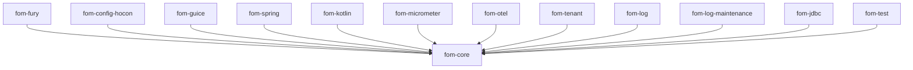

# Модули

FOM — многомодульная сборка. `fom-core` — единственная обязательная зависимость;
всё остальное опционально и аддитивно.

| Модуль | Имя JPMS | Зависит от | Назначение |
|---|---|---|---|
| **fom-core** | `io.fom.core` | только slf4j | Рантайм: `Engine`, `ProcessFSM`, `GraphMachine`, граф/билдер, SPI лога + бэкенды `InMemory`/`LocalFile`, `JavaSerializableSerDe`, снапшоты, триггеры/watcher'ы, реактивный каскад, замена графа на лету, горячая перезагрузка, SPI `EngineObserver` |
| **fom-fury** | `io.fom.fury` | fom-core, Apache Fury | `FurySerDe` — компактный быстрый бинарный сериализатор (**рекомендуется для прода**) |
| **fom-config-hocon** | `io.fom.config.hocon` | fom-core, Typesafe Config, cron-utils | Парсинг `EngineConfig` из HOCON; cron Quartz → `SnapshotPolicy.FixedInterval` |
| **fom-guice** | `io.fom.guice` | fom-core, Guice | `GuiceFactories` — сериализуемые суплаеры, разрешающие привязки Guice |
| **fom-spring** | `io.fom.spring` | fom-core, spring-context | `SpringFactories` — сериализуемые суплаеры, разрешающие бины Spring |
| **fom-kotlin** | _(automatic module)_ | fom-core, kotlinx-coroutines | DSL `graph { }`, `SuspendingProcess`, suspend-расширения |
| **fom-micrometer** | `io.fom.micrometer` | fom-core, Micrometer | `MicrometerEngineObserver` — счётчики/таймеры |
| **fom-otel** | `io.fom.otel` | fom-core, OpenTelemetry | `OtelEngineObserver` — спаны для init/load/query |
| **fom-tenant** | `io.fom.tenant` | fom-core | `TenantAwareEngine` — authz по тенантам + жизненный цикл |
| **fom-log** | _(automatic module)_ | fom-core, picocli | Автономный CLI: `inspect`, `diagnose`, `migrate` |
| **fom-log-maintenance** | `io.fom.log.maintenance` (пакет `io.fom.maintenance`) | fom-core | `SizeBasedSnapshotPolicy`, `CompositeSnapshotPolicy` |
| **fom-jdbc** | `io.fom.jdbc` | fom-core, postgresql | `PostgresLogBackend` — координация лидерства между узлами (advisory lock) |
| **fom-test** | `io.fom.test` | fom-core | `InterruptContractTest` — переиспользуемый контракт устойчивости к прерыванию |

## Направление зависимостей

Всё указывает на `fom-core`, и ничто не указывает поперёк — можно взять любое
подмножество, не подтягивая сериализаторы, DI или БД, которые вам не нужны.

## Ключевые типы по пакетам (fom-core)

| Пакет | Главное |
|---|---|
| `io.fom` | `Engine`, `EngineConfig`, `Graph`, `GraphBuilder`, `ProcessNode`, `Dependency`, `QueryRoute`, `Sid`, `ScheduledWatcher`, `SnapshotPolicy`, `EngineReport`, `Properties`/`TypedKey`/`Codec`/`Codecs`, `SerializableSupplier`/`SerializableFunction` |
| `io.fom.api` | `Process`, `ProcessInitializer`/`ProcessLoader` (+ `Param…`-варианты), `QueryableContext`, `ProcessContext`, `Routable`, `EngineObserver`, исключения |
| `io.fom.log` | `LogBackend`, записи событий `Log*`, `InMemoryLogBackend`, `LocalFileLogBackend`, `LogBackendReport` |
| `io.fom.serde` | `SerDe`, `JavaSerializableSerDe`, `ObjectInputFilters` |

> [English version](../../reference/modules.md)
