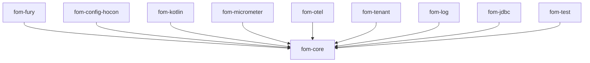

# Модули

FOM — многомодульная сборка. `fom-core` — единственная обязательная зависимость;
всё остальное опционально и аддитивно.

| Модуль | Имя JPMS | Зависит от | Назначение |
|---|---|---|---|
| **fom-core** | `io.fom.core` | только slf4j | Рантайм: `Engine`, `ProcessFSM`, `GraphMachine`, граф/билдер, SPI лога + бэкенды `InMemory`/`LocalFile`, `JavaSerializableSerDe`, снапшоты, триггеры/watcher'ы, реактивный каскад, замена графа на лету, горячая перезагрузка, SPI `EngineObserver` |
| **fom-fury** | `io.fom.fury` | fom-core, Apache Fury | `FurySerDe` — компактный быстрый бинарный сериализатор (**рекомендуется для прода**) |
| **fom-config-hocon** | `io.fom.config.hocon` | fom-core, Typesafe Config, cron-utils | Парсинг `EngineConfig` из HOCON; cron Quartz → `CronSnapshotPolicy` |
| **fom-kotlin** | _(automatic module)_ | fom-core, kotlinx-coroutines | DSL `graph { }`, `SuspendingProcess`, suspend-расширения |
| **fom-micrometer** | `io.fom.micrometer` | fom-core, Micrometer | `MicrometerEngineObserver` — счётчики/таймеры |
| **fom-otel** | `io.fom.otel` | fom-core, OpenTelemetry | `OtelEngineObserver` — спаны для init/load/query |
| **fom-tenant** | `io.fom.tenant` | fom-core | `TenantAwareEngine` — authz по тенантам + жизненный цикл |
| **fom-log** | _(automatic module)_ | fom-core, picocli | Автономный CLI: `inspect`, `diagnose`, `compact` |
| **fom-jdbc** | `io.fom.jdbc` | fom-core, postgresql | `PostgresLogBackend` — координация лидерства между узлами (advisory lock) |
| **fom-test** | `io.fom.test` | fom-core, JUnit 5, AssertJ | `LogBackendContractTest`, `SerDeContractTest`, `InterruptContractTest` — контрактные тесты для ваших реализаций |

## Направление зависимостей

```mermaid
graph TD
  core["fom-core"]
  fury["fom-fury"] --> core
  hocon["fom-config-hocon"] --> core
  kotlin["fom-kotlin"] --> core
  mm["fom-micrometer"] --> core
  otel["fom-otel"] --> core
  tenant["fom-tenant"] --> core
  cli["fom-log"] --> core
  jdbc["fom-jdbc"] --> core
  test["fom-test"] --> core
```

Всё указывает на `fom-core`, и ничто не указывает поперёк — можно взять любое
подмножество, не подтягивая сериализаторы, DI или БД, которые вам не нужны.

## Ключевые типы по пакетам (fom-core)

| Пакет | Главное |
|---|---|
| `io.fom` | `Engine`, `EngineConfig`, `Graph`, `GraphBuilder`, `ProcessNode`, `ProcessRef`, `Dependency`, `QueryRoute`, `Sid`, `ScheduledWatcher`, `SnapshotPolicy`, `LogCompaction`, `EngineReport`, `Properties`/`TypedKey`/`Codec`/`Codecs` |
| `io.fom.api` | `Process`, `ProcessInitializer`/`ProcessLoader` (+ `Param…`-варианты), `QueryableContext`, `ProcessContext`, `Routable`, `EngineObserver`, исключения |
| `io.fom.log` | `LogBackend`, записи событий `Log*`, `InMemoryLogBackend`, `FileLogBackend`, `LogBackendReport` |
| `io.fom.serde` | `SerDe`, `JavaSerializableSerDe`, `ObjectInputFilters` |

В **Java** `io.fom.api.Process` носит то же простое имя, что и `java.lang.Process`, а
импорт «по требованию» никогда не побеждает неявный `java.lang`. Сам по себе
`import io.fom.api.*;` допустим — неоднозначность возникает только там, где
простое имя `Process` действительно **используется**, и тогда компиляция падает
с «reference to Process is ambiguous». Импортируйте его явно —
`import io.fom.api.Process;` — точно так же, как `io.fom.Properties` требует
явного импорта рядом с `java.util.*`. Это касается только Java: в Kotlin
`import io.fom.api.*` компилируется, и `Process` разрешается в
`io.fom.api.Process`, так что явный импорт не нужен.

> [English version](../../reference/modules.md)
